=====================
Develop you own games
=====================

Read this section to learn how to create and edit games.

Tutorial: Exemplified instructions to program an ultimatum game
===============================================================

To help you getting started with creating your own games this section gives step by step instructions for how to implement an Ultimatum Game.

The Ultimatum Game
------------------

In an Ultimatum Game the participants play in groups of two. One of them takes the role of the proposer. He decides upon how to divide an initial endowment between him and the other player – the responder. The responder then decides whether he accepts the proposal. If he does so, the final payoffs of the players are according to the proposal. If the responder does not accept the proposal both players receive nothing as final payoff.

Building the game
-----------------

To create a new game click on "new game" in your overview screen. Type in a game name of your choice and change the availability to “private”. Thus other users cannot see “your” Ultimatum Game. Click “save”. ClassEx will automatically switch into editing mode and you can start building the game.

Matching
~~~~~~~~

Go to the tab “matching”. Select “role” in the drop-down menu “matching” and select “2” in the drop-down menu “roles”. This means the participants in this game are selected into groups of two with every group consisting of one participant of each role.

Stage 1: Proposer’s decision
~~~~~~~~~~~~~~~~~~~~~~~~~~~~~

Go on to the tab "stage 1". In this first stage of the game the instructions for all participants should be on the lecturer’s screen (all participants can see it) and the proposers should decide how much they want to transfer to the responder. The stage should be started by the lecturer pressing a start button.

First type in a name for the stage, e. g. “UltimatumProposer”. “Late arrival” should be “possible”. That means, participants can still log in after the stage has been started by the lecturer. The start button is already implemented by default in the first stage in the lecturer field on the right side.

To add the instructions click on “add new element” in the lecturer field and select “text box”. Click on the little symbol Insert.png above the start button field to insert the instructions above the start button. Insert the game instructions that should be visible for all participants into this text box.

Than you have to edit the participant’s field on the left side. An input element with one input field is implemented by default. Change the “Type of input field” to “Numeric input field”. Every participant in the role of a proposer will be able to decide upon the amount he wants to keep for himself by entering it into this field. The field “variable names” next to the “Type of input field” defines the variable name. This is the internal name of the variable and will not be visible for the participant. Type in e. g. “keep”. Only the proposers should have an input field in this stage. Therefore change the field “for all roles” to “only role 1”. In the text field you can insert a description of the input value that is visible for the participant. Type in e. g. “For me:”. Below the text field you can edit some more settings of the input field. The “Minimum” should be "0" because the responder cannot keep a negative amount. The “Maximum” should equal the initial endowment because the proposer cannot keep more than this for himself. The initial endowment could be a parameter you maybe will want to change in the future. You should only need to change one value to do so. Therefore you should define the initial endowment as a general parameter of the game. To do so you need to add a “program code (subjects)” element (participants field -> add new element -> program code (subjects)). Click on the little symbol Insert.png above the input field to insert the program field. In the program field you now can define the initial endowment as a variable. Type in “$endow = 10;” for an initial andowment of 10. Now you can use this variable to define the upper threshold of the amount the proposer can keep. Type “$endow;” in to the “Maximum” field. Type in “0” into “decimal place” to not allow for decimal numbers and define the "unit" e. g. as “€”.

To make sure the proposer fully understands his decision the value left for the responder should be calculated and displayed. Therefore click on Insert.png to add a new input field in the input element. Change the field “for all roles” to “only role 1” again and name the variable (e. g. “send”). Isert the description for the variable in the text box, e. g. “Player 2 gets:”. You don’t need minimum and maximum values because the value should be calculated automatically from the variables "keep" and "endow". Set decimal place and unit the same as in the first input field. Because this field is actually not an input field in which the participant can insert a value check the box “output only”. To calculate the updated amount for the respondent every time the proposer changes the value he wants to keep you need to insert a third input field in your input element. This time it the “Type of input field” is “calculation field”. Again change the field “for all roles” to “only role 1”. Type “send=endow-keep;” into the program field.

For clarification you should add a more general explanation of the stage for the proposers that is displayed above the input element. Click on “add new element” in the participants field and select “text box”. Click on Insert.png between the “program code (subject)” and the input element. Again change the field “for all roles” to “only role 1”. Then insert the instructions, e. g. “You decide how to divide $endow; € between you and player 2 . Player 2 decides, if he accepts or rejects. If he rejects, you both get nothing.”

Stage 2: Responder’s decision
~~~~~~~~~~~~~~~~~~~~~~~~~~~~~~

In the second stage the responders are informed about the proposals and they decide whether to accept or to reject.

To create a new stage click on Plus.JPG on the right side of the tab of stage 1 (now bearing the name you chose). Type in a name for stage 2 (e. g. "UltimatumResponder"). “Late arrival” should be “not possible” in this stage, because the matching is already done and newcomers cannot be integrated once the first stage has been played. The new stage has by default implemented a textbox in the participant’s field. Use this textbox to inform the responder about the proposal. You need to display for every responder the values of the proposal made by the proposer who was matched to them. To do so you need a "program code (subjects)" field again. Insert it above the text box and change “for all roles” to “only role 2”. Type in the following code:

	| $keep = $findVariablePartner(“keep”;$round);
	| $send=$endow-$keep;

The first line defines a variable “keep” and assigns to it the value of the player’s matching partner’s “keep”-variable. The second line calculates how much the proposer kept for himself and assigns the value to a variable “send”. Now you can use both new variables to inform the responder about the proposal made to him. Change “for all roles” to “only role 2” in the text box and type in the following instructions:

	"Player 1 has decided to split $endow; as follows: $keep; for player 1 and $send; for you. You can accept the proposal 		or reject it. If you reject it, both get nothing."

Now you need an input element via which the responder can accept or reject the proposal. Insert an input element beneath the text box and insert a “new input field” within the input element. Change the type to “Buttons (Single Choice)”. Set the variable name to e. g. “accepted” and define the Input field as visible for “only role 2”. Write a text into the text box that should appear above the “accept” and “reject” button (e. g. “Your decision”). To insert these buttons type “2” into the text field next to “add new possible answer” and click on Plus.JPG. Insert “Accept” and “Reject” into the text fields. The values assigned to the decision buttons are very important. Choose the value “1” for the accept button and the value “0” for the reject button.

The second stage should start for a responder automatically as soon as “his” proposer has sent a proposal. Therefore delete the “start button” field in the lecturer field by clicking on Rubbish.JPG. Then insert an “automatic start” via “add new element”. Change the mode to “wait for others”. To display how many proposers and responders have already made their decisions on the lecturer’s screen, set the counter to “display” and the count to “by role”.

Stage 3: Results
~~~~~~~~~~~~~~~~~

When the responders have accepted or rejected the proposals you can display the results in a third stage. Add a new stage and name it e. g. “Results”. “Late arrival” again is “Not possible”. The two fields next to the “late arrival” field define how often and where to jump after finishing this stage. You can define the number of rounds you want to play. Choose “back to stage 1” and e. g. “2x” (for playing two rounds).

For both players the payoff depends on whether the responder accepted the proposal or not. You have to distinguish these two cases. To do so you use a program code (subjects) field again. You need one for “only role 1” and one for “only role 2”. The program for role 1 is:
	
	| $accepted=$findVariablePartner(“accepted);
	| $payoff=$keep*$accepted;
	| if($accepted==0) {
	| $text=”Player 2 has rejected your proposal.”
	| } else {
	| $text=”Player 2 has accepted your proposal.”
	| }

The program for role 2 is:

	| $payoff=$send*$accepted;
	| if($accepted==0) {
	| $text=”You have rejected the proposal.”
	| } else {
	| $text=”You have accepted the proposal.”
	| }

Then insert two text boxes in the participants field. Again one for role 1 and one for role 2. In these text boxes you inform the players about their final payoff. For role 1 the text could be:

	You have proposed to split $endow; as follows: $keep; € for you and $send; € for player 2. $text; Your payoff is $payoff; €.

For role 2 the text could be:

	Player 1 has proposed to split $endow; as follows: $keep; € for him and $send; € for you. $text; Your payoff is $payoff; €.

In the lecturer field you can show the results. Delete the start button that is implemented in a new stage by default. Then add a results bubble element. Select the variable “accept” for the x-axis with 0 as minimum and 2 as maximum value. Choose a label for the x-axis, e. g. “acceptance." Select the variable “keep” for the y-axis with 0 as minimum and $endow as maximum value. Choose a label for the y-axis, e. g. “proposal (amount kept)”. Select “display if stage is activated and after” and select “by role” in the field “count”.

Testing the game
----------------

To test the game, change into lecture mode. You can test the game on your own PC by clicking on Testpart.JPG in the top bar of the lecture mode. This opens a participant screen in a new tab. You will see the game just as your subjects will see it when actually playing the game. You can open as many screens as you want, where each screen represents a participant. After opening enough test participant screens click "Start" in the lecturer screen. Then you can go through the game with all test participants. 

Create a new game
=================

To create a new game you can either click on *new game* in you Overview or go to Editing mode and select *game - new game*. 

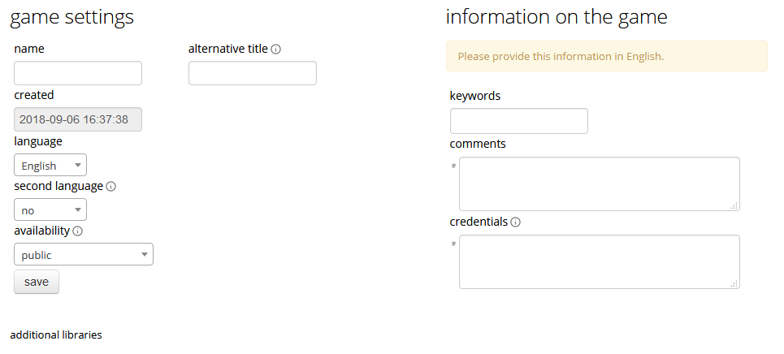

classEx takes you to the settings page of the created game were you have to select a name. You can also define an alternative name which is displayed instead of the name wherever the game is listed. You have to select a language and can define a second language that is used if the account language is set to this language. Also you have to choose whether the game should be public or private.
Further you can insert information on the game in the left column. You can select keywords, add comments and credentials. The credentials are typically used for references to published literature relevant for your game. The credentials will be displayed next to the name of you game. 
Once you are done click on *save* to create the game. classEx automatically takes you to editing mode where you can proceed designing the game.

Assignment and Matching
=======================

Left to the tab *stage 1* you find the tab *assignment and matching*. Here, you can specify whether you want to assign participants to treatments, groups, roles or a combination of all (complex assigment). 

.. image:: _static/Matching.PNG
    :alt:  300px

Assignment at the beginning of a game
-------------------------------------

classEx allows you to flexibly adapt to an unknown number of participants, meaning that you choose the number of different roles, the number of treatments and the size of groups. ClassEx then assigns participants automatically. Specifically, have following available options:

No assigment
	Participants all are assigned to role 0, treatment 0 and group 0.

treatments
	Allows you to assign participants to treatments. A division into treatments will distribute participants evenly over treatments. You can select any number of treatments between 1 and 10. Treatments will be distributed according to arrival in the experiment (e.g. with two treatments the first will be treatment 1, the second treatment 2, the third again treatment 1,...)

role and group
	Allows you to assign participants to a number of different roles in the game. Participants will be allocated to role 1, role 2, role 3... alternately. Participants will also be assigned to a group. E.g. if you have defined 3 roles, a group will consists of role 1, role 2 and role3. If you want to have groups with asymmetric combination of roles please use complex assignment.

group
	Allows you to assign participants to groups (all participants will have the same role). Groups are filled one after each other. You are free to select any group size. 

treatment + role and group
	Allows you to assign both role+group and treatments. If combines the two above options.

complex assignment
	Allows you to assign participants to a different number of roles, treatments and groups.

	Tip: The so-called between-subject design examines how a controlled variation of the game influences the behaviour of different participants. This can be implemented using treatments. The groups in one treatment only interact with participants in their own treatment and never with participants of the other treatment. The game can be adapted for every treatment, for example by providing different information, altered probabilities of random events or diverse strategic interactions.

Matching
--------

If you have assigned participants, you can specify how you want them to be rematched if your game consists of several rounds. You can choose from the following options:

partner
	Participants stay in the same groups and keep their roles throughout the entire game.

random
	Participants are randomly assigned to a new role, group and treatment (if specified).

Absolute stranger matching, ensuring that participants never interact with players they have interacted with before, is not available. 

Random matching with constant roles
~~~~~~~~~~~~~~~~~~~~~~~~~~~~~~~~~~~

Random matching with constant roles means randomly matching the subjects into new groups at the beginning of each round but at the same time keeping the subject's roles constant. This is not provided as an option but can be implemented manually as follows.

1. The assignment selected must be "role and group". The matching method selected should be "partner".

2. You need to add a globals program and a subjects program in the first repeated stage of your experiment.

3. Insert the following code in the globals program:

	| $rolesarray = $getRoles();
	| # Shuffle rolesarray
	| $keys = array_keys($rolesarray);
	| shuffle($keys);
	| foreach($keys as $key) { #Note that $key are the values!!!
	| $new[$key] = $rolesarray[$key];
	| }
	| $rolesarray = $new; #$rolesarray is now shuffled but with the initial key-value pairs
	| # Create new groups
	| $numberofroles = max($rolesarray);
	| for ($i = 1; $i <= $numberofroles; $i++) {
  	| $count[$i] = 1; #Initializing group count per role array
	| }
	| foreach ($rolesarray as $key => $values){ #Looks at every subject in new (shuffled) order
  	| for ($i = 1; $i <= $numberofroles; $i++) { #Tries every role
    	| if ($values == $i) { #If role fits
    	| ${"group_$key"} = $count[$i]; #Group assignment to group count
    	| $count[$i] = $count[$i]+1; #Increase group count for the role
	| }}}

4. Insert the following code in the subjects program:

	$save("group", ${"group_$id"}); #saves the value of the "group_[id]" variable created in the globals program as new value of "group"

Further settings
----------------

On the page assignment and matching you can further choose if the role should be displayed in the header of the participants page and if the player id should be displayed there as well.

Available roles
---------------

Up to 13 roles are available (and an additional gray role 0 for no role assignment). Role 2 is distinguishable by a different figure to allow distinction for person who have red–green color blindness.

.. image:: _static/Allroles.PNG
    :alt:  300px

This roles are standardized items and are shown in the header of the participant's page.

Define your stages
==================

Games consist of several stages. There are at least 2 stages, one for the decision input and one for the result output. Stages are ordered sequentially and are meant to be synchronization points in the game. Synchronization means that for the next stage to begin, all elements of the previous stage must have been finalized.

Configuration of Stages
-------------------------

Stages are points of synchronisation in a [[Games|game]]. Generally, the input phase is one stage and the results or output phase is a different stage, as the output can only be displayed after all [[Participants|participants]] have entered their input. Each stage consists of one or more [[Elements|elements]] (e.g. input, results, small programmes) that require the input of at least one participant. In the [[Editing Mode]], you can choose to give the stages names instead if numbers in order to identify them more easily. To give them a name, simply enter it in the box.

.. image:: _static/Stage.PNG
    :alt:  300px

Rounds
~~~~~~

If you want to run one or more stages more than once, you can define rounds and determine how often you would like to return to a certain stage. If you determine the return value as 0 or if the stage has been run for the predetermined number of times, classEx will redirect you to the next stage right underneath. You can also determine which stage you want to return to if you play several rounds.

Late arrival
~~~~~~~~~~~~

You can specify whether participants can arrive late, i.e. if they only just logged in. You can choose for this to be possible, not possible, or only possible in the first round.

Move stages
~~~~~~~~~~~

When you create a new stage, this stage will automatically be defined as the next stage. You can move stages by pressing *Move stage upwards* or *Move stage downwards*. The order in which stages are run is always from left to right.

Add stage
~~~~~~~~

You can add a new stage by clicking on *Add new stage* beside the tabs displaying the different stages or on the top right of the current stage.

Delete stage
~~~~~~~~~~
You can delete a stage by pressing *Delete stage*.

Elements (display condition,…, mit Bsp…, general input)
===========================================================

Elements are the modules of a stage. A stage has two areas in which you can add modules: participants and lecturer.

.. image:: _static/Stage.PNG
    :alt:  300px
    
The left side represents the player level (subject level). Visual elements added here are displayed on the players' devices. Program code (subjects) added here is run for every single player.
The right side represents the lecturer level (global level). Visual elements added here are displayed on the lecturer's screen. Program code (globals) added here is run once for all players.

You can chose from text elements, input elements (numerical input, likert scales, …), programme elements and output elements (histograms, bar charts, …). These can be combined and arranged as you like.

	Tip: Input and output elements should be located in different stages in order to collect all input in the first stage. Then, the lecturer can synchronise the game and turn to the output elements in the next stage.

Adding elements
---------------

You can add an element via clicking on *add element* and selecting the type of element you want to add. After that you have to choose where you want to place the element. If you do so the following two icons will appear for every possible location of the element.

.. image:: _static/Pasteelement.PNG
    :alt:  300px

Choose a location for your element by clicking on the corresponding *paste element* icon or cancel placing the icon by clicking on any *do not paste* icon. Keep in mind that the order of emlements defines how the elements are displayed on the players' devices.

Handling elements
-----------------

.. image:: _static/Elements.PNG
    :alt:  300px

Element Number
	The elements are numbered (E1, E2, …). This also defines the order of display in a stage. Elements can be moved within a stage with the *move element* arrows.

Element Type and Help
	Beside the number of the element, you can see the element type. Clicking on the info button next to the element type leads you to the respective description in this documentation.

Groups, Treatments and Roles
	If you have defined groups, treatments or roles, you can also choose whether the element shall be displayed for all groups, treatments or roles.

Delete Element
	You can delete the element by pressing *delete element*.

Copy Element
	You can copy an element by pressing *copy element*

Cut and Paste
	You can cut and paste an element by pressing *cut element*.

Display Condition
	If showing the element should be contitional (e.g. not for every role or dependent on other variables) you can specify the display condition for an element in the code line that appears when you click on *show display condition*.

Element types
--------------

Text Box
~~~~~~~~~

.. image:: _static/Textbox.JPG
    :alt:  300px

The text box is the simplest element. The entered text will be displayed to the players.
The text box is equipped with a text editor which allows you to insert tables, symbols etc. If you double-click into the text element, you see the text as it will be displayed to participants.

- Special Characters

=========== ============== ===============
Special     Characters     Function Example
=========== ============== ===============
$$          Multilanguage  Support If you want to provide German and English support, you can write both texts in the same textbox and seperate them by "$$". E.g. "Das ist Deutsch$$This is English" displays the German text if the selected language is German and English if it is English.
role1.png   Symbol Role 1  Red player symbol |role1| is displayed.
role2.png   Symbol Role 2  Green player symbol |role2| is displayed.
$variable;  Variables      Beside normal text, you can also insert variables into the text box. If you have defined variables (see element [[Program Code|Program]]), you can have these displayed by inserting the character "$", the variable name followed by ";". Make sure not to forget the ";" at the end! Variables and normal text can be combined
=========== ============== ===============

.. |role1| image:: Role1.JPG
.. |role2| image:: Role1.JPG

- Configuration for Participants

For participants you can chose to display the text box only for certain roles, treatments or groups (if defined). You can simply choose who the box shall be displayed for in the drop down menu above the text.

Further, you can determine where the text shall be aligned (left, center or right).

- Conditional text

So far we have only tackled how to read the php variables and display them in he text field (e.g. $variable;), but sometimes we would like to display conditional text. For example we might have a bool variable that tells whether a participant is buyer or seller. We can achieve this task by the use of javascript code embedded in our text element:

	| Endowment: $endowment;. 
	| 

since ClassEx supports JQuery, it is very easy. We create a span (an html tag to which we can easily add text) and than using the javascript syntax we add text to this tag with the id "isbuyer". We could also have used another id. Its only important that this id is unique in resulting html document. The Jquery text function gets the text we want to add as an argument. In this example we used the ternary Operator since it produces shorter code, but we could also have used a if else statement or more elaborate conditions. 

Element Reference
~~~~~~~~~~~~~~~~~

.. image:: _static/Refer.JPG
    :alt:  300p

In order to avoid redundancies, you can copy elements and add them in a different place in the game. For this, you need a reference, i.e. the element that shall be copied. If the original element is altered, the copy is adapted automatically. The reference is created by entering the stage number and the element number you are referring to. If you require the same text in to stages, for example, an element reference is a far more elegant version than a simple copy because any changes to the original element are adopted automatically.

Please notice that the display condition is not references but taken from the element which calls the reference.

Program code
~~~~~~~~~~~~

Program snippets can be implemented to calculate results for each subjects. For further information see Program code.

Input element (only for players)
~~~~~~~~~~~~~

In this element you can insert several input fields. These are numbered #1, #2, …. You can add input fields by clicking on “add new input field”. The input fields are displayed one after each other.

The following settings are available for every input field. You can determine the type of input field and define a name. The name can then be used in programmes and will give out the value of the variable. For example, if your variable is called “e”, you can access it by writing “$e;”. For more details see program. Furthermore, you can delete an input field by clicking on http://classex.uni-passau.de/classex3/pic/reject.png. You cannot delete the first input field (#1).

	**Please notice that only one input element is allowed per stage. For several inputs add additional input fields to the first input element.**

In the following, the different sorts of input fields are described in more detail.

- Numeric Input Fields

Numbers can be inserted into this input field. 

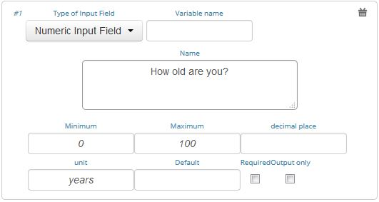

The name of the input field is used as the label and is displayed on the left hand side of the input field when it is displayed to participants. In the [[Editing Mode]], you can specify the minimum and the maximum and the number of decimal places allowed. If entries are different from these specifications, participants will see an error notification and will be requested to correct their entry.

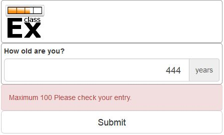

In addition, a unit (e.g. %, €, mm, …) can be specified that will be displayed on the right of the input field (here "years"). You can also set a default value that is displayed to participants at the start. Further, you can determine whether input is compulsory which is not the case for voluntary information for example.

"Output only" can be used, if an input field shall only display output. This can be necessary for calculations. For example, if participants are required to allocate different parts of income to different purposes, an "Output only" field can be used to display how much income is still left after filling in the input fields.

	Tip: The numeric input automatically corrects minor inconsistencies of participants. classEx checks whether participants adhere to the minimum and maximum values, rounds numbers according to the predetermined decimal places and automatically adapts the decimal separator by adding zeroes. classEx also automatically changes the input to numeric on mobile devices and shows the correct keyboard.

- Text Input

.. image:: _static/TextInput.JPG
    :alt:  300px

Text input fields enable you to let participants enter a text. You can specify the minimum and maximum amount of characters if required.

- Editing Buttons and Selection Lists (single choice)

.. image:: _static/ButtonsAndSelection1.JPG
    :alt:  300px

This type of input is used for discrete decisions. Besides the text that is shown above the buttons, you can specify the different answer options. Participants make a decision by choosing one of the options. The order of options can be altered by clickingon the arrow [[File:up.JPG]]. The correct answer can be specified and you can also delete or add options. You can also select if the options should be displayed in order or randomly (different for each participant).

You can implement single choice questions using buttons, simple lists or drop lists. This is what they look like in the participants' display.

.. image:: _static/ButtonsAndSelection2.JPG
    :alt:  300px
    
.. image:: _static/ButtonsAndSelection3.JPG
    :alt:  300px
    
.. image:: _static/ButtonsAndSelection4.JPG
    :alt:  300px

Choosing one of the options when using buttons submits the data, therefore, this type of input can only be used once in a stage. Multiple input fields (e.g. a single choice question and a numeric input field) should not be inserted as this leads to input errors. For simple lists and drop lists the choice needs to be submitted by pressing the submit button.

Choosing multiple options is possible by using [[Check Boxes]]. Checkboxes work in exactly the same way as single choice options. Only the form of display is slightly different, as these are displayed as a list from which participants can pick several options. This way, multiple inputs can occur in one stage.

- Radiolines and Sliders

Radiolines, like Likert scales, offer stepwise input. For this, you need to specify the minimum and maximum as well as the number of steps (e.g. Min1, Max 7 and Steps 6 would lead to integers and Steps 12 would lead to steps of the size 0.5). Furthermore, you need to enter a description for the left and right hand side.

Sliders are a similar concept. In this form of input, the participant moves a slider along a bar of predetermined positions.

Defaults can be set for radiolines and sliders. If no default is set, the radioline is empty and the slider is positioned in the middle of the bar.

- Checkboxes

Check boxes allow for choosing multiple answers. Options can be set just as described for selection lists ([[Buttons and Selection Lists (single choice)|single choice]]). Further, the minimum and maximum number of answers must be specified. It is possible to set a default. You can also select if the options should be displayed in order or randomly (different for each participant).

- Other Input Fields

Average over all input fields
	This option saves the average over all input fields which is not displayed to the user. The average is created automatically by calculating the mean over several numeric inpu fields (e.g. radiolines, numeric input fields, sliders).

Filled in input field
	This element allows you to display the filled in input field of the last stage.

Up to date, small programmes for manipulating the input (e.g. input in field 1 determines input in field 2) cannot yet be configurated in the backend.

Winner's Notification (only for players)
~~~~~~~~~~~~~~~~~~~~~

If a game is played with real payoffs, this element displays the payoff code to participants. (only works together with winners' draw) 

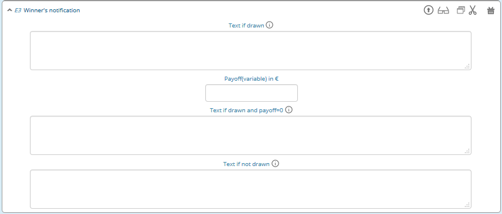

A winning notification is necessary for games with monetary payoff. The players who are randomly drawn receive a winning notification as well as a code to cash in their earnings. You can adapt the message that is displayed in the winning notification. The amount of earnings can be determined in the field “Payoff(variable) in €”. Besides a fix amount, you can also enter a variable that is calculated beforehand. If, for example, the variable “$payoff;” is calculated in a programme during the game, you can enter this variable in the earnings field.

	Tip: The winning notification can only be displayed if you also define a [[Winners'_Draw|winner's draw]] on the lecturer side. Otherwise no winner can be determined.

Clicking on the little info circles above the boxes will show you what will be displayed if you leave the boxes blank.

	Important: Payoffs per game are restricted to 100€ per default. If you need higher payoffs, you have to overwrite the variable $maxWin in a global program (e.g. $maxWin=1000;).

Payoff Matrix Game (only for players)
~~~~~~~~~~~~~~~~~~

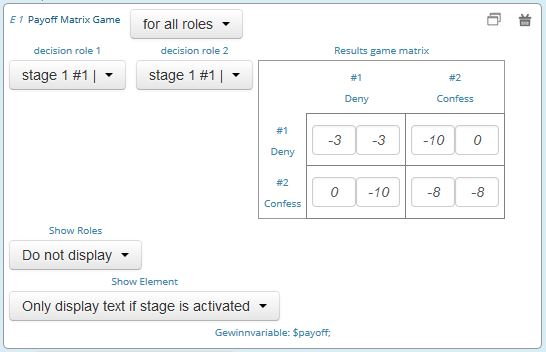

This element helps display the payoff for a two role game easily with a matrix. Alternatively, you can also do this through a program. In this element, you need to specify which input field contains the decision of the respective player for the row player and for the column player. The labels of the matrix are determined by the specified input fields. In the table, you enter the payoff for the row player first followed by the payoff for the column player. The payoff is stored as variable $payoff; which can then be used for the winning notification or further calculations.

Contract

.. image:: _static/Contractparticipant.JPG
    :alt:  300p

With this element, you can enable participants to form contracts. By adjusting the settings, you can customise the contract to your needs.

**Please note that you need to set seperate contract elements for buyers and sellers.**

- Functionality

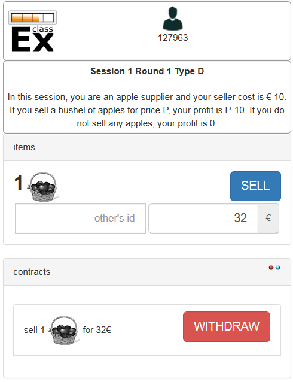

.. image:: _static/Buyer.PNG
    :alt:  300p

Contracts can be used to trade a commodity between subjects in real time. Subjects move around in the classroom and talk to each other. When they agreed on a price they enter it into the input mask together with the signature of the counterparty (see seller screen). The counterparty has to accept the trade (or reject it, see buyer screen).

- Settings

sell offers/buy offers
	If you turn this on, you allow for sell or buy offers made by the respective subject.

set quantities
	allows to set quantities (otherwise quantity is always 1). Prices are set as price/unit.

no signature
	allows to disable the signature. The signature is needed for sell and buy offers to be send to a specific person. E.g. if the buyer can make buy offers, she needs the signature of the seller to send the offer to.

max # contracts
	maximum number of (accepted) contracts

currency/min price/max price/decimal place
	Currency of the prices and minimum, maximum and decimal places.

maximum quantity
	maximum quanity a subject is allowed to possess

products
	at the moment only one typoe of product can be traded. You can specify a name (or a small image) and the initial amount of the good (e.g. the seller has 1 unit, the buyer 0 units).

- Output

The contracts made can be shown at the lecturer's screen with the contract table. In addition, there are special functions in globals and subjects programs to retrieve contracts. All contracts are also stored in the standard excel file which can be retrieved in the data menu. 

Camera (only for players)
~~~~~~~~

.. image:: _static/Camera1.PNG
    :alt:  300p

With this element, you can enable participants take a picture of themselves.

- Settings

The filename, under which the picture is stored, has to be defined. Additionally, you can define if participants are allowed to retake a picture. Then only the last picture taken is saved.

.. image:: _static/Camera2.PNG
    :alt:  300p

- Informed Consent

Participants are asked by the browser if the browser can access the webcam or not. Please make participants aware that they do not have to take a picture and ask them for their consent.

- Retrieving Pictures

Pictures can be retrieved in the following ways:

At another participant' screen
	You can use the normal variable notation ($image;) to display pictures in textboxes.

At the lecturer screen
	You can use $getValues(...) to retrieve the pictures of all participants and display them.

From the stored data
	In the downloaded data you find stored images in the subjects table. They can are base64 decoded and can be encoded with free online tools. Just take away "data:image/jpeg;base64," from the string, so that it starts e.g. with "/9j/....".

Javascript (only for players)
~~~~~~~~~~

- Reading php variables

To read php variables one currently neads a two step approach:
	* write php variable in the text field
	* parse textfield content in javascript using jquery
	* [optional] hide textfield

Assume we have a php variable <code>$foo</code> that containing an array we want to use as an javascript array.

- Textfield content:

	| <pre>
$foo;
</pre>
	| The id does not need to have this format, but it must be unique and match the variable used in the Javascript field

- Javascript-field content:

	| var foo = JSON.parse($('#php_var_foo').html());
	| $('#php_var_foo').parent().hide(); // optional

This finds the html element with the id of the div containing the variable content. It's inner html (the content) is taken and than parsed. Now the variable foo in javascript contains the content of the php variable foo.

[Optional] Hide the parent of the div containing the variable.

- Writing php variables

This can be achieved via hidden input fields that are triggered via JQuery calls

Start Button (only for lecturers)
~~~~~~~~~~~~~~

The start button is used to initiate a stage. Each stage '''requires a start button''' apart from stages that has a result element. Result elements have their own buttons. 

There are two options. A start button which has to be clicked by the experimenter or a automatic start.

- Start Button

.. image:: _static/Startbutton.PNG
    :alt:  300p

The start button can be configured according to the needs. 

* Name: You can name the button (e.g. Start Trade).
* Feature: Instead of starting the current stage, you can also use the start button to jump to different stages. 
* Confirmation message: you can set if a pop-up should appear after clicking to confirm the action. 
* Count: You can set the counter which appears after the start button is clicked. It can count decisions (also by role, treatment or group if set). 

- Automatic Start

.. image:: _static/Automaticstart.PNG
    :alt:  300p

The automatic start button allows you to start stages when subjects finished the previous stage.

The mode can be set to:

start if possible
	if a subjects finishes the previous stage, it is forwarded to the next stage.

wait for all
	subjects are only forwared if everyone in the group is done with the previous stage.

no forwarding
	subjects are not forwarded (This feature is only used if subjects forward themself by clicking on a button. This can be set in additional settings of the input element).

Count
	You can set the counter which appears after the start button of the previous stage is clicked. It can count decisions (also by role, treatment or group if set).
Counter
	Setting this additionally allows you to deactivate the counter completly.

Winner's Draw  (only for lecturers)
~~~~~~~~~~~~~

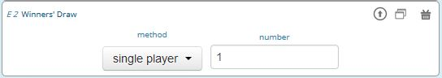

This element should be implemented in the last stage and draws a winner from among all participants. The earnings should be calculated individually on the participant side (see [[Winner's_Notification|winning notification]] for participants). You can determine whether single players or coupled players shall be drawn. Drawing coupled players only makes sense if you have defined roles. You can also decide how many winners you want to draw.

 Important: Payoffs per game are restricted to 100€ per default. If you need higher payoffs, you have to overwrite the variable $maxWin in a global program (e.g. $maxWin=1000;).

	Tip: For games with two roles it is advisable to draw coupled players as winners because the possibility that only one of the two players could be drawn might overshadow considerations of fairness or reciprocity. Experience has shown that earnings of less than 5€ are usually not cashed in. Therefore, games should be calibrated in a way that ensures that earnings are at least 10€.

**Important: Winners are only drawn from players who made a decision to avoid inactive players to be drawn. Therefore it does not make any sense to put the winners' draw in the first stage.**

You should draw winners only once in a game as the payoffs codes do not distinguish between rounds.

Lecturer Discrete Choice
~~~~~~~~~~~~~~~~~~~~~~~~~

.. image:: _static/Randomdraw.PNG
    :alt:  300p

- Usage

With this element the lecturer/experimenter can make decisions for all players during the game, e.g. tossing a coin in front of the class and entering the value in classEx so that payoffs can be calculated based on the coin toss.

- Settings

name
	This name will be displayed on the screen to identify the input button.

variable name
	The value will be saved under this name as a global variable and can be retrieved by that name.

for each player
	If you switch this on, you can set the value for each player separatly. The value will be stored as a global variable in an array with the player ID as index.

default
	You can set a default.

options
	You can specify options with different values.

update
	If you switch on the update, the element will check every two second if new players arrived (only necessary when you switched on "for each player").

Contract table
~~~~~~~~~~~~~~~~~

.. image:: _static/Contracttable.JPG
    :alt:  300p

With this element, all contracts that were entered into by participants as well as a chart and the average are displayed on the lecturer's screen.

.. image:: _static/Ctable4.PNG
    :alt:  300p

.. image:: _static/Ctable2.PNG
    :alt:  300p

.. image:: _static/Ctable3.PNG
    :alt:  300p

.. image:: _static/Ctable1.PNG
    :alt:  300p

- Functionality

In the contract table you have several tabs where you can jump between. You can see them in the pictures on the right hand side.

Contracts
	lists all contracts made.

Averages
	yields overview statistics for each round (mean, median, min, max, std dev)

Chart
	show contracts made over time. In case of different quantities it also shows a bubble chart for the combination of quantities and prices.

Predicition
	shows a predicition (if set). To create a prediction the variables $demand and $supply have to be filled in a global program. $supply and $demand should be arrays which contain prices as index and the resulting quantity as a value.

- Settings

value array
	gives the name of a (pre-filled) array which contains the role of the player as index and the respective buyer or seller value as value. This is shown in the table as buyer/seller value. 

label
	all labels in the table can be changed according to needs (seller/buyer/seller value/buyer value/price).

profit variables
	can be left empty.

show quantities
	additionally shows quantities in the contract table and a bubble chart with quantities and prices.

Result Element
~~~~~~~~~~~~~~~

For displaying the results of a game various types of charts are available. Note that you can only display saved subject variables.

Whenever you can select variables in a field you only need to insert the variable name (e.g. "payoff"). Ordinary input fields require the usual php notation (e.g. "$payoff;").

The program code does not distingiush between binary 0 and numeric 0. Some result elements, however, cannot display binary 0. Make sure to convert binary 0 in numeric 0 in the program code (e.g. "if($accept == 0) {$accept = 0;}") in case you want to display it in a result element.

Under the header “count”, you can determine whether results shall be displayed separately for groups, treatments or roles (if defined). Further, you can determine for some result elements whether you want the button “show results” to be displayed or not. Not displaying the button can be useful, if you want to display several diagrams underneath each other. You do, however, need at least one button per stage. You can use a normal start button element as well.

- Results Single / Multiple Choice Questions

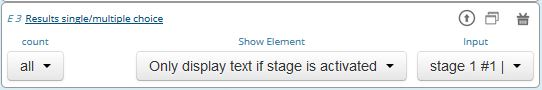

The results are displayed with percentage bars.

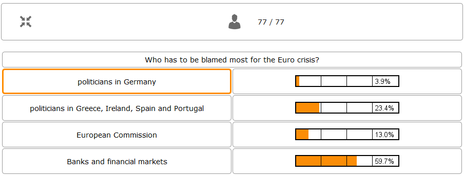

The following options can be changed:

Count
	Participants are counted all together (or per treatment / role).
Show element
	Always display element or only if stage is activated.
Input
	The variable which should be displayed (here: stage #1 input field #1). 

The element automatically detects if the input is multiple choice or single choice. Hovering over the bars gives the absolute frequency of participants who opted for that option. The element should only be used with input fields with predefined options (otherwise you should use the counter result element).

- Results Histogram

.. image:: _static/Numericindic.PNG
    :alt:  300p

.. image:: _static/Hist.PNG
    :alt:  300p

The following options can be changed:

Variable
	Choose which variable you want to display

Show element
	Element is always displayed or only if stage is activated.

Min
	Minimum of the histogram (Default 0)

Max
	Maximum of the histogram 

Bin
	How the values shall be pooled into “bins”. For example, if you define the bin width: 10, the data will be pooled in brackets of ten.

X-Line
	Vertical Line is drawn at this x-value (e.g. to specify a correct or true value)

Count
	Participants are counted all together or per treatment / role. This can be changed in drop down menu at the bottom.

	Tip: All values that are larger than the displayed maximum value are automatically pooled into the last bin.

- Results Line Chart

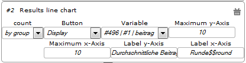

.. image:: _static/Commons.PNG
    :alt:  300p

A line chart enables the display of the results of several rounds. The following options can be changed:

Count
Participants are counted all together (or per treatment / role).

Button
	A button to start the result stage is displayed (or not).
Input
	The variable which should be displayed (here: stage #496 input field #1 (variable name "beitrag")). 
Max x-Axis
	Maximum of x-Axis
Max y-Axis
	Maximum of y-Axis
Label x-Axis
	Label of x-Axis
Label y-Axis
	Label of y-Axis

If no maximum is determined, the programme will automatically use the maximum of the input field. You can label both axes.

The line chart automatically calculates the average of the input variable over all subjects, per group or per treatment.
If the input variable is a binary variable the result is diaplayed in percent.

- Results Bubble

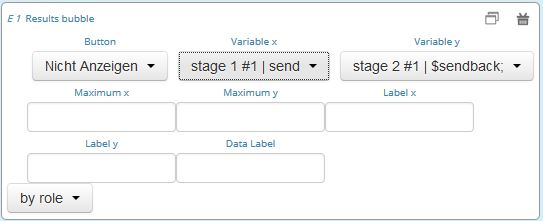

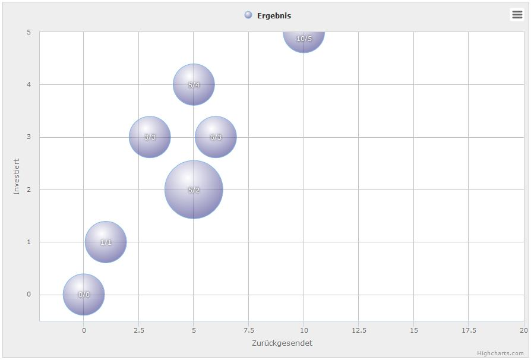

Displays a bubble chart, which can be useful for trust games, for example.

You can define the variables to be displayed on the x-axis and the y-axis as well as a minimum and a label for each axis.
 
- Results Counter

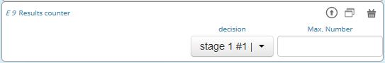

.. image:: _static/Bc.PNG
    :alt:  300p

The counter enables you to display the relative frequency with which a specific answer was chosen. If participants are required to choose a pair of answers, like in the faces beauty contest for example, you can also display how often a specific pair of answers was chosen.

Hovering over the bars gives the absolute frequency of participants who opted for that option. 

Using a multiple choice input field will result in the listing of combined answers. E.g. You can select A, B, C (multiple choice). Then the counter elemnet will display who many percent chose A, A&B, A&C,... If you want to have the items analysed seperately (only A, B, C) you should use the Results Single / Multiple Choice Questions (see above). 

- Results Game Matrix

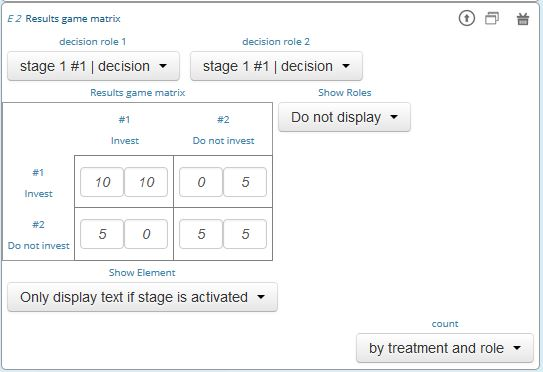

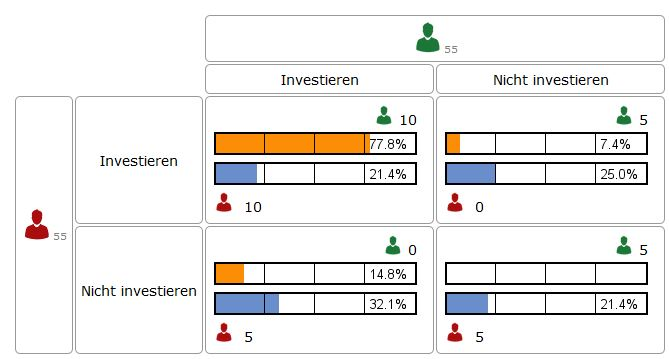

If a game is played with two different roles, the results can be displayed as a matrix. The settings are the same as for the participant screen. If you have defined treatments, you can decide whether the results shall be displayed per treatment or altogether.

If you have several rounds, the matrix calculates the results overall rounds. If you want to show temporal structures (e.g. learning), please use the time line diagram.

	Tip: The displayed matrix only determines the image on the lecturer’s screen and not the payoff for participants. The payoff is calculated individually for the participants (either through the element "payoff for 2 roles" or through a program).

- Other result elements

Other result elements include likert scales and pie charts.

Programs and PHP functions
==========================

Programmes are a very useful tool to design dynamic games. Programs are elements of stages and therefore created like any other element (see `Adding elements`_). 

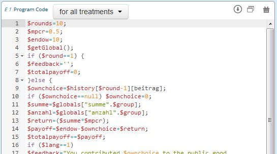

You can define for which roles, groups or treatments (if defined) the code shall apply to by choosing the corresponding option from the drop down menu above the code.

Programming language and editor
-------------------------------

Variables and programmes are specified via `PHP<https://en.wikipedia.org/wiki/PHP>`_. This is a well-documented standard which enables easy programming. Details can be found in the internet, for example `here<http://php.net/docs.php>`_. You can utilise the normal PHP features (e.g. round, rand, number_format(),…).

Programmes are entered in an editor that comprises syntax-highlighting as well as a simple error check of the entered codes.

Furthermore, the editor contains a completion system which will show you all available variables. If you start entering the beginning of a variable ($...) and then press Ctrl+space the automatic completion system will show you all corresponding variables and features.

Declaration of Variables
------------------------

Variables are defined by starting with "$". It does not matter whether the variable is a number or text. Variable names are case sensitive.

**ATTENTION! Do not use single quotes within double quotes as this may produce errors (e.g. $text="don't"), instead of ' you should use &apos; (e.g. $text="don&apos;t") in texts.**

Scope of Variables
--------------------

There are two different scopes: globals and subjects variables. 

Global variables are 
* available for all participants (can be accessed by subjects program), 
* are calculated at the lecturer side, 
* are the same for every participant,
* are calculated first (i.e. before subjects variables).

Please notice that globals and subjects variables share the same namespace. Using the same variablename may overwrite variables.

Subject variables are
* only available for a certain participant
* saved by default if they are decision variables (set via input elements).
* not saved by default if you create or calculate them in subject programs; to do so use the `Function to save variables`_

Variables for Participants (subjects)
-------------------------------------

Standard Variables for Participants (Subjects)
~~~~~~~~~~~~~~~~~~~~~~~~~~~~~~~~~~~~~~~~~~~~~~

============== =========
Variable Name  Value
============== =========
$lang          Actual Language (0: German, 1: English, 2: Spanish)
$round         Current Round
$id            Player ID (unique in all games, decisions are stored with the playerid)
$subject       Subject ID (unique in game, starts from 1,...)
$role          Role ID (if set)
$treatment     Treatment ID (if set)
$group         Group ID (if set)
$signID        Private Signature (for contracts)
$tic           External ID (if set at login)
============== =========

The variables $group, $role and $treatment can be overwritten in a subjects program.

Functions for participants (subjects) to retrieve variables
~~~~~~~~~~~~~~~~~~~~~~~~~~~~~~~~~~~~~~~~~~~~~~~~~~~~~~~~~~~~

The following functions can be used to retrieve variables. Here is some additional information on the structure. If you want to access the name of a variable, you put the name in quotation marks. If you want to access the value of a varible, you add a $ infront of the variable name. The elements of the functions mean the following:

varname
	here, you need to enter the name of the variable you want to retrieve, for example 'price'

round = currentRound
	this means that the default is set to the current round. If you want to access the variable of a different round, you must enter the round in the function. If you want to set the round to the current round (you need to do this if you add another parameter behind the round), you simply write $round in the expression.

includingOwn = false
	for averages, sums and frequencies, you can decide whether you want to include the own value or not. The default is set to *false* which means that values are calculated over all other subjects, excluding the own value. If you want to include the own value, you need to enter *true* in the function

$partnerRole = null
	if you only have two players in a group, the other player is automatically the partner. However, you can specify which partner is meant if you have more than two players in one group. To specify a player, just write the role number in the expression.

$no_decision = null
	this means that the default is set that if the partner has not made a decision and you try to access it, the function gives you null.

	IMPORTANT NOTICE: If you want to add an element that, for example, is placed at the third position in the function, you have to specify the elements before that, too. Otherwise, the element is used at the wrong position for the wrong expression.

=========================================================================================== ================================================= ==============
Function name                                                                               Calculates                                        Returns
=========================================================================================== ================================================= ==============
$findVariablePartner('varname', round=currentRound, $partnerRole=null, $no_decision=null);  Returns the decision of the partner               Variable value
$findGroupAverage('varname',round=currentRound,includingOwn=false);                         Average of a variable per group                   Array with group number as index
$findGroupSum('varname',round=currentRound,includingOwn=false);                             Sum of a variable                                 Sum as number, 0 otherwise
$findGroupFreq('varname',round=currentRound,includingOwn=false);                            Frequency of specific decisions by group members  Array with frequency of each decision
$findSold(round = currentRound)                                                             For a contract table: finds sell                  Array with number of unit (1,2,...) and corresponding price
$findBought(round = currentRound)                                                           For a contract table: finds buy                   Array with number of unit (1,2,...) and corresponding price
=========================================================================================== ================================================= ==============

Here are examples of all mentioned funtions:

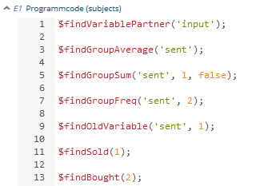

Function to save variables
~~~~~~~~~~~~~~~~~~~~~~~~~~~~

To save calculated variables you must use the following function:

**$save('varname', value);**

The elements of the function mean the following:

varname
	enter the name as which you want to save the calculated variable

value
	enter the value which should be saved for it. Here, you can insert a variable such as $price; or a calculation such as 10-$price

Here is an example:

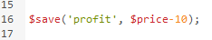

Variables for Lecturers (globals)
-----------------------------------

Standard variables for lecturers (globals)
~~~~~~~~~~~~~~~~~~~~~~~~~~~~~~~~~~~~~~~~~~

============== ============
Variable       Name Value
============== ============
$lang          Actual Language (0: German, 1: English, 2: Spanish)
$currentRound  Current Round
============== ============

Functions for lecturer (globals)
~~~~~~~~~~~~~~~~~~~~~~~~~~~~~~~~~~~

The following functions can be used to retrieve global variables. Here is some additional information on the structure. If you want to access the name of a variable, you put the name in quotation marks. If you want to access the value of a varible, you add a $ infront of the variable name. The elements of the functions mean the following:

varname
	here, you need to enter the name of the variable you want to retrieve, for example 'price'

round = currentRound
	this means that the default is set to the current round. If you want to access the variable of a different round, you must enter the round in the function

======================================================== ====================================================================================================================================== ====================
Function name                                            Calculates                                                                                                                             Returns
======================================================== ====================================================================================================================================== ====================
$getAverage('varname',round=currentRound);               Average of a variable                                                                                                                  Average as number, 0 otherwise
$getAveragePerRole('varname',round=currentRound);        Average of a variable per role                                                                                                         Array with role number as index
$getAveragePerTreatment('varname',round=currentRound);   Average of a variable per treatment                                                                                                    Array with treatment number as index
$getAveragePerGroup('varname',round=currentRound);       Average of a variable per group                                                                                                        Array with groupnumber as index
$getVarSum('varname',round=currentRound);                Sum of a variable (also available getVarSumPerGroup, getVarSumTreatment, getVarSumPerRole)                                             Sum as number, 0 otherwise
$getMin('varname',round=currentRound);                   Minimum of a variable (also available getMinPerGroup, getMinPerTreatment, getMinPerRole)                                               Minimum as number, 0 otherwise
$getMax('varname',round=currentRound);                   Maximum of a variable (also available getMaxPerGroup, getMaxPerTreatment, getMaxPerRole)                                               Maximum as number, 0 otherwise
$getFreq('varname',round=currentRound, multiple=false);  Frequency of a variable value (if multiple is set to true, answers from multiple choice questions are decomposed into single answers)  Array with the variable value as index
$getValues('varname',round=currentRound);                Single values for each player                                                                                                          Array with the player number as index and the corresponding value
$getRoles();                                             Role for each player                                                                                                                   Array with the player number as index and the corresponding role
$getTreatments();                                        Treatment for each player                                                                                                              Array with the player number as index and the corresponding treatment
$getNumRoles();                                          Number of roles                                                                                                                        Array with role as index and the number of players who have this role
$getNumPlayer();                                         Number of players                                                                                                                      Number
$getSubjectIDs();                                        Get Corresponding Subject IDs to player IDs                                                                                            Array with player ID as index and subject ID as value
$getNumDecisions('varname',round=currentRound);          Number of decisions made                                                                                                               Number
$getNumDecisionsPerGroup('varname',round=currentRound);  Number of decisions made                                                                                                               Array with Group Number as an index
======================================================== ====================================================================================================================================== ====================

Here are examples of all mentioned funtions:

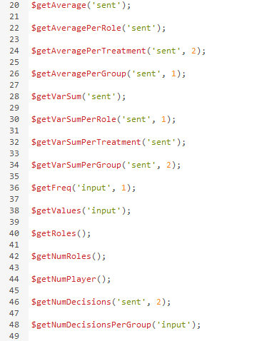

Pre-Defined Variables
---------------------

Functions
---------

Testing (Diagnose mode)
=======================

The diagnosis mode is very useful for trouble shooting and testing your game. You can access the diagnosis mode by clicking on the stetoscope icon in the top bar of the Lecture mode.

.. image:: _static/Diagnosissteto.PNG
    :alt:  300p

Clicking on the symbol opens up a space beside the usual display on the lecturer's screen, which shows you all variables and their current values.

.. image:: _static/Diagnosis.PNG
    :alt:  300p

The different tabs allow you to access the globals or the variables for each player. This makes it much programming and error finding much easier than having to jump back and forth between the lecture mode and the editing mode.

Test a Game

Before playing a game in your lecture, you can test the game on your own PC by clicking on Testpart.JPG in the top bar of the lecture mode. This opens a participant screen in a new tab. You will see the game just as your subjects will see it when actually playing the game. You can open as many screens as you want, which enables you to also test interaction between participants in games with several roles. 

Error spotting

If you try out the game you just programmed and find that something doesn't work, you can use the new Diagnosis mode for error spotting. This shows you all variables during the game in the lecture mode. 

Parameter
=========
parameter

By clicking on this button, you can set different parameters of a game that can be changed easily in the lecture mode if you want to play the same game several times with different parameters.

Here is an example for a public goods game:

Param.JPG

Languages 
=========
Languages

For some elements, you can enter the text in two different languages, English and German.

Gereng.PNG

To switch the languages on and off, you can click on the flag Flags.PNG symbols above the elements.

For other elements, this function has not been implemented yet. In this case, you need to enter both languages in one text box, separated by $$, for more information see Text Box. 

Tool Comparison 
===============
Tool Comparison 

Here you find an overview how classEx compares to other tools. It was last updated in September 2015 and is based on available information on the respective websites (see references below).

==Participation==
{| class="wikitable" style="border:solid 2px #999999;font-size:96%;"
|- class="hintergrundfarbe8"

! style="width:15%;font-size:103%;" | 
! style="width:15%;font-size:103%;" | classEx
Giamattei & Lamsbdorff 2015
! style="width:15%;font-size:103%;" | Econ Port 
Cox and Swarthout 2006
! style="width:15%;font-size:103%;" | VeconLab
Holt 2015
! style="width:15%;font-size:103%;" | MobLab
MobLab 2015
! style="width:15%;font-size:103%;" | oTree
Chen et al. 2015
! style="width:15%;font-size:103%;" | z-Tree
Fischbacher 2007
|- 
! Device for participation
! Platform-independent
! Computer
! Computer
! Platform-independent
! Platform-independent
! Computer
Windows only
|-
! Optimized for mobile use
! [[file:Yes2.png | 20px]]
 &nbsp;
! [[file:No.png | 20px]]
Plugin not compatible
! [[file:No.png | 20px]]
Not Optimized
! [[file:Yes2.png | 20px]]
 &nbsp;
! [[file:Yes2.png | 20px]]
 &nbsp;
! [[file:No.png | 20px]]
 &nbsp;
|-
! Free Use
! [[file:Yes2.png | 20px]]
! [[file:Yes2.png | 20px]]
! [[file:Yes2.png | 20px]]
! [[file:No.png | 20px]]
Research: $500 + session fee 
Teaching:$18 per student/class

! [[file:Yes2.png | 20px]]
! [[file:Yes2.png | 20px]]
|-
! Easy Access
! [[file:Yes2.png | 20px]]
no download and registration
 &nbsp;
! [[file:Yes2.png | 20px]]
no download, but registration
 &nbsp;
! [[file:Yes2.png | 20px]]
no download, but registration
 &nbsp;
! [[file:No.png | 20px]]
download optional, but registration
! [[file:Yes2.png | 20px]]
no download and registration
 &nbsp;
! [[file:No.png | 20px]]
download and registration
|}

==Games==
{| class="wikitable" style="border:solid 2px #999999;font-size:96%;"
|- class="hintergrundfarbe8"
  
! style="width:15%;font-size:103%;" | 
! style="width:15%;font-size:103%;" | classEx
Giamattei & Lamsbdorff 2015
! style="width:15%;font-size:103%;" | Econ Port 
Cox and Swarthout 2006
! style="width:15%;font-size:103%;" | VeconLab
Holt 2015
! style="width:15%;font-size:103%;" | MobLab
MobLab 2015
! style="width:15%;font-size:103%;" | oTree
Chen et al. 2015
! style="width:15%;font-size:103%;" | z-Tree
Fischbacher 2007
|-
! Asynchronous Games
! [[file:No.png | 20px]]
To be implemented

! [[file:No.png | 20px]]
 &nbsp;
! [[file:No.png | 20px]]
 &nbsp;
! [[file:Yes2.png | 20px]]
 &nbsp;
! [[file:No.png | 20px]]
 &nbsp;
! [[file:No.png | 20px]]
 &nbsp;
|-
! Between-subject design within a session
! [[file:Yes2.png | 20px]]
! [[file:No.png | 20px]]
! [[file:No.png | 20px]]
! [[file:No.png | 20px]]
! [[file:Yes2.png | 20px]]
! [[file:Yes2.png | 20px]]

|}

==Results==
{| class="wikitable" style="border:solid 2px #999999;font-size:96%;"
|- class="hintergrundfarbe8"

! style="width:15%;font-size:103%;" | 
! style="width:15%;font-size:103%;" | classEx
Giamattei & Lamsbdorff 2015
! style="width:15%;font-size:103%;" | Econ Port 
Cox and Swarthout 2006
! style="width:15%;font-size:103%;" | VeconLab
Holt 2015
! style="width:15%;font-size:103%;" | MobLab
MobLab 2015
! style="width:15%;font-size:103%;" | oTree
Chen et al. 2015
! style="width:15%;font-size:103%;" | z-Tree
Fischbacher 2007
|-
! Immediate graphical results at the end of the experiment
! [[file:Yes2.png | 20px]]
 &nbsp;
! [[file:Yes2.png | 20px]]
Limited

! [[file:Yes2.png | 20px]]
 &nbsp;
! [[file:Yes2.png | 20px]]
 &nbsp;
! [[file:Yes2.png | 20px]]
 &nbsp;
! [[file:No.png | 20px]]
 &nbsp;
|-
! Data Output
! XLS
! XML
! Unformated
! PDF
! CSV
! XLS

|}

==Own Experiments==

{| class="wikitable" style="border:solid 2px #999999;font-size:96%;"
|- class="hintergrundfarbe8"
  
! style="width:15%;font-size:103%;" | 
! style="width:15%;font-size:103%;" | classEx
Giamattei & Lamsbdorff 2015
! style="width:15%;font-size:103%;" | Econ Port 
Cox and Swarthout 2006
! style="width:15%;font-size:103%;" | VeconLab
Holt 2015
! style="width:15%;font-size:103%;" | MobLab
MobLab 2015
! style="width:15%;font-size:103%;" | oTree
Chen et al. 2015
! style="width:15%;font-size:103%;" | z-Tree
Fischbacher 2007
|-
! Development of own games
! [[file:Yes2.png | 20px]]
! [[file:No.png | 20px]]
! [[file:No.png | 20px]]
! [[file:No.png | 20px]]
! [[file:Yes2.png | 20px]]
! [[file:Yes2.png | 20px]]
|-
! Backend system
A backend system means that like in z-Tree experiments can be set by building together predefined elements so that only little programming is required.
! [[file:Yes2.png | 20px]]
! [[file:No.png | 20px]]
! [[file:No.png | 20px]]
! [[file:No.png | 20px]]
! [[file:No.png | 20px]]
! [[file:Yes2.png | 20px]]
|- 
! Programming Language
! PHP, AJAX
! JAVA
! PHP
! No info
! Phyton, Django
! C++
|}

==References==

Chen, D. L., Schonger, M., & Wickens, C. (2015). oTree-An Open-Source Platform for Laboratory, Online, and Field Experiments. https://mpra.ub.uni-muenchen.de/62730/1/MPRA_paper_62730.pdf. Accessed 23 August 2015.

Cox, J. C., & Swarthout, J. T. (2011). EconPort: Creating and Maintaining a Knowledge Common. In C. Hess & E. Ostrom (Eds.), Understanding knowledge as a commons: From theory to practice (pp. 333–348). Cambridge, Mass.: MIT Press.

Fischbacher, U. (2007). z-Tree: Zurich toolbox for ready-made economic experiments. Experimental Economics, 10(2), 171–178.

Giamattei, M.,& Lambsdorff, J. G. (2015). classex - an online software for classroom experiments. Working Paper. https://www.researchgate.net/publication/280153877_classEx_-_an_online_software_for_classroom_experiments

Holt, C. (2015). University of Virgina Veconlab. http://veconlab.econ.virginia.edu. . Accessed 23 August 2015.

Moblab. (2015). Moblab: A playground for decisions. https://www.moblab.com/. Accessed 23 August 2015.

Leiste.JPG

These provide you with several options which are described below.
Tip: If you make any input in the editing mode and leave the input field the value is stored automatically.
Select game

Aa.JPG

Click on the button in the left corner to open the drop down list of your existing games. Clicking on a game will open the selected game.

If a game has already been played by at least 10 participants, it cannot be adapted any more. The same applies if the game was created by another person. You can, however, replicate the game and then adapt it.

Bb.JPG
Game

By clicking on the button game a drop down menu opens.

Cc.JPG

Game settings: Clicking on game settings lets you change the name of the game and lets you specify whether you would like it to be public or not. By default, all games are public. This function is also available in the Overview on the Starting Screen. Also, you can provide additional information on your game. You can classify your game and provide information on the content and additional comments. This information can be accessed by other users and provides them with more details on your game.

Copy game: The currently selected game is copied and can then be edited and adapted.

Delete game: By pressing "delete game", the currently selected game is deleted. For your safety, you will be asked if you really want to delete the game. It is not possible to delete the game if it has already been started in the lecture mode. You then need to start a different game in the lecture mode before being able to delete the selected one. You cannot undo the deletion of a game.

New game: Creates a new game. A standard new game is always a single-choice question with four possible answers. Find an example of such a single-choice question here. 

Information on the game (meta data)
===================================

Participants elements
Screenshot 	Name 	Brief description
Tbnewnew.JPG 	Text Box 	Element to display text (including variables)
Inputfield.PNG 	Input Element 	In this element you can insert several input fields.
Codenew.JPG 	Program Code 	Program snippets can be implemented to calculate results for each subjects.
Winner.PNG 	Winner's Notification 	If a game is played with real payoffs, this element displays the payoff code to participants. (only works together with winners' draw)
Matrixpay.JPG 	Payoff Matrix Game 	This is a special element for matrix games.
Contract participant.JPG 	Contract 	This element allows participants to make contracts
Camera.png 	Camera 	This element allows participants to make a photo of themselves.
Refer.JPG 	Element Reference 	A reference can be used to reuse elements and thereby avoid redundant elements.
Javascript 	Program javascript snippets to implement more flexibly

Elements for the lecturer are generally only displayed on the lecturer’s screen which is usually projected to a wall for all participants to see. The start button, text boxes, elements for payoff calculations and output displays are typical elements for the lecturer.
Screenshot 	Name 	Brief description
Tblec.JPG 	Text Box 	Element to display text (including varibales) on the lecturers' screen.
Startt.JPG 	Start Button 	A Start Button is needed to start a stage. You can also set an automatic start here.
Draw.JPG 	Winners' Draw 	If a game is played with real payoffs, this element draws the winners (only works togehter with winner's notification).
Codenew.JPG 	Global Program 	Progam snippets can be implemented to calculate results on the global level for all participants.
Randomdraw.PNG 	Lecturer Discrete Choice 	Lecturer Discrete Choice allows the lecturer to input data in the course of the game
Contracttable.JPG 	Contract table 	Contract tables give you an overview of contracts concluded by the participants.
Refer.JPG 	Element Reference 	An reference can be used to reuse elements and thereby avoid redudant elements.
Ress.JPG 	Result Element 	Different Result Elements like Pie Chars, Line Charts, Histograms... are available. 

Text Box -- view under Player, Text Box

Player
------

Lecturer
--------

Identification of subjects in the system
========================================

By default, subjects are completely anonymous in classEx. Should it be required, you also have several possibilities to identify subjects in the system.

Ticket: You can provide participants with a personalised ticket to log-in to classEx. This way you can ensure that participants only take part on one device and also track the actions of specific participants. You simply need to add &tic= to the URL. The ticket is saved to the player data and can be retrieved as $tic; in the game.

Ask for data during the game: At a certain stage, or after the end of the game, you can ask participants to enter their personal data or an ID you provide them with.

During login: You can change the settings so that participants are asked for certain data before they log-in. For this, go to "course data" and click on additional settings. You can then enter what you would like participants to enter before logging in.

Here is an example:

.. image:: _static/Data1.PNG
    :alt:  300px
    
And this is what it looks like for participants before login:

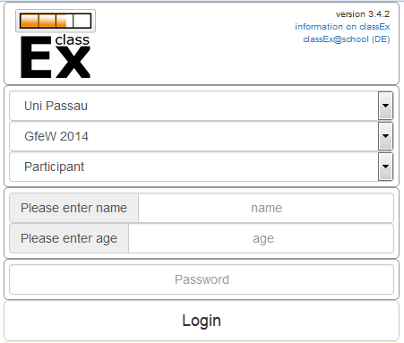

