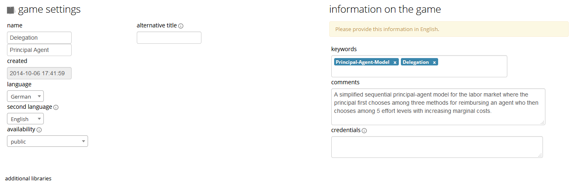
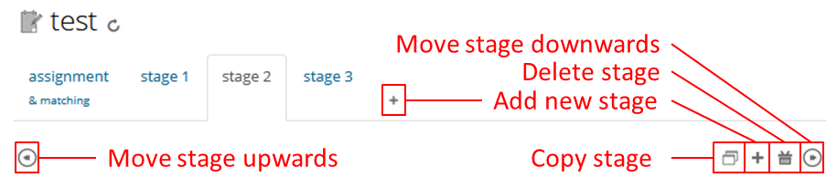
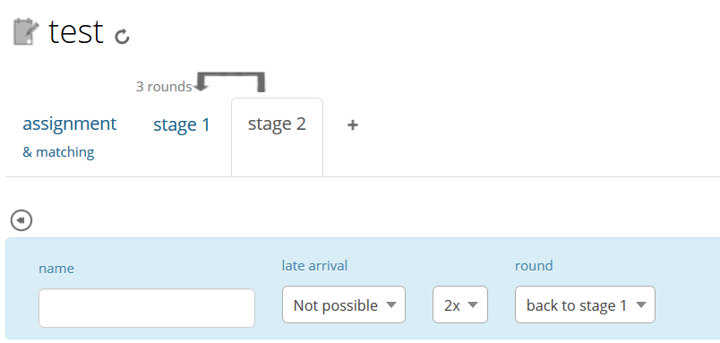
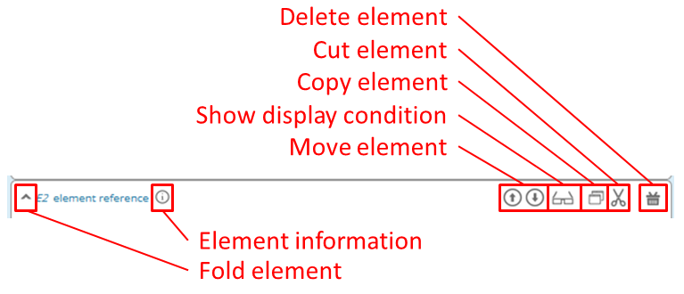
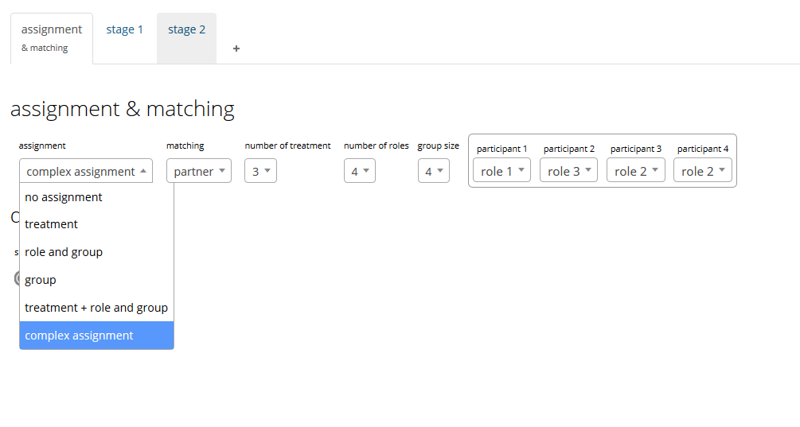
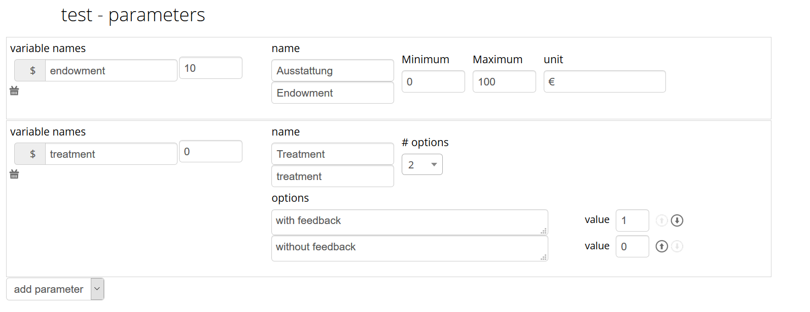
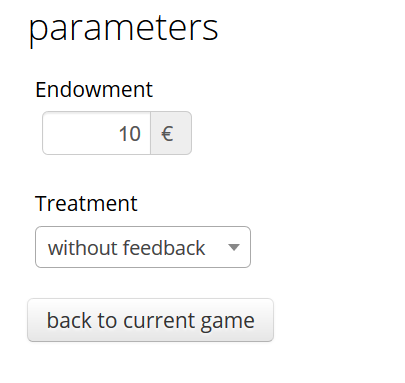

.. _develop:

======================
Develop your own games
======================

In the following three chapters of this documentation you will learn how to design and implement your own games. The chapter "Develop your own games" will start with the basic functions of the editing mode and explains some patterns every game in classEx follows - like the way participants are assigned and matched when the game starts. The chapter "Elements" explains all different elements you can use to build up your own game. To avoid that experimenters have to learn a lot of programming, classEx games are designed modular. Thus every element is like a brick you need to construct your game. The last chapter "Programming" shows how to create more powerful, dynamic games by combining already existing elements with some PHP programming.

To develop your own games in classEx change to the editing |pic_editmode|. In the editing mode, you can create games according to your own needs. Games can be clicked together with an easy-to-use modular backend system. You divide your game in stages and you can add different elements (input, output, calculation,...) for your games.

	.. note:: In the editing mode, changes are stored automatically. If you change an element of your game and click next to the element, the element is stored. Most of the elements blink green when they are stored. 

	.. note:: If a game has already been played by at least 10 participants, it cannot be adapted any more. The same applies if the game was created by another person. You can, however, copy the game and then adapt it.

.. |pic_editmode| image:: _static/pic/editMode.png
   :width: 15px

Settings in the top bar
============================

The top bar in the editing mode looks like this:

It provides you with several options which are described below.

Select game
~~~~~~~~~~~~

.. image:: _static/Selectgame.JPG
    :alt:  300px

Click on the button in the left corner to open the drop down list of your existing games. Clicking on a game will open the selected game in the editing mode. If you open the editing mode, the currently running game is preselected.

Game
~~~~~

By clicking on *game*, a dropdown menu will open, which shows up to four possible options. The number of options is reduced if you do not own the game. Then, e.g. you cannot delete the game.

.. image:: _static/Game.JPG
    :alt:  300px

Game settings
--------------
Clicking on game settings, a new screen appears. On this screen you can change different settings of the game. You can also access this screen from the overview by clicking on the |pic_setting| symbol next to the name of a game. Changes to any field are again saved automatically. 

Name of the game
	First of all, you can specify the name of the game. If your game is available in different languages, you have to provide a translation of the title as well. 

Alternative title
	You can also define an alternative title which is displayed instead of the name wherever the game is listed in your own account. Other users will see the original name of the game and not the alternative title.
	.. note:: This features is useful if you imported a game, which has the same name as one of your games. Then you can use the alternative title to distinguish from your game, because you cannot change the original name of the game which belongs to another user.

Creation date
	The created field shows the creation date of the game, which is not editable. 

Language
	For each game, you can specify a primary language and optionally a second language. If you add a second language all text fields will be shown twice for both languages.

	.. note:: If a text field misses the multi-language feature, you can input the text in both languages separated with $$. One exemple would be: Please decide now$$Bitte entscheide jetzt. 

	.. note:: classEx always chooses automatically which language to use based on the account language. If the game is available in the account language it uses this language. Then it tries to find an English version. Otherwise it displays the available language.

Availability
	You can specify whether you would like a game and its results to be public or not. By default, all games (and their results) are public. You can set a game (and its results) to private or you can set only the results to private and the game to public. In the latter case, other experimenters can still copy your game, but they do not see previous results by you. If you decide to set games or results to public they become subject to a creative commons license as described in the `terms of use`_. You can change the setting of public and private also in the overview by clicking on |pic_private| for private or |pic_public| for public next to the name of the game. The option to set only the game public, but results private is not available there.

	If you set your game public, it can be found in the :ref:`Organize:Repository`  and others can play and copy the game. If you set your game private, it is not listed in the repository anymore, but previous made copies of your game will remain with their owners and are not revoked.

Additional libraries
	If you click on *additonal libraries* new settings appear. You can select to load different libraries for the participants. Libraries are packages for special usages. They come with an increased necessity to load data from the server (for each participants). Therefore, you should only turn them on if you need them. For lecturers, they are loaded automatically.  The three available libraries are `plotly`_ or `highcharts`_ for drawing graphs on the participant screen. The library `phaser`_ can be used for creating game-like interactions. For more information visit the respective website of the library by clicking on the library's name.

.. _terms of use: https://classEx.de/TermsOfUse.pdf
.. _plotly: https://plot.ly
.. _highcharts: https://www.highcharts.com
.. _phaser: https://phaser.io

Information on the game
------------------------

Here you can classify your game and provide meta-information on the content. This information can be accessed by other users and provides them with more details on your game. Please provide this information in English.

.. note:: classEx promotes the idea of sharing games. Therefore, it is important to provide meta-information on games so that they can be found easily. Another advantage is that you can transfer your meta-information directly to the data-repository :ref:`Run:Data`.

Keywords
	You can provide a set of keywords to better describe your game. Many standard keywords on typical games are offered automatically when typing in some characters. Keywords are shown in the repository.

Comments
	In the comments section, you can provide a brief description of your game. Comments are shown in the repository and if others import your games to their account, it is shown in their overview.

Credentials
	This field can be used to state a reference or source of your game. This will be shown in the repository and displayed in the lecture mode below the title of the game.

	.. |pic_setting| image:: _static/pic/setting.png
                            :width: 15px
	.. |pic_public| image:: _static/pic/public.png
							:width: 15px
	.. |pic_private| image:: _static/pic/private.png
							:width: 15px

Copy game
----------
If you click on *copy game*, the currently selected game is copied and can then be edited and adapted. 

.. note:: The difference between copying and importing is that with the latter classEx only sets a reference to the original game. Therefore, it cannot be modified, but only used. A copied game, instead, is a complete copy of the original game and can be changed.

Delete game
------------
By clicking on *delete game*, the currently selected game is deleted. For your safety, you will be asked if you really want to delete the game. It is not possible to delete the game if it has already been started in the lecture mode. You then need to start a different game in the lecture mode before being able to delete the selected one. You cannot undo the deletion of a game.

.. note:: If it happens that you accidentally delete a game, please email to classEx@uni-passau.de as soon as possible. Internally, we completely remove deleted games only each month so that recovery is possible.

New game
---------
Clicking on *new game* creates a new game. A standard new game is always a single-choice question with four possible answers. Before you can edit the game, classEx takes you to the :ref:`Develop:Game settings` of the created game were you have to provide a title. You have to select a language and to choose whether the game should be public or private. Once you are done, click on *save* to create the game. classEx automatically takes you to editing mode where you can proceed designing the game.

Parameter
~~~~~~~~~~
If you click on parameters, you can edit the parameters of a game. Parameters are global variables that can be changed right before starting a game. They allow other lecturers to run your game without changing the implementation of the game. More information can be found under :ref:`Develop:Parameters`.

Test a game
============

Before actually using a game in your lecture or while you develop, you can always test a game. To do so switch to the lecture mode and select your game, if it is not selected yet. 

Next, open as many test participant as you need for testing your game by clicking on the *add test participant* icon |pic_testparticipant|. This opens a participant screen in a new tab. You will see the game just as your subjects will see it when actually playing the game. You can open as many test participants as you want, which enables you to also test interaction between participants.

.. note:: You can open multiple test participants by holing the Ctrl-Key and clicking multiple times on the test participant icon |pic_testparticipant|. 

Then start your game. You can perform the interaction required in the browser tabs for each participant and you can see how your game is running. 

.. note:: Test participants are not reload-safe. This means that if you reload the page, in some cases the content of the page may change. Real participants cannot do this.

If something is not working, go back to the editing mode and check your settings there. If you used variables and programs, you can use the :ref:`Programming:Diagnosis tool` for error spotting. The diagnosis mode shows all available variables and helps to debug them.

.. note:: All major browsers also provide their own development tools which can be very helpful for error spotting. They provide a console which gives feedback on potential errors. In this console, you can also observe the background task performed by classEx and if they are running correctly. Finally it allows you to see javascript errors. In Firefox, the development tools are started by hitting F12.

.. |pic_testparticipant| image:: _static/pic/addPlayer.png
   :width: 15px

.. |pic_paste1| image:: _static/pic/paste.png
	:width: 15px
.. |pic_paste2| image:: _static/pic/undo.png
	:width: 15px

Define Stages
=============

Stages are points of synchronization in a game. Synchronization means that for the next stage to begin, all elements of the previous stage must have been finalized. Generally, the input phase is one stage and the results phase is a different stage, as the output can only be displayed after all participants have entered their input. Stages are ordered in tabs in a horizontal way in classEx. The first tab is not a stage - it shows the options for :ref:`Develop:Assignment and Matching` of roles, treatments and groups. 

Name of a stage
~~~~~~~~~~~~~~~~

You can choose to give the stages names instead of numbers in order to identify them more easily. To give them a name, simply enter it in the box. The name is then display below the stage number in the tab.

.. note:: classEx stores stages internally with a unique ID (which has between 4-6 digits) and neither with the name of the stage nor the number of the stage within the game (stage 1, stage 2,...). If you want to get the unique ID just hover over the stage tab and the unique ID will be displayed. This may be useful if you want to compare e.g. results from the excel sheet (see :ref:`Run:Data`.

Rounds
~~~~~~

If you want to run one or more stages more than once, you can define loops with a certain number of rounds. You can determine how often you would like to return to a certain stage. E.g. if you want to repeat stage 1 and 2 three times, you have to specify in stage 2 that you want to return two times (2x) back to stage 1. With this, stages 1 and 2 are repeated three times as shown by the arrow above the tabs as you go through both stages a first time and then two times back to stage 1.

If you set the number to zero times (0x) or if the stage has been run for the predetermined number of times, classEx will continue to the next regular stage.

.. note:: You should only define only one loop per game. Decisions and other variables are stored with the same variable name but with an increasing round number. 

Late arrival
~~~~~~~~~~~~

You can specify whether participants can arrive late, i.e. if they login in after the game has already started. You can choose for this to be possible, not possible, or only possible in the first round of a game.

.. note:: If you allow for late arrival in later stages, participants miss the first stages. Make sure that in this case, participants miss nothing which is necessary for later stages (e.g. declaration of variables,...). Assignment and matching is done in the first stage, so you should only allow later arrival if assignment and matching is not necessary.

.. note:: Matching is done on-the-fly. This means if a subject arrives late (only in the first stage) it will be matched according to your settings.

Move stages
~~~~~~~~~~~

When you create a new stage, this stage will automatically be defined as the next stage. You can move stages by pressing *Move stage backward* (left) or *Move stage forward* (right). The order in which stages are run is always from left to right.

Add stage
~~~~~~~~~

You can add a new stage by clicking on *Add new stage* beside the tabs displaying the different stages or on the top right of the current stage.

Copy stage
~~~~~~~~~~~

You can copy a stage including all elements and settings of this stage. If you click on copy, the paste symbol |pic_paste| will appear. The left icon |pic_paste2| can undo the copying. The right icon |pic_paste1| pastes the stage after the current stage. You can copy stages also across different games. Just copy the stage, open the new game and paste it there.

Delete stage
~~~~~~~~~~~~~
You can delete a stage by pressing *Delete stage*. Deletion can not be reversed.

Define Elements 
================

Each stage consists of one or more elements. Elements are the modules of a stage. A stage has two areas in which you can add elements: participants and lecturer.

.. image:: _static/views.PNG
    :alt:  300px
    
The left side shows the elements for the participant. Elements added here are displayed on the participants' devices. Program code (so called subjects programs) added here is run for every single participant.

The right side shows the elements for the lecturer. Elements added here are displayed on the lecturer's screen in the lecture mode. Program code (so called globals programs) added here is run once for all participants.

Some elements are the same for participants and lecturers (as e.g text boxes), but most elements are different. Typical elements for participants are input elements, program codes, text boxes and winning notifications. Typical elements for lectureres are start buttons, program codes, text boxes and many different result elements. 

.. note:: A full list of all elements can be found in the section :ref:`Elements:Elements`.

.. note:: Elements are always displayed and executed from top to bottom.

Adding elements
~~~~~~~~~~~~~~~~

You can add an element via clicking on *add element* and selecting the type of element you want to add. Note that there are different elements for lecturers and participants. After that you have to choose where you want to place the element. The paste symbol |pic_paste| will appear for every possible location of the element. Choose a location for your element by clicking on the corresponding *paste element* icon |pic_paste1| or cancel placing the icon by clicking on any *do not paste* icon |pic_paste2|. If there are no elements defined yet (for the participant or the lecturer), the element is automatically added to the first place.

Handling elements
~~~~~~~~~~~~~~~~~~

All elements share some common characteristic which are described here. The details for every element are described in the secion :ref:`Elements:Elements`.

Fold element
	Each element can be folded to save space on the screen.

Element number
	The elements are numbered (E1, E2, …). This also defines the order of display in a stage. Elements can be moved within a stage with the *move element* arrows or by cut-and-paste.

Element type and help
	Beside the number of the element, you can see the element type. Clicking on the info button next to the element type leads you to the respective description in this documentation.

Display condition
	If showing the element should be conditional (e.g. not for every role or dependent on other variables), you can specify the display condition for an element in the code line that appears when you click on *show display condition*. The code will be evaluated as being true or false. Display conditions are defined in PHP. It should only contain comparison and should *not* end with a semicolon.

	.. code:: php

		$round>2 || ($role==1 & $treatment==2)

	You can combine different combinations with the and-operator & and the or-operator ||. The example only displays the element if the round is higher than 2 (so from round 3 on) or if the role is 1 and the treatment is 2 (independent of the round).

Copy element
	You can copy an element by pressing *copy element*. Then the paste symbol appears on every possible location |pic_paste|. You can copy and paste elements across all stages of the game.

Cut element
	You can cut an element by pressing *cut element*. Then the paste symbol appears on every possible location |pic_paste|. You can copy and paste elements across all stages of the game. This can also be used to order elements instead of moving them up or down with the move element arrows.

Delete element
	You can delete the element by pressing *delete element*. You have to confirm a deletion. After that a deletion cannot be reversed.

Groups, treatments and roles boxes
	If you have defined groups, treatments or roles (more information about this in the next chapter), a box appears where you can also choose whether the element shall be displayed for all groups, treatments or roles or for special groups, treatments or roles only.

.. note:: Restricting the display and execution of elements for certain groups, treatments or roles can be both done with the boxes and with the display condition. With the boxes, you can limit the display on to one group, role or treatment. With the display condition you can combine different conditions or allow for multiple group, roles or treatments.

Assignment and Matching
=======================

Left to the tab *stage 1* you find the tab *assignment and matching*. Here, you can specify whether you want to assign participants to treatments, groups, roles or a combination of all (complex assignment). 

Normally, the total number of participants is not known prior to the start of the experiment. This requires matching-on-the-fly. After they are logged in, subjects wait in a virtual lobby. Once the experimenter starts the experiment, the assignment of roles and treatments and the matching into groups takes place. 

.. note:: The number of participants may not match the composition of groups of players that a lecturer seeks to assemble. For example, a mismatch would occur with an uneven number of participants in a game in which players must be matched into pairs of two. classEx offers different methods to deal with this. Either, decisions of other participants can be duplicated and matched to excess participants as a clone, or random decisions can be used. The experimenter can specify in the :ref:`Programming:Functions to retrieve variables` which method shall be employed. This makes sure that participants always get feedback, which can be important in order to avoid disappointing participants. As a further option, participants with no partner can be excluded from the game. Certainly, cloned or random observations may have to be deleted prior to using data for research. 

Available roles
~~~~~~~~~~~~~~~~

Up to 13 role symbols (and therefore roles) are available (and an additional gray role 0 for no role assignment). Role 1 is shown with a red figure. Role 2 is shown with a green figure and distinguishable by a different form to allow distinction for person who have red–green color blindness.

.. image:: _static/Allroles.PNG
    :alt:  300px

These roles are standardized items and are shown in the header of the participant's page. If you want to display the role figure in a text box just add role1.png to the text (for role 1). This will be replace with the respective figure. **Make sure that role1.png is followed by a space, otherwise the replacement will not work.**

Assignment at the beginning of a game
~~~~~~~~~~~~~~~~~~~~~~~~~~~~~~~~~~~~~

classEx allows you to flexibly adapt to an unknown number of participants, meaning that you choose the number of different roles, the number of treatments and the size of groups. classEx then assigns participants automatically. classEx allows lecturers to either set the size of a group (for example two for a trust game or four for a public goods game), in which case the number of groups is automatically determined at the start of the experiment. Alternatively an experimenter specifies the number of groups (for example if each plays a different treatment), in which case their size is determined automatically. Specifically, you have the following available options:

no assignment
	Participants all are assigned to role 0, treatment 0 and group 0.

treatments
	This allows you to assign participants to treatments. A division into treatments will distribute participants evenly over treatments. You can select any number of treatments between 1 and 10. Treatments will be distributed according to arrival in the experiment (e.g. with two treatments the first player will be treatment 1, the second treatment 2, the third again treatment 1,...). If you have defined groups as well, members of a group will always be assigned to the same treatment.

role and group
	This allows you to assign participants to a number of different roles in the game. Participants will be allocated to role 1, role 2, role 3... alternately. Participants will also be assigned to a group which contains one participant with each role. E.g. if you have defined 3 roles, a group will consists of role 1, role 2 and role 3. If you want to have groups with asymmetric combination of roles please use complex assignment.

group
	Allows you to assign participants to groups (all participants will have the same role 0). Groups are filled one after each other. You are free to select any group size. The number of groups is determined automatically by classEx. 

treatment + role and group
	Allows you to assign both role+group and treatments. It combines the two above options. Members of a group are always assigned to the same treatment.

complex assignment
	Allows you to assign participants to a different number of roles, treatments and groups. Again, members of a group are always assigned to the same treatment.

.. note:: The so-called between-subject design examines how a controlled variation of the game influences the behavior of different participants. This can be implemented using treatments. The groups in one treatment only interact with participants in their own treatment and never with participants of the other treatment. The game can be adapted for every treatment, for example by providing different information, altered probabilities of random events or diverse strategic interactions.

Matching
~~~~~~~~

At the beginning of a game, the assigned participants are always matched randomly to roles, treatments and groups. If your game consists of several rounds, you can specify how you want them to be rematched. You can choose from the following options:

partner
	Participants stay in the same groups and keep their roles throughout the entire game.

random
	Participants are randomly assigned to a new role, group and treatment (if specified).

.. note:: Absolute stranger matching, ensuring that participants never interact with participants they have interacted with before, is not available.

Random matching with constant roles
~~~~~~~~~~~~~~~~~~~~~~~~~~~~~~~~~~~

Random matching with constant roles means randomly matching the subjects into new groups at the beginning of each round but at the same time keeping the subject's roles constant. This is not provided as an option but can be implemented manually as follows.

1. The assignment selected must be "role and group". The matching method selected should be "partner".

2. You need to add a globals program in the lecturer field in the first repeated stage of your experiment and a subjects program in the participants field.

3. Insert the following code in the globals program:

.. code:: php

	# This gives an array with the internal participant ID and the role
	$rolesarray = $getRoles();
	# Shuffle rolesarray
	$keys = array_keys($rolesarray);
	shuffle($keys);
	foreach($keys as $internalplayerid) { #Note that $key are the values!!!
	$new[$internalplayerid] = $rolesarray[$internalplayerid];
	}
	$rolesarray = $new; #$rolesarray is now shuffled but with the initial key-value pairs
	# Create new groups
	$numberofroles = max($rolesarray);
	for ($i = 1; $i <= $numberofroles; $i++) {
  	$count[$i] = 1; #Initializing group count per role array
	}
	foreach ($rolesarray as $key => $values){ #Looks at every subject in new (shuffled) order
  	for ($i = 1; $i <= $numberofroles; $i++) { #Tries every role
    	if ($values == $i) { #If role fits
    	${"group_$key"} = $count[$i]; #Group assignment to group count
    	$count[$i] = $count[$i]+1; #Increase group count for the role
	}}}

4. Insert the following code in the subjects program:

.. code:: php

	/* saves the value of the "group_[id]" variable 
	created in the globals program as new value of "group"*/

	$save("group", ${"group_$id"}); 

Further settings
----------------

On the page *assignment and matching* you can further choose if the role should be displayed in the header of the participants page and if the internal ID of the participant should be displayed there as well.

Parameters
==========

Parameters are global variables that can be adjusted in the lecture mode directly before starting an experiment. You can define parameters to enable adaptation of the game for lecturers without any knowledge of how to edit games. You can then play the same game several times with different parameters. This feature is very useful if you want to introduce some flexibility in the game.

.. note:: Parameters are initialized at the start of the game. They are read-only. They are the same for all participants.

You can define parameters by clicking on the *parameter* button in the top bar of the editing mode. Here you can see all defined parameters for the active game, edit them and add new ones. After adding a parameter, you can use it as global variable in the whole game. 

In the editing mode, parameters and their values are shown in the top right corner (if defined). If you display old results in the lecture mode, parameters are shown there as well. 

Here is an example with a numeric parameter and a select list.

For *numeric parameters*, you have to define a variable name (here $endowment) and a default value. The default value is used, if the lecturer does not change the parameter. On the right hand side, you can define how the parameters are displayed to the lecturer (when they set the parameters in the lecture mode). They should not be bothered with variable names, therefore providing an easy name is useful. If the game is implemented in two languages, you can provide two different names. Additionally, you have to provide a minimum and maximum. You can also provide a unit (e.g. €, meters,...). 

For *select lists*, you have to define a variable name and default value as well. Also a name is required. For *options* you can specify a label and a respective value.

In the lecture mode, the lecturer can then set the endowment and choose from different treatment options as shown in the figure above.

Languages 
=========

If you defined a second language in the game settings, all text fields show up twice so that you can enter the text in the two different languages, here German and English.

.. image:: _static/Language.PNG
    :alt:  300p

To display only one language in the editing mode, you can click on the flag symbols next to the game name. Then all fields with the respective language are hidden. Note that this does not mean that the language is deactived when the game is played, but only that you can hide some fields while implementing the game.

.. image:: _static/Languageonoff.PNG
    :alt:  300p

For other elements, this function has not been implemented yet. In this case, you need to enter both languages in one text box, separated by $$, for more information see :ref:`Elements:Text box`. 

