.. _Elements:

=========
Elements
=========

Elements for lecturers and participants
=======================================

Text box
~~~~~~~~~

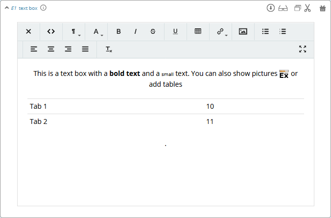
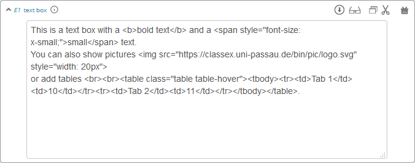

The text box is the simplest element. The entered text will be displayed to the participants or a the lecturer screen depending where you place the element. The text box is equipped with a WYSIWG editor which allows you to insert tables, symbols etc. If you double-click into the text element, the WYSIWG editor opens (see left figure). You can switch back to the normal text box by clicking on the **<>** symbol (see right figure). 

If you are not in the WYSIWG editor, you can use standard HTML to design your texts. You can do e.g. the following:

.. code:: html

	This is a text box with a <b>bold text</b> and a small text.
	
	You can also show pictures 
	or add tables   

	<table class="table table-hover"><tbody>
		<tr><td>Tab 1</td><td>10</td></tr>
		<tr><td>Tab 2</td><td>11</td></tr>
	</tbody></table>.

Special Characters
-------------------

=========== ============== ===============
Special     Name 		   Function Example
=========== ============== ===============
role1.png   Symbol Role 1  Red participant symbol |pic_role1| is displayed. 
role2.png   Symbol Role 2  Green participant symbol |pic_role2| is displayed.
$variable;  Variables      Beside normal text, you can also insert variables into the text box. 
=========== ============== ===============

If you have defined variables (see :ref:`Programming:Programming`), you can have these displayed by inserting the character "$", the variable name followed by ";". Make sure not to forget the ";" at the end! Variables and normal text can be combined.

Make sure that role1.png, role2.png,... are followed by a space. Otherwise the figure will not be replaced.

.. |pic_role1| image:: _static/pic/role1.PNG
	:width: 15px
.. |pic_role2| image:: _static/pic/role2.PNG
	:width: 15px

Conditional text
-----------------

So far we have only tackled how to read the PHP variables and display them in he text field (e.g. $variable;), but sometimes we would like to display conditional text. For example we might have a variable that tells whether a participant is buyer or seller. We can achieve this task by a program element where you define:

.. code:: php

	if ($isBuyer) $buyerText="You are buyer"; else $buyerText="You are seller";

Then you can enter and output $buyerText; in the text box.

Element Reference
~~~~~~~~~~~~~~~~~

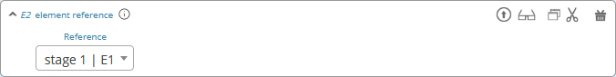

In order to avoid redundancies, you can reference elements and add them in a different place in the game (instead of copying them directly). This place has to be after or in the same stage as the original element is. For this, you can use the reference element. If the original element is altered, the reference is adapted automatically. The reference is created by selecting the stage number and the element number you are referring to. 

.. note:: If you require the same text in two stages, for example, an element reference is a far more elegant version than a simple copy because any changes to the original element are adopted automatically. Also a reference objects in a participant field can just link to another participant opject (the same principle holds for the lecturer fields).

.. note:: Please notice that the display condition is not taken from the referenced element but  from the reference itself.

.. warning:: If you change the order of referenced elements, the reference does not automatically adapt, but has to be changed manually.

Program code
~~~~~~~~~~~~

Program snippets can be implemented to calculate results for each subjects. For further information see :ref:`Programming:Programming`.

.. image:: _static/program.png
.. role:: php(code)
   :language: php

Elements for participants
==========================

Input element
~~~~~~~~~~~~~

In this element, you can insert several input fields. These are numbered #1, #2, …. You can add input fields by clicking on *add new input field*. The input fields are displayed one after each other. Input elements always provide a submit button automatically. In the following, the different types of input fields are described in more detail.

The following settings are available for every input field: 

type of input field
	The type of input specifies how input should be taken by the input field, like numeric input, discrete choice, sliders, ...

variable name 
	The variable name is the identifier of the decision input. The variable is automatically stored in the subjects table. The variable name can then be used in programs. For example, if your variable is called $e, you can access it by writing "$e;" in a text box or use :php:`$e` in a program element. 

Furthermore, you can delete an input field by clicking on |pic_delete| or provide a display condition by clicking on |pic_display|. Display conditions are defined in the same way as for elements (see :ref:`Develop:Handling elements`).

.. |pic_delete| image:: _static/pic/reject.png
				:width: 15px

.. |pic_display| image:: _static/pic/show.png
				:width: 15px

.. warning:: Please notice that only one input element is allowed per stage. For several inputs add additional input fields to the first input element.

.. note:: In all input fields, you can also use variables instead of numbers or text. This can e.g. be useful if you want to set a maximum depending on a variable :php:`$x`. Just enter $x; in the maximum field. This holds true for other fields as well.

Numeric input field
--------------------

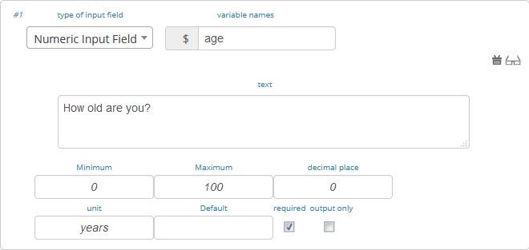
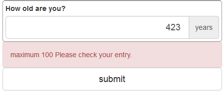

The numeric input stores numeric input by participants and provides a basic check (minimum, maximum). It automatically rounds the input to a given decimal place and allows for input of digits with as :php:`2.34` or :php:`2,34`. classEx also automatically changes the input to numeric on mobile devices and shows the correct keyboard.

text
	The text is displayed on top of the input field. 

minimum
	The minimum specifies the minimal value. If the participant enters a value below the minimum a warning is displayed and he or she cannot proceed.

maximum
	The maximum specifies the maximal value. If the participant enters a value above the maximum a warning is displayed and he or she cannot proceed. (see figure)

decimal place
	The number of decimal places. classEx automatically rounds accordingly.

unit
	A unit (e.g. %, €, mm, …) can be specified that will be displayed on the right of the input field (here "years").

default
	A default value that is displayed to participants at the start. 

required
	This determines whether input is mandatory. In this case, participants cannot proceed without entering a value. 

output only
	This means that the field is read-only. Still, the value of the field is stored as normal variable. It can e.g. be used to provide :ref:`Programming:Live feedback on input` with javascript.

Buttons, simple list and drop list (single choice)
----------------------------------------------------

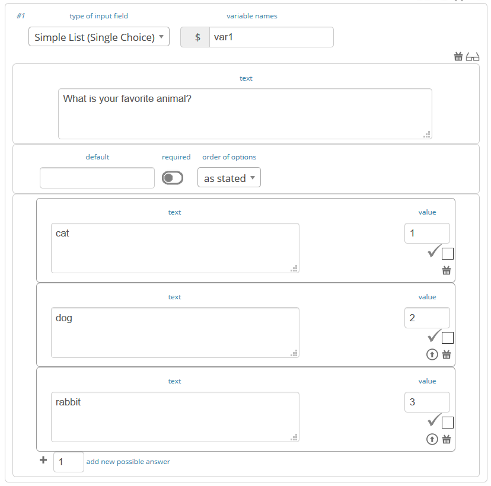

Those three types of input fields are used for discrete decisions. You can implement single choice questions using buttons (first figure below), simple lists (second figure) or drop lists (third figure). This is what they look like in the participants' display. The settings are the same for these input fields.

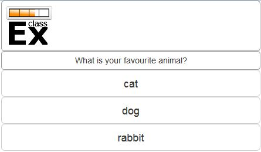
.. image:: _static/ButtonsAndSelection2.JPG
    :width: 30%
.. image:: _static/ButtonsAndSelection4.JPG
     :width: 30%

text
	The text is displayed on top of the input field. 

default
	The default value is pre-marked at the start. For buttons it is highlighted with a color. For drop lists it is preselected.

required
	This determines whether input is mandatory. In this case, participants cannot proceed before making a choice.

order of options
	The order of options can be set to *as stated* or to *random*. In the latter case, the random order is determined separately for each participant.

options
	Options can be defined in the lower area of the element. Participants make a decision by choosing one of the options. The order of options can be altered by clicking on the arrow. You can also delete or add options. 

	Options come with a displayed text and with a value. The value is stored in the data and as variable.

	You can mark the correct answer by clicking on the symbol |pic_check.png|. In this case, if you use the single/multiple choice result element for the lecturer, the correct answer is marked there.

.. |pic_check.png| image:: _static/elements/check.png.PNG 
	:width: 15px

Checkboxes (multiple choice)
------------------------------

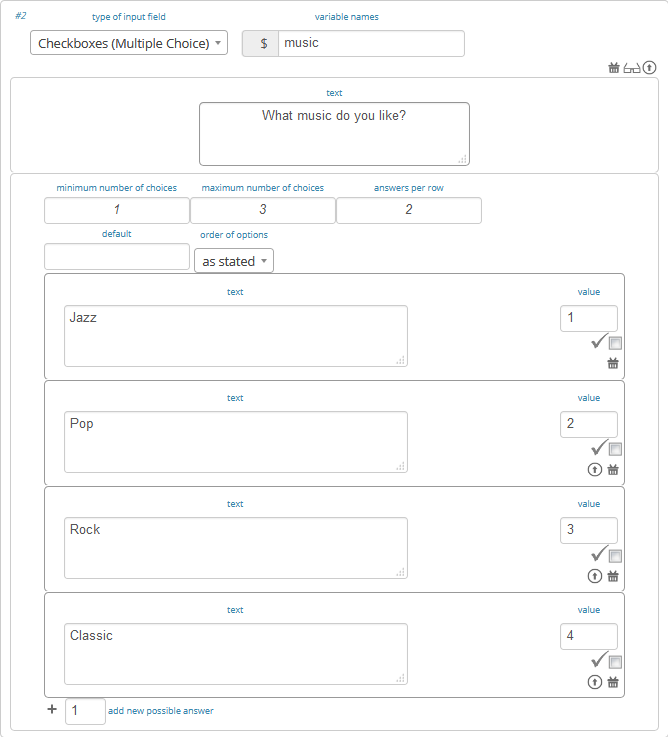
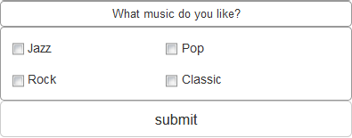

Choosing multiple options is possible by using checkboxes. Checkboxes work in exactly the same way as single choice options shown above. Only the form of display is slightly different, as these are displayed as a list from which participants can pick several options. This way, multiple inputs can occur in one stage. Additionally to the single choice, you can specify the following settings:

minimum and maximum number of choices and 
	This restricts how many options can be picked by the participant.

number of answers per row
	This states how many options are displayed in each row (here 2).

.. important:: Multiple choice inputs are stored separated with :php:`_`, e.g. :php:`2_3` if options with value 2 and 3 were selected. If you specify a default, please specify it accordingly. 

Radioline
---------

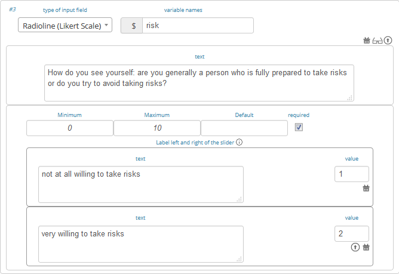
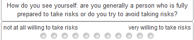

Radiolines, like Likert scales, offer stepwise input. Settings are

minimum and maximum
	The first bullet of the slider is the minimum value, the last the maximum values. For each bullet the value increases by one. In the example, a minimum of 0 and a maximum of 10 give 11 input possibilities.

default
	The default value is pre-marked at the start.

required
	This determines whether input is mandatory. In this case, participants cannot proceed before making a choice.

label left and right of the slider
	You can add a label on the left and the right of the slider. Note that the values stated next to the labels are not used in the radioline.

Slider
------

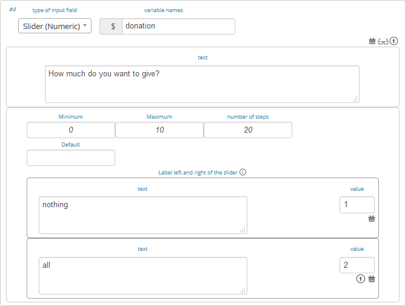
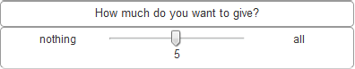

Sliders are a similar concept to radiolines. In this form of input, the participant moves a slider along a bar of predetermined positions. 

minimum and maximum
	The minimum and maximum determine the range of the slider.

number of steps
	The number of steps determines to how many position the slider can be moved. In the example, 20 steps between 0 and 10 mean that each step increase by 0.5. 

default
	The default value is pre-marked at the start. If no default is set, the slider is positioned in the middle of the range.

label left and right of the slider
	You can add a label on the left and the right of the slider. Note that the values stated next to the labels are not used in the radioline.

Text input
----------

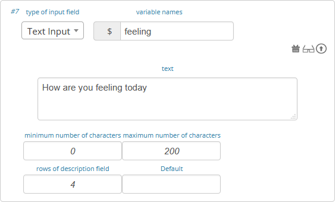
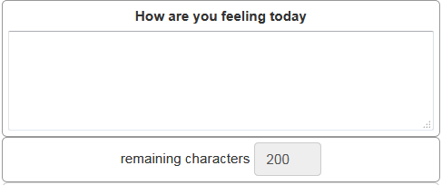

Text input fields allow participants to enter a text. If a maximum is specified, it shows the number of remaining characters. 

minimum and maximum number of characters
	This limits the amount of characters which can be written by participants.

default
	The default value is written in the text input field.

number of rows 
	This determines the height of the text input field.

Hidden field
-------------

The hidden fields allows to save values. The only setting is to provide a default.

Next button
------------

The next button allows to add an additional button. Note that classEx normally provides buttons automatically. This may be useful, if you have no input but only a button. The only setting is the label of the button.

Other input fields
------------------

There are other input fields available (urn, infotext, mean of all input fields). Those are outdated and should only be used with care.

The contract input field is also outdated. Please use the `Contract`_ element instead.

Additional settings
-------------------

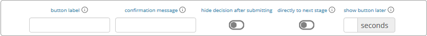

At the bottom of each input element you can find additional settings which open by clicking on *additional settings*.

button label
	Here you can specify the label of the button. The default is "Submit". This button label is only used, if there is an own button for submitting your decision. E.g. in *Buttons (single choice)* buttons are labeled with the possible answers the editor inserted.

confirmation message
	If you enter a text here, participants are asked for confirmation before submitting. E.g. you can enter "Are you sure?" which is then displayed together with an OK button to participants.

hide decision after submitting
	After submitting, participants see a confirmation message and their input. If you switch this setting on, the input is not displayed anymore after submitting.

directly to next stage
	Normally participants are moved to the next stage by the experimenter (see `Start button and automatic start`_). If participants play individually and this settings is switched on, they move autonomously to the next stage. In this case, you have to select *no forwarding* if you use an automatic start.

show button later
	The appearance of the buttons can be delayed, e.g. if you want participants not to click too fast.

Winner's Notification
~~~~~~~~~~~~~~~~~~~~~

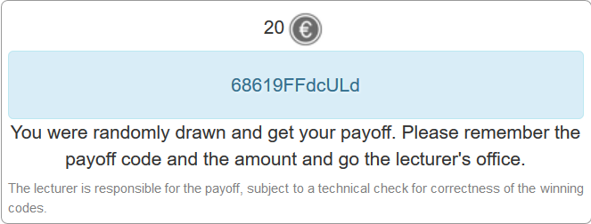

If a game is played with real payoffs, this element displays the payoff code to participants and the respective payoff. The payoff can be a number or also a text (e.g. two tickets for the theater). The element automatically provides a legal disclaimer. The payoff notice can be changed.  

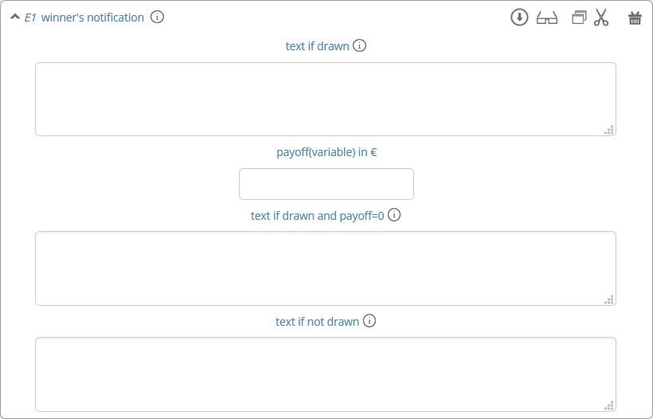

A winning notification is necessary for games with monetary payoff. The participants who are randomly drawn receive a winning notification as well as a code to cash in their earnings. 

payoff(variable) in €
	The amount of earnings can be determined by this setting. You can enter a fixed amount or you can enter a variable that is calculated beforehand. If, for example, the variable :php:`$payoff` is calculated in a program during the game, you can enter :php:`$payoff;` in the earnings field.

text if drawn
	The default text is: You were randomly drawn and get your payoff. Please remember the payoff code and the amount and go the lecturer's office.

text if not drawn
	The default text is: You were not randomly drawn to be paid out.

text if drawn and payoff = 0
	The default text is: You were randomly drawn, but your payoff is X. It is therefore not paid out.

.. important:: The winning notification can only be displayed if you also define a `Winner's draw`_ on the lecturer side. Otherwise no winner can be determined. Winners are always drawn with a lecturer element.

Contract
~~~~~~~~

With this element, you can enable participants to conclude contracts. By adjusting the settings, you can customize the contract to your needs. Contracts can be used to trade a commodity between subjects in real time. Subjects move around in the classroom and talk to each other. When they agreed on a price, they enter it into the input mask together with the signature of the counterpart (see seller screen). The counterpart has to accept the trade (or reject it, see buyer screen).

**The screen for the seller**
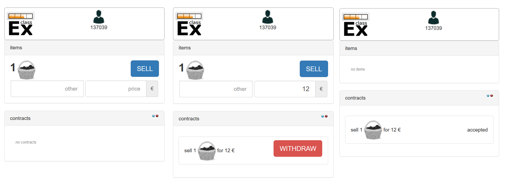

**The screen for the buyer**
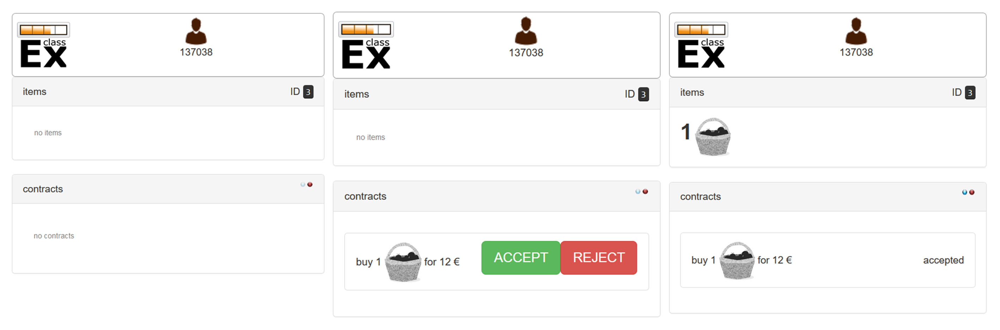

The contracts made can be shown at the lecturer's screen with the `Contract table`_. In addition, there are special functions in globals and subjects programs to retrieve contracts (see :ref:`Programming:Programming`). All contracts are also stored in the standard excel file which can be retrieved in the data menu (see :ref:`Run:Data`). 

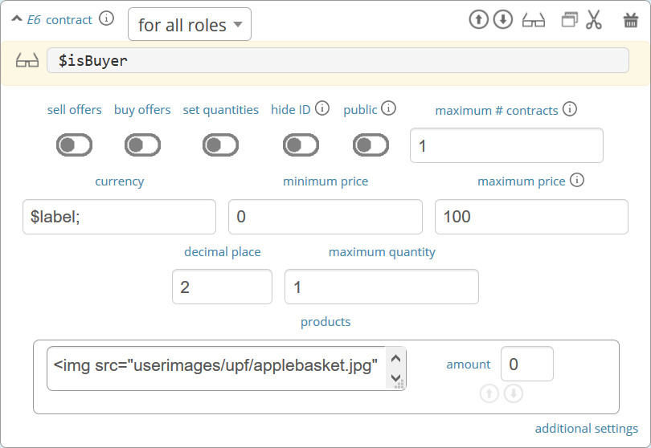

Contracts can be set up by adding contract elements **both for buyers and sellers**. 

sell offers/buy offers
	If you turn this on, you allow for sell or buy offers made by the respective subject.

set quantities
	Allows to set quantities (otherwise quantity is always 1). With quantities, prices are set as price/unit.

hide ID
	allows to disable the ID. The ID is needed for sell and buy offers to be send to a specific person. E.g. if the buyer can make buy offers, she needs the ID of the seller to send the offer to.

	.. note:: Contract elements use the subject ID as ID for trading (because it is very short). But contracts are stored with the internal participant ID.

public
	If you activate this, offers are made to all other subjects who can accept them. This feature is still in a beta version. So test it with care.

max # contracts
	Maximum number of (accepted) contracts limits how many contracts can be made by a subject.

currency/min price/max price/decimal place
	Currency of the prices and minimum, maximum and decimal places can be specified here.

maximum quantity
	Maximum quantity a subject is allowed to possess. Limits how many items can be bought.

products
	You can specify a name (or a small image) and the initial amount of the good (e.g. the seller has 1 unit, the buyer 0 units).

By clicking on additional settings, further advanced settings can be adjusted.

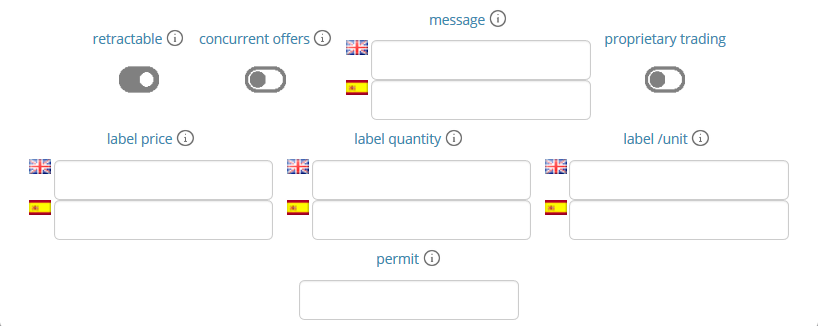

retractable
	This determines if an offer can be withdrawn or not. The default is that offers can be withdrawn.
	
concurrent offers
	In case of public offers, this determines if more offers can be made at the same time. Note that this is only checked for the respective contract element. If you provide more contract elements to the same persons the check is only made for each contract element.

message
	You can provide a static message (e.g. about the buyer type) with the contract.

proprietary trading
	This allows to sell to or buy from yourself.

label price
	The label price can be changed, e.g. to wage. The label is shown in the price field if the field is empty.

label quantity
	The label quantity can be changed, e.g. to hours. The label is shown in the quantity field if the field is empty.

label /unit
	The label /unit can be changed, e.g. to /hour. The label is shown at the price input field.

permit
	If you enter a text or a number here, contracts can only be concluded if you enter the number.

Payoff matrix game
~~~~~~~~~~~~~~~~~~

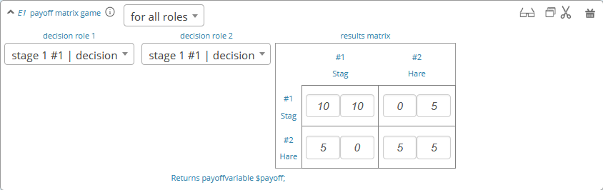
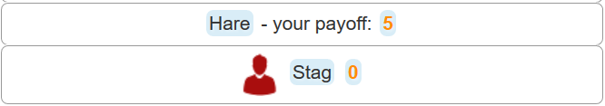

This element helps display the payoff from a two role game easily. This provides a simplification instead of using subjects programs to retrieve the other participant's value and to calculate payoffs. The same can be achieved with text boxes and subjects programs.

decision role 1 and role 2
	You need to specify which input field contains the decision of the respective participant for the row participant and for the column participant. The labels of the payoff matrix are determined by the specified input fields. 

results matrix
	In the table, you enter the payoff for the row participant first followed by the payoff for the column participant. The payoff is stored as variable $payoff; which can then be used for the winning notification or further calculations.

Camera
~~~~~~

.. image:: _static/Camera1.PNG
    :width: 49%
.. image:: _static/Camera2.PNG
    :width: 30%

With this element, you can enable participants take a picture of themselves.

variable
	The variable name, under which the picture is stored, has to be defined. 

allow retake
	Additionally, you can define if participants are allowed to retake a picture. Then only the last picture taken is saved.

.. note:: Informed Consent: Participants are asked by the browser if the browser can access the webcam or not. Please make participants aware that they do not have to take a picture and ask them for their consent.

Retrieving Pictures
-------------------
Pictures can be retrieved in the following ways:

At the participant' screen
	You can use the normal variable notation ($image;) to display pictures in text boxes.

At the lecturer screen
	You can use :php:`$getValues(...)` to retrieve the pictures of all participants and display them (see :ref:`Programming:Functions`).

From the stored data
	In the downloaded data you find stored images in the subjects table. They are base64 decoded and can be encoded with free online tools. Just take away "data:image/jpeg;base64," from the string, so that it starts e.g. with "/9j/....".

Javascript program
~~~~~~~~~~~~~~~~~~~

You can also add small javascript programs to the participant screen. More information can be found at :ref:`Programming:Javascript`.

Filled in form 
~~~~~~~~~~~~~~

This element allows you to display the filled in input element of the previous stage. This element is outdated and should only be used with care.

Elements for lecturers
======================

Start button and automatic start
~~~~~~~~~~~~~~~~~~~~~~~~~~~~~~~~

The start button is used to initiate a stage. 

.. important:: Each stage requires a start button or an automatic start. If stages have result elements, this is not true as result elements automatically provide a button to start the stage (if not other button is defined).

There are two alternatives. A start button which has to be clicked by the experimenter or an automatic start.

Start button
------------

.. image:: _static/elements/startbutton.png
    :width: 70%

The start buttons allows to start stages of a game. It is marked in blue and clearly visible to ease guidance for the lecturer. Before the start of the first stage it additionally states the number of logged in participants (here: 1). 

.. image:: _static/elements/startbutton2.png
    :width: 70%

After pressing the start button, the stage is started, the button disappears and a counter is shown which counts the number of participants in that stage. In the example it means that there are no red participants (0/0) and one green participant who finished the stage (1/1). Counting can done over all, by role, group or treatment.

The start button can be configured according to the own needs. 

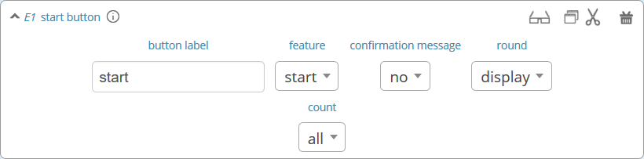

button label
	You can name the button (e.g. Start Trade).
feature
	Instead of starting the current stage, you can also use the start button to jump to different stages. 
confirmation message
	You can set if a pop-up should appear after clicking to confirm the action. 
round
	You can set if the current round number should be displayed or not.
count
	You can set the counter which appears after the start button is clicked. It can count decisions (also by role, treatment or group if set). 

Automatic start
---------------

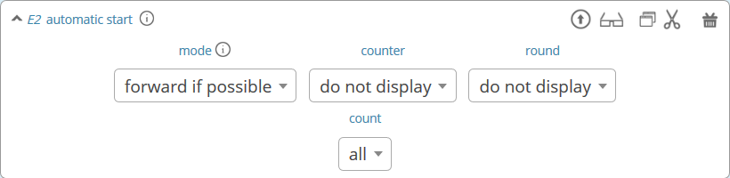

The automatic start button allows you to start stages when subjects finished the previous stage. With this feature, they can move through the game autonomously. 

.. important:: With an automatic start, classEx runs a script which is executed every 5 seconds to push finished participants forward. This only works if the lecture mode is open. If the lecture mode is not open, participants are not forwarded.

mode
	The mode can be set to:

	- start if possible: If a subjects finishes the previous stage, it is forwarded to the next stage.
	- wait for all: Subjects are only forwarded if everyone in the group is done with the previous stage.
	- no forwarding: Subjects are not forwarded (This feature is only used if subjects forward them self by clicking on a button. This can be set in additional settings of the input element).
counter
	Setting this additionally allows you to deactivate the counter completely.
round
	You can set if the current round number should be displayed or not.
count
	You can set the counter which appears after the start button of the previous stage is clicked. It can count decisions (also by role, treatment or group if set).

Winner's draw
~~~~~~~~~~~~~

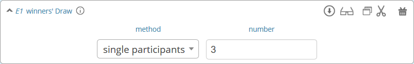

This element should be implemented in the last stage and draws a winner among all participants. The earnings have to be calculated individually on the participant side (see `Winner's notification`_ for participants). You should draw winners only once in a game as the payoff codes do not distinguish between rounds.

method
	You can determine whether single participants or coupled participants shall be drawn. Drawing coupled participants only makes sense if you have defined roles. For games with two roles it is advisable to draw coupled participants as winners because the possibility that only one of the two participants could be drawn might overshadow considerations of fairness or reciprocity. 

number
	You can also decide how many participants or groups you want to draw.

.. important:: Payoffs per game are restricted to 100€ per default. If you need higher payoffs, you have to overwrite the variable $maxWin in a global program (e.g. :php:`$maxWin=1000;`).

.. note:: Experience has shown that earnings of less than 5€ are usually not cashed in. Therefore, games should be calibrated in a way that ensures that earnings are at least 10€.

.. important:: Winners are only drawn from participants who made a decision to avoid inactive participants to be drawn. Therefore it does not make any sense to put the winners' draw in the first stage.

Lecturer discrete choice
~~~~~~~~~~~~~~~~~~~~~~~~~

With this element the lecturer/experimenter can make decisions for all participants during the game, e.g. tossing a coin in front of the class and entering the value in classEx so that payoffs can be calculated based on the coin toss.

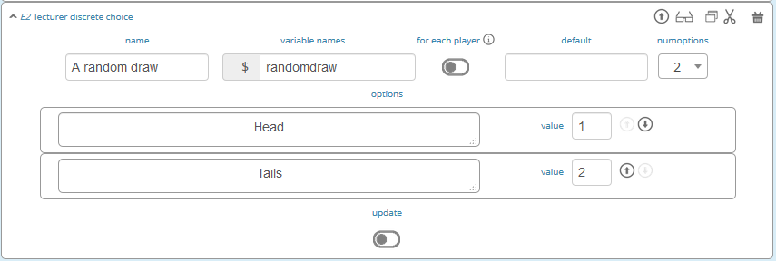

name
	This name will be displayed on the screen to identify the input button.

variable name
	The value will be saved under this name as a global variable and can be retrieved by that name.

for each participant
	If you switch this on, you can set the value for each participant separately. The value will be stored as a global variable in an array with the participant ID as index.

default
	You can set a default.

options
	You can specify options with different values.

update
	If you switch on the update, the element will check every two second if new participants arrived (only necessary when you switched on "for each participant").

Contract table
~~~~~~~~~~~~~~

With this element, all contracts that were concluded by participants as well as a chart and the average are displayed on the lecturer's screen. In the contract table, you have several tabs where you can switch between. You can see them in the figures below. 

The first tab lists the contracts for each round separately. If set, you can also display seller costs and buyer values along with the contract.

.. note:: The combination of session and round is a special feature in some games (apple market, fish market, ...). Normally, classEx only knows rounds.

.. image:: _static/Ctable4.PNG
    :alt:  300p

The tab *on average* provides summary statistics for each round (mean, median, min, max, std dev).

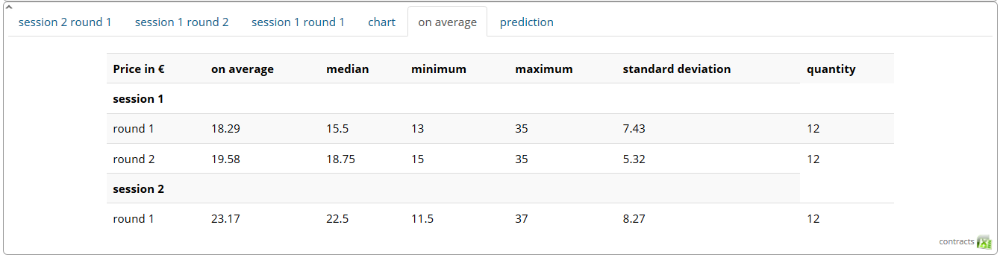

The tab *chart*	shows contracts made over time. In case of different quantities, it also shows a bubble chart for the combination of quantities and prices.

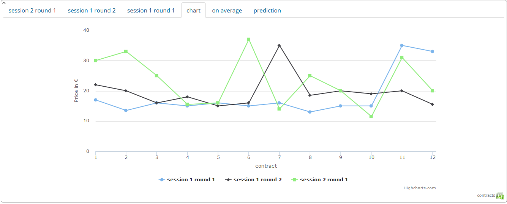

The tab *prediction* shows a predicition (if set). To create a prediction the variables :php:`$demand` and :php:`$supply` have to be filled in a global program. :php:`$supply` and :php:`$demand` should be arrays which contain prices as index and the resulting quantity as a value.

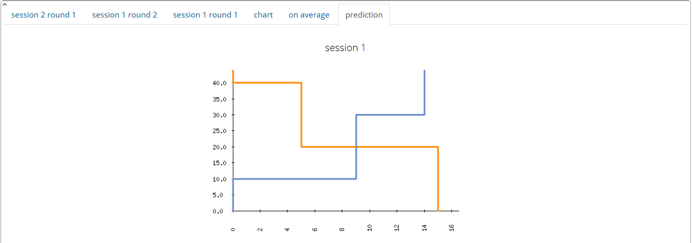

The following settings can be adapted:

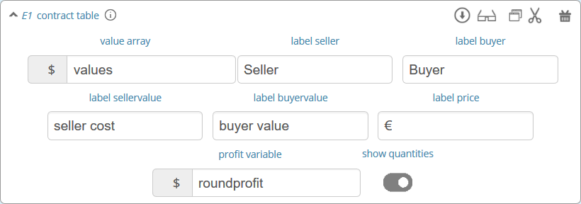

value array
	Gives the name of a (pre-filled) array which contains the role of the participant as index and the respective buyer or seller value as value. This is shown in the table as buyer/seller value.

label seller/buyer/price
	All labels in the table can be changed according to needs.

label seller value/buyer value
	If these are left empty, the columns seller value or buyer value are not displayed. If a text is provided, columns are labeled with the text and classEx reads the value array to provide seller/buyer values.

profit variables
	Can be left empty.

show quantities
	Additionally shows quantities in the contract table and a bubble chart with quantities and prices.

Result element
~~~~~~~~~~~~~~~

For displaying the results of a game various types of charts are available. 

.. important:: Note that you can only display saved subject variables. Decisions for input fields are saved automatically so that they can be displayed as well.

Whenever you can select variables in a field you only need to insert the variable name (e.g. "payoff"). If you want to use variables in other settings (e.g. the maximum) you have to use the standard notation (e.g. "$payoff;"), which gives the value of the variable.

For most result elements you can change the setting for *count*. By this you can determine whether results shall be displayed separately for groups, treatments or roles (if defined). 

Results single / multiple choice questions
------------------------------------------

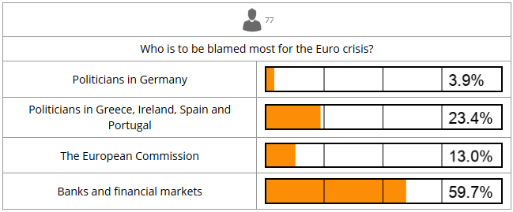

The results are displayed with percentage bars. The element automatically detects if the input is multiple choice or single choice. Hovering over the bars gives the absolute frequency of participants who opted for that option. The element should only be used with input fields with predefined options (otherwise you should use the `Results counter`_).

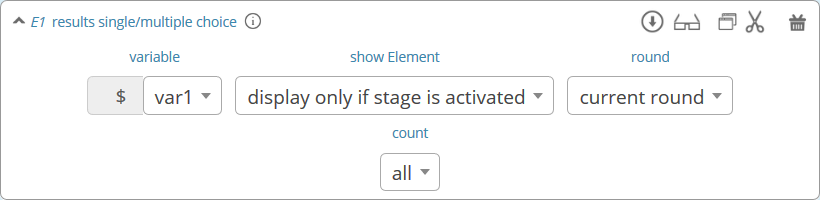

The following settings can be changed:

variable
	Provide the name of the subjects variable.

show element
	Always display element or only if stage is activated.

round
	Select if only the current round or all rounds should be displayed.

count
	Participants are counted all together (or per treatment / role / group).

Results histogram
------------------

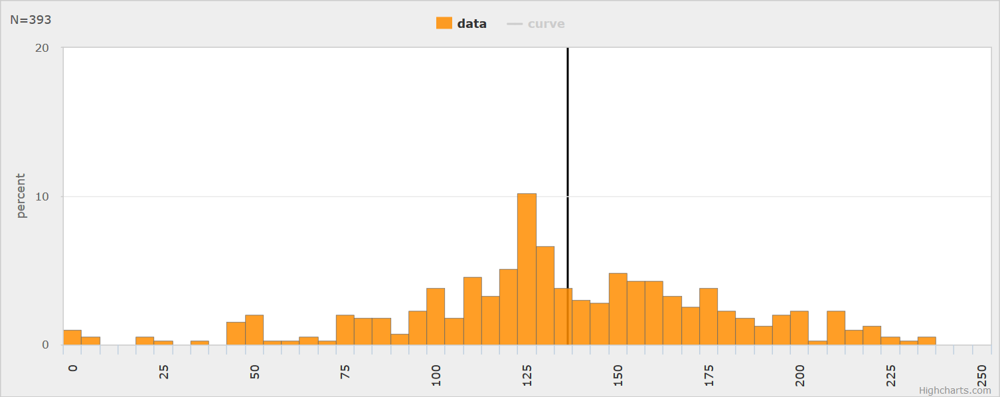

The histogram draws the distribution of a variable. The black line marks the mean. Decisions are clustered into so called bins (here bins of 5). The graph allows for zooming and for adjusting the bin size and the maximum.

.. image:: _static/elements/histogram_screen_new.PNG
    :alt:  300p

The following settings can be changed:

variable
	Choose which variable you want to display.

show element
	Element is always displayed, only if stage is activated or if it is activated and after.

min
	Minimum of the histogram (Default 0).

max
	Maximum of the histogram.

size of bins
	How the values shall be pooled into *bins*. For example, if you define the bin 10, the data will be pooled in brackets of ten.

label x-axis
	The label you choose for the x-axis is displayed below the x-axis.

vertical line
	An additional red vertical line is drawn at the selected x-value (e.g. to specify a correct or true value).

round
    Select if only the current round or all rounds should be displayed.

count
	Participants are counted all together or per treatment / role / group.

.. note:: All values that are larger than the displayed maximum value are automatically pooled into the last bin.

Results Line Chart
-------------------

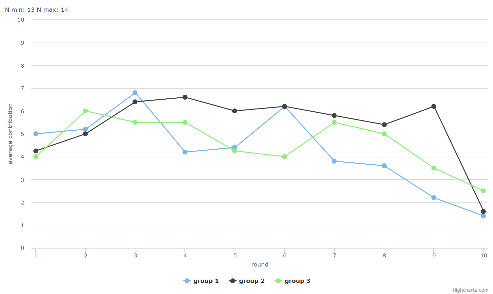

A line chart enables the display of the results of several rounds. The line chart automatically calculates the average of the input variable over all subjects. If the input variable is a discrete choice variable, the result is displayed in percent of choices. In the example, you can see a public goods game with three groups. The graph allows for zooming.

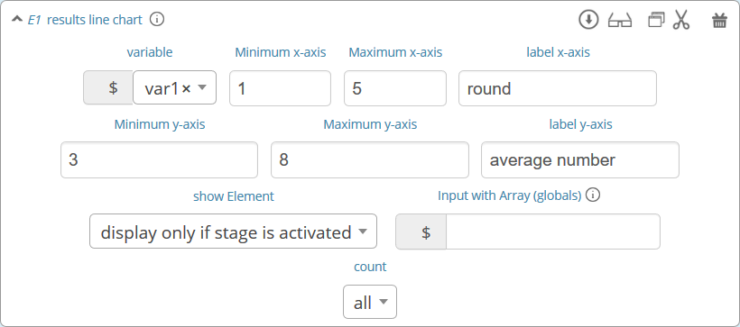

The following settings are available:

variable
	The variable which should be displayed. 
minimum/maximum/label x-axis
	Minimum, maximum and label of x-axis
minimum/maximum/label y-axis
	Minimum, maximum and label of y-axis
show element
	Always display element or only if stage is activated.
input with array (globals)
	If you provide the name of a globals variable here, the variable setting is overwritten and data are taken directly from the globals array. The array should have the x-value as index and the respective y-value. 
count
	Participants are counted all together (or per treatment / role / group).

Results bubble
---------------

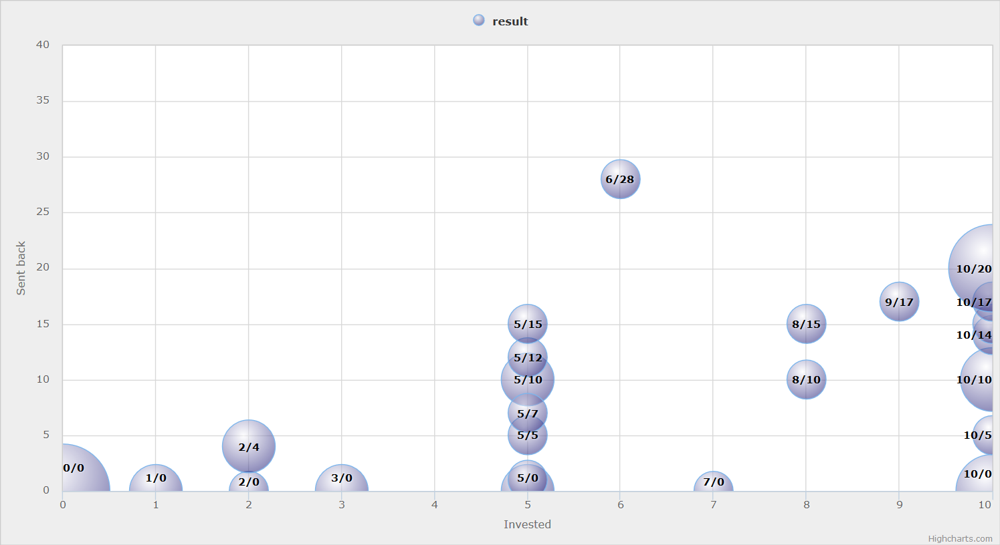

The bubble chart displays the linkage between to continuous decisions, e.g. amount sent and amount returned. The size of the bubble shows how often the number was chosen. The number in the bubble shows x-value / y-value. If you display by role, group or treatment, bubbles in different colors are displayed. Hovering over the bubble, shows the total number of observations. The graph allows for zooming.

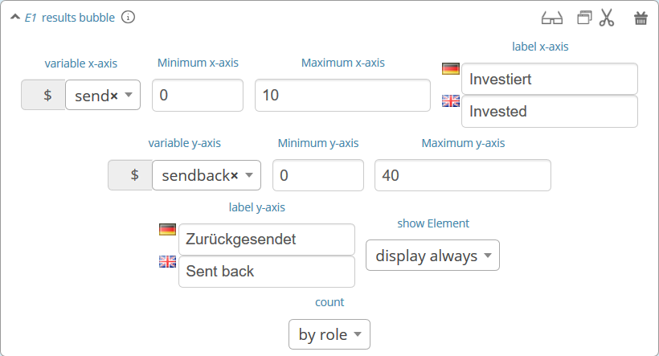

variable x-axis and y-axis
	The variable which should be displayed on the x-axis and y-axis. 
minimum/maximum/label x-axis
	Minimum, maximum and label of x-axis
minimum/maximum/label y-axis
	Minimum, maximum and label of y-axis
show element
	Always display element, only if stage is activated or only if it's activated and after.

count
	Participants are counted all together (or per treatment / role / group).

 
Results counter
----------------

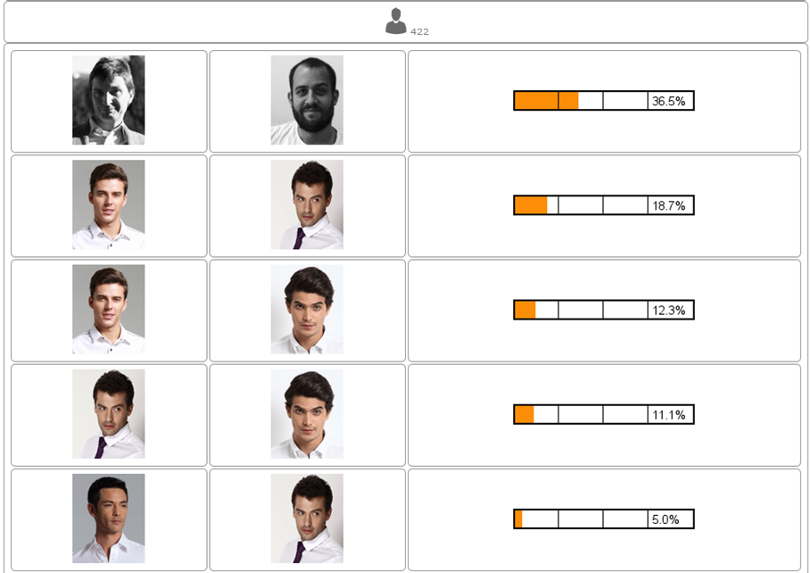

The counter enables you to display the relative frequency with which a specific answer was chosen. Hovering over the bars gives the absolute frequency of participants who opted for that option. The counter can be useful if the set of answers is open (e.g. text input). It lists all variable inputs according to their frequency.

.. note:: Using a multiple choice input field will result in the listing of combined answers. E.g. You can select A, B, C (multiple choice). Then the counter element will display how many percent chose A, A&B, A&C,... If you want to have the items analyzed separately (only A, B, C) you should use `Results single / multiple choice questions`_. 

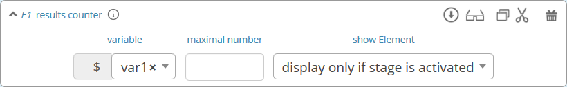

variable
	The variable which should be displayed. 
maximal number
	This limits the maximal number of answers to be displayed. E.g. if this is set to 10, only the 10 most frequent answers are shown.
show element
	Always display element, only if stage is activated or only if it's activated and after.

Results game matrix
--------------------

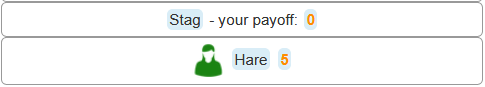

The matrix displays the linkage between to discrete decisions. If a game e.g. is played with two different participants, the results can be displayed as a matrix. Or if a participant makes two different decisions the linkage between the two can be shown.

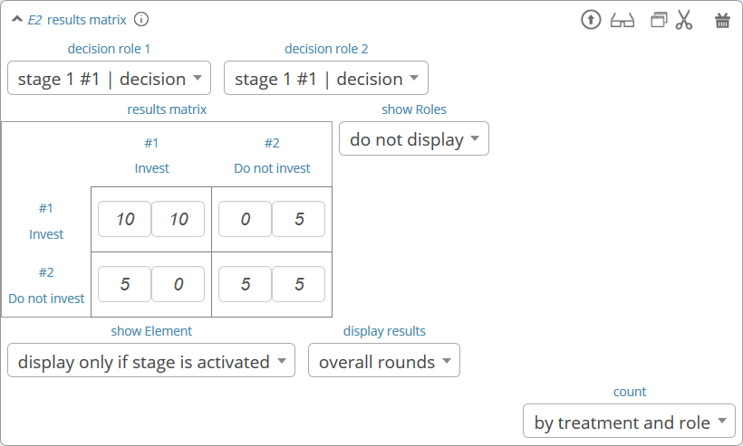

decision role 1
	The decision for the row participant.
decision role 2
	The decision for the column participant.
results matrix
	Here you can specify the payoffs for each combination. The first value is the row participants, the second value the column participant.
show roles
	This settings determines if the role figure is displayed next to the payoffs in the matrix table.
show element
	Always display element or only if stage is activated.
display results
	Here you can choose if results should be pooled over all rounds or displayed separately for each round.
count
	Participants are counted all together (or per treatment / role / group).

.. note:: The displayed matrix only determines the image on the lecturer’s screen and not the payoff for participants. The payoff is calculated individually for the participants (either through the element `Payoff matrix game`_ or through a subjects program).

Results supply and demand
--------------------------

.. image:: _static/elements/supplydemand.png

This element displays a supply and demand graph. It uses array which are calculated in a globals program to display supply and demand. The graph allows for zooming.

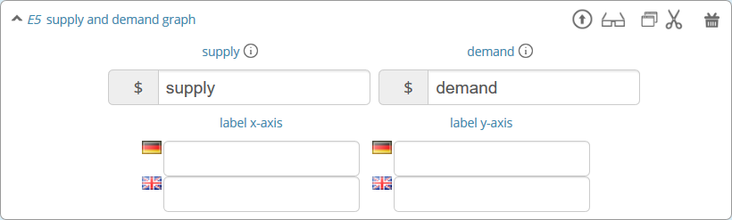

supply
	This is the name of the globals variable which contains the supply data. The index of the array is the price and the value of the array is the number of suppliers which are willing to supply at this price. E.g. if you have 2 sellers with seller cost 20 and 4 sellers with seller cost 40, the supply array should be :php:`$supply = array(20=>2, 40=>4);`. Note that the number of sellers is not cumulated across prices. This is automatically done by classEx. If you provide a two dimensional array, you can plot more than one supply line, e.g. :php:`$supply = array(1=>array(20=>2, 40=>4), 2=>array(10=>3, 20=>1));` draws to supply lines.

demand
	This is the name of the globals variable which contains the demand data. The index of the array is the price and the value of the array is the number of demander which are willing to buy at this price. The logic follows the description for supply.

label x-axis / y-axis
	Labels can be provided for both axes.
count
	Participants are counted all together (or per treatment / role / group).

Results pie chart
------------------

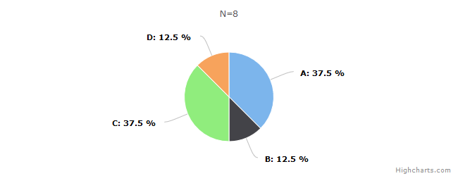
	
The pie chart shows the distribution of discrete choices as a pie chart. Slices of the pie can be highlighted by clicking on them. The graph allows for zooming.

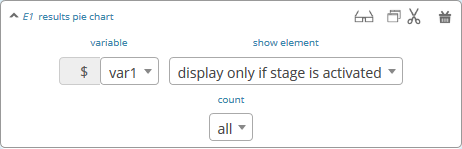

variable
	The name of the variable
show element
	Always display element or only if stage is activated.

count
	Participants are counted all together (or per treatment / role / group).

.. note:: If you provide a numeric input as variable, classEx plots all numeric inputs from the stage in the pie chart. This only makes sense if you ask for percentages (which add up to 100%). For an example see the game Ricardian equivalence in the macroeconomics folder.

Results Likert scale
---------------------

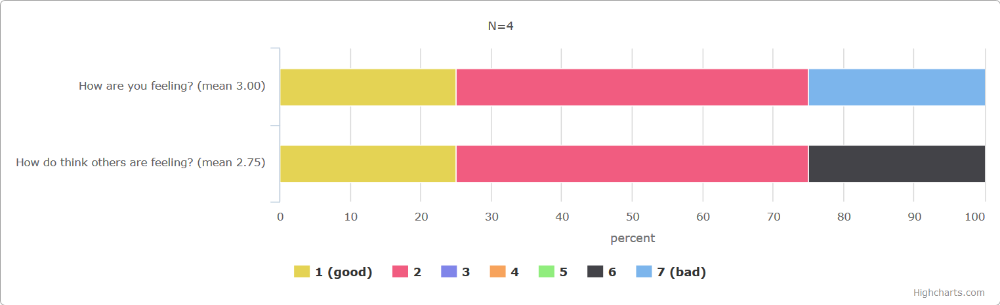

This graphs allows to show data from Likert scales if the input was provided with a `Radioline`_ or `Slider`_. It shows the distribution and provides the mean. The graph allows for zooming. The graph allows for showing multiple variables in one graph.

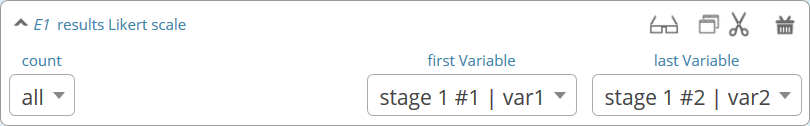

first variable / last variable
	Here you can select the variable(s) to be displayed. If you select e.g. variable #1 to #3 from a stage, the graph shows all three variables #1, #2, #3. If you want to show only one variable, just select the same variable for first and last variable.

count
	Participants are counted all together (or per treatment / role / group).