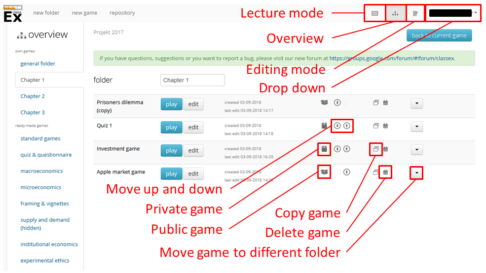
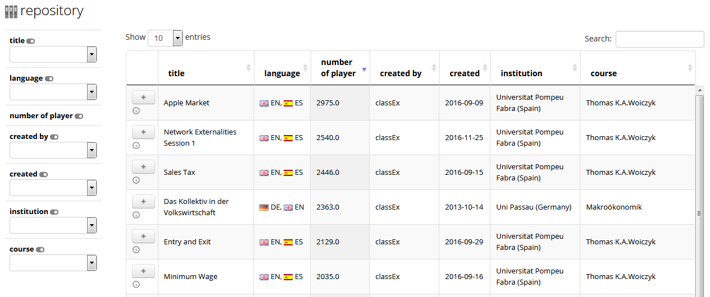

===============
Organize games 
===============

You can organize your games in the overview mode. Here, you can find all your own games as well as the ready-made games that are shown in your overview by default.

On the left hand side you find the folders for own games (empty at first login) and the folders for ready-made games below it (standard games, quiz & questionnaire,...).

In the top right-hand corner, you find the main navigation bar which is always displayed in every mode. This allows you to switch from one mode to another and access your personal data.

The currently active mode is marked by a darker shade around its symbol |pic_overview|, here the **overview mode**. The left symbol |pic_lecturemode| takes you to the **lecture mode**. The right symbol |pic_editmode| takes you to the **editing mode**. The **drop down menu** (which shows the name of the lecturer and is shaded in black in the figure above) provides access to your personal data and your course data as well as the terms of use, the documentation, some general info on classEx and the log out button.

.. |pic_lecturemode| image:: _static/pic/lectureMode.png
   :width: 15px
.. |pic_overview| image:: _static/pic/lecture.png
   :width: 15px
.. |pic_editmode| image:: _static/pic/editMode.png
   :width: 15px

Settings in the top bar
========================

You can see the top bar for the **overview mode** in the picture above in the left hand corner. It offers the following functionality:

new folder
    Create new folders to organize your games.

new game
    Create new games which you can design in the editing mode.

repository
    The repository which provides access to games provided by other lecturers. 

Folders
=======

Games are sorted into folders, which can be named for example after different chapters of lectures. They can be found on the left. You can create a new folder by clicking on *new folder* in the top bar. Folders can be renamed by clicking on the title of a folder in the main screen (above the list of games). This is not possible for the general folder that is provided by default. Folders are ordered alphabetically. It is not possible to change the order of folders. 

.. note:: If you need a specific order, you may name the folders e.g. 01 - intro, 02 - motivation, ...

Folders can only be deleted when they are empty. Then the delete symbol |pic_delete| will appear. The deletion cannot be reversed. 

Each account has a standard folder which is called *general folder*. This cannot be deleted.

.. |pic_delete| image:: _static/pic/reject.png
    :width: 15px

.. |pic_handle| image:: _static/pic/drophandle.png
    :width: 15px

.. |pic_public| image:: _static/pic/public.png
    :width: 15px

.. |pic_private| image:: _static/pic/private.png
    :width: 15px

.. |pic_other| image:: _static/pic/attributes.png
    :width: 15px

.. |pic_copy| image:: _static/pic/copy.png
    :width: 15px

Order games
============

You can move games by clicking on the *move game* icon |pic_handle| and dragging the game into another folder (in the left bar). You can also drag the game within your folder in order to change its position. 

Play and edit games
====================

If you click on the *play game* button, the game is directly started in the lecture mode.

.. note:: If you click on *play game*, the current game which is running will be stopped and the game you clicked on will be started. If you want to switch back to your currently running game instead use the buttons in the top navigation bar to go the lecture mode or click on the button *back to current game* below the navigation bar.

You can directly enter the editing mode by clicking on the *edit game* icon. The title of this button changes to *view* if you cannot edit the game. This may happen if you are not the owner of the game, but you imported the game (see below). 

.. note:: You can also switch to the lecture and editing mode by clicking on the symbols in the top navigation bar.

Public, private and imported games
==================================

All games are marked as *public* |pic_public|,  *private* |pic_private| or as *created by someone else* |pic_other|. The *public game* icon |pic_public| means that you created the game but other users can see and copy this game. The *private game* |pic_private| icon means your game is private and cannot be seen by other users. You can change the game status between private or public by clicking on the symbol. The *created by someone else* marks the ready-made games provided by classEx and all games you imported from the repository. You cannot edit them but only view and play them. If you want to make your own version of such a game you have to copy it.

Copy and delete games
========================

If you want to make a copy of a game (e.g. to create your own version of a ready-made game), click on the copy button |pic_copy|. This will create a copy of the game in your *general folder*. You can edit this copy and thus make your own version of any game on classEx. Alternatively, you can go to the editing mode and click on the drop down menu *game* and then select *copy game*. 

The *delete game* icon |pic_delete| deletes a game. This can't be reversed.

Repository
==========

The repository lists all public games created by you and other lecturers and allows you to import these games to your account. You can enter the repository by clicking on the *repository* button in the top bar of the overview. 

If you do not want your game to be listed in the repository you have to change its status from public to private. 

    
Search games
------------

The repository lists all games which were set public by their owners. The list can be searched by the different criteria on the left hand side. The switch button disables viewing a certain criterion in the list. You can also make a free text search by typing in the search box in the top right corner. Clicking on the *Game information* button shows some more information and a sample screenshot (if provided by the owner). 

Import games
-------------

All games from the repository can be imported to one's own account by clicking on the *Import game* button. You can then find the game in the general folder.

.. note:: If you import games, they are not copied to your account. classEx only sets a reference to the game of the other lecturer. Therefore, you cannot modify imported games. In order to modify an imported game you have to copy it.

