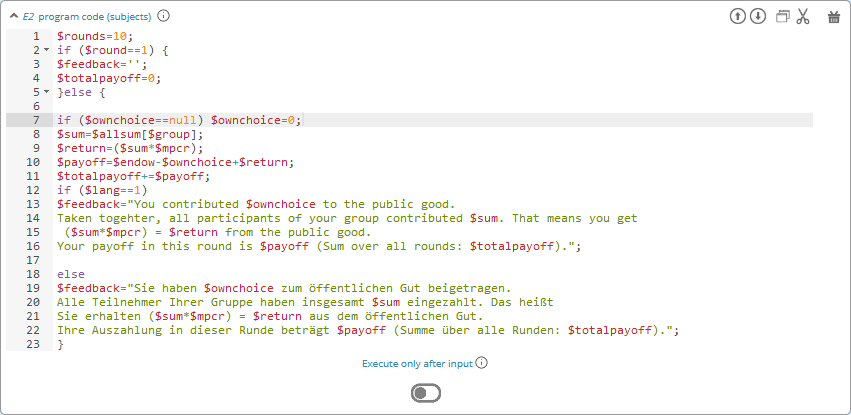

===========
Programming
===========

.. role:: php(code)
   :language: php

.. role:: java(code)
   :language: javascript

.. role:: html2(code)
   :language: html

Programs are a very useful to design dynamic games. Programs are elements of stages and therefore created like any other element (see :ref:`Develop:Define Elements`).

There are two types of programs, subjects and globals. Subjects programs are executed for each participant, global programs are executed once for all participants.

.. note:: It is always good to comment the code if you try to understand it later. Add comments with :php:`/* comment */` to your program code.

Programming language 
====================

Variables and programs are specified via `PHP <https://en.wikipedia.org/wiki/PHP>`_. Currently, we use PHP 7.0. This is a well-documented standard which enables easy programming. Details can be found on the internet, for example `here <http://php.net/docs.php>`_. You can utilize the normal standard PHP functions (e.g. :php:`round(), rand(...), number_format()`,...).

Programs are entered in an editor that comprises syntax-highlighting as well as a simple error check of the entered codes.

Furthermore, the editor contains a completion system which will show you all available variables. If you start entering the beginning of a variable ($...) and then press Ctrl+space the automatic completion system will show you all corresponding variables and functions.

.. warning:: You can not declare own PHP functions in classEx.

Declaration of variables
========================

Variables are defined by starting with :php:`$`. It does not matter whether the variable is a number or text. Variable names are case sensitive.

.. code:: php
	
	/* numeric variable */
	$endowment = 10;

	/* string variable with a varialble */
	$info = "Your endowment is ".$endowment." Euros.";

	/* array */ 
	$values = array(1=>"one", 2=>"two", 3=>"three");

.. warning:: Do not use single quotes within double quotes as this may produce errors (e.g. $text="don't"), instead of ' you should use the HTML code &apos; (e.g. $text="don&apos;t") in texts.

Type and scope of variables
===========================

There are two different scopes: globals and subjects variables. 

Globals variables are

- available for all participants (can be accessed by subjects program),
- are calculated at the lecturer side,
- are the same for every participant,
- are calculated first (i.e. before subjects variables).

Subjects variables are

- only available for a specific participant
- saved by default if they are decision variables (set via input elements).
- not saved by default if you create or calculate them in subject programs; to do so use the `Function to save variables`_

.. note:: Please notice that globals and subjects variables share the same namespace. Using the same variable name may overwrite variables. E.g. if you define :php:`$payoff=1;` as a globals variable, and :php:`$payoff=2;` as a subjects variable, the first will be overwritten by the latter as globals are executed first.

.. note:: Subjects variables are only available to a specific participant. This means if you want to use the decision of one participant in another's screen, you have to use the functions below to retrieve the decision (e.g. from the partner or group member). You can also retrieve decisions as a globals variable (which then are available to all participants) and retrieve the globals variable for a specific participant.

In addition to globals and subjects variables, there is a third table where data is stored in classEx - contracts. Contracts are always concluded between a buyer and a seller and a contract contains a price and a quantity. Some of the functions below help to retrieve contract data. 

Execution, Synchronization and Lifetime 
========================================

Execution
~~~~~~~~~

Variables and program code is always executed in a sequential order. This means that elements which come first are executed first. 

The overall order is the following:

- First, parameters are set as globals variables (see also :ref:`Develop:Parameters`).
- Second, globals programs are executed (in the order stated for the lecturer screen).
- Third, subjects programs are executed (in the order stated at the participant screen).

Subjects programs offer the option to delay them after the decision has been made. This is provided by the setting *execute only after input*. This means that the subjects program is not executed on the loading of the respective screen, but only after a participant submitted his or her decision. 

.. note:: This feature can be useful if you want to do some calculations with the current input before the next stage has started. You can e.g. add to inputs :php:`$a` and :php:`$b` and safe them as a new variable with :php:`$save('sum',$a+$b)`. Logically, this can only be done, once the inputs are provided. In some cases, it might be useful to have the sum already available in the next stage (e.g. to display the sum in a graph).

Synchronization
~~~~~~~~~~~~~~~

It is always important to keep in mind how synchronization works in classEx in order to retrieve variables at the correct moment in time. Within one stages, participants make their decisions (and therefore create their input variables) at any point in time. So you do not know if the value has been set or not. For this reason, you should only retrieve values in the following stage. 

E.g. if you want to display the input :php:`$a` of participant A to another participant B, you can only use :php:`$other = $findVariablePartner("a");` in the next stage and not in the current one. It may be the case that A has not made his or her decision while B is trying to retrieve it. The same holds true if you want to display the input :php:`$a` in a result graph or do some calculations with it in a globals program.

One exception is the usage of *execute only after input* in the section `Execution`_. This allows to do some calculations after the input of a participant. Still, keep in mind, that you do not know when this program will be executed as the participant may submit his or her input at any point in time.

Another exception is that you can repeat globals programs every 2 seconds. This can be set by selecting *update every 2 s* next to the program element. Then the program is executed every 2 seconds and calculations are updated. This allows to get input decisions in real time.

Lifetime
~~~~~~~~~

Variables and their values can be used after their declaration during the whole game. They can be read (and also overwritten) at any point after their declaration. After the last stage of the game, all subjects variables (which are not decision input or were stored) are deleted. Globals variables are automatically stored.

Subjects values can only be changed by subjects programs and globals values only by globals programs.

If you e.g. set :php:`$a=1;` in stage 1 (as a globals variable), you can use this value in all stages after stage 1 as well. Keep in mind that for subjects variables this only holds true for the participant's own variables.

Description of functions in the documentation
==============================================

Functions are described in the following way. It follows the standard way of documentation of functions. Let's take the following example:

.. code:: php

 $findVariablePartner("varname", $round = $currentRound, $partnerRole = null, $no_decision = null);

Function name
 	The name of the function is *$findVariablePartner*. 

	.. note:: Notice that in contrast to standard PHP function, internal functions in classEx always start with a $ sign. 

Arguments
	A function has arguments which are the values the function is called with. In this case, the function has four arguments. The first argument is mandatory, the other three arguments are optional. Arguments can be strings, numbers or variables.

Arguments without default value (mandatory)
	Arguments which are **not** marked with a :php:`=` sign and a default value are *mandatory*. This means you have to specify them in order to make the function work. In the example, you have to specify the variable name :php:`"varname"`. The quotes indicate that you have to specify it as a string. 

	.. note:: Note that variables names in functions are specified without the $ sign.

Arguments with default value (optional)
	All the other arguments in the function have default values which means that they are optional. You can specify the function with only one parameter as well. The values after the :php:`=` sign are taken as default. In the example, the variable :php:`$currentRound` (which is available as pre-defined global variable) is taken as default for the round. If you want to use a different round, you have to overwrite the default value. The same holds true for the other arguments. :php:`$partnerRole` and :php:`$no_decision` are set to :php:`null` as a default, where :php:`null` means no value.

	Here are some examples:

.. code:: php

	/* This gives the value of the third round. */
 	$findVariablePartner("varname", 3);

 	/* This gives the value of the previous round. */
	$findVariablePartner("varname", $round - 1);

	/* This gives the value of the current round for partner role 2. */
	$findVariablePartner("varname", $round, 2);

	/* This gives the value of the current round and return 0 in case of no decision. ($partnerRole is set to its default.) */
	$findVariablePartner("varname", $round, null, 0);

.. note:: If you want to change some of the default values in arguments at the end of the function, you also have to specify the arguments before the argument you want to change. You can see this in the last code example where we want to leave :php:`$partnerRole` on its default value and only change :php:`$no_decision`.

Internally used variable names
===============================

Some variable names are internally used in classEx and **should not be used as own variable names**. These are the following variables:

.. code:: php

	$newMatchedPartner, $newMatchedGroup, $currentStage, $lastStage, 
	$sendprog, $history, $simpleID, $signRound, $idCourse, $player  

Variables for participants (subjects)
======================================

Pre-Defined Variables
~~~~~~~~~~~~~~~~~~~~~~

=================  =====
name  			   value
=================  =====
:php:`$lang`       Current language (0: German, 1: English, 2: Spanish)
:php:`$round`      Current round
:php:`$id`         Participant ID (unique in all games, decisions are stored with the participant ID)
:php:`$subject`    Subject ID (unique in game, starts from 1,...)
:php:`$role`       Role ID (if set)
:php:`$treatment`  Treatment ID (if set)
:php:`$group`      Group ID (if set)
:php:`$signID`     Private signature (for contract elements)
:php:`$tic`        External ID (if set at login or provided with URL)
=================  =====

The variables :php:`$group`, :php:`$role` and :php:`$treatment` can be overwritten in a subjects program.

.. note:: Pre-defined variables are not saved automatically in the subjects table. Therefore, they can only be retrieved with e.g. :php:`$findVariablePartner(...)`, :php:`$getValues(...)` or other functions if they are saved before. This is explained in :ref:`Function to save variables`.

Functions to retrieve variables
~~~~~~~~~~~~~~~~~~~~~~~~~~~~~~~~

The following functions can be used to retrieve subjects variables. 

:php:`$findVariablePartner("varname", $round = $currentRound, $partnerRole = null, $no_decision = null);`

	**Function** retrieves the variable from another participant in the same group. The function makes sure that participants always get feedback, which can be important in order to avoid disappointing participants. Certainly, cloned or random observations may have to be deleted prior to using data for research. 

	**Returns** variable of the other participants. In case the other has not made a decision, it tries to clone a decision from a different participant which has the respective role but is in a different group. If :php:`$no_decision` is specified, the function returns the value of  :php:`$no_decision` if no value is available. In this case, the function does not look for a cloned decision.

	.. note:: The function may retrieve a value if the other participant submitted an empty form. In this case the value is an empty string :php:`""` or :php:`null`.

	**Arguments** are:

	-  :php:`varname` the variable name (mandatory). The function can retrieve subjects variables which were saved before or which were decision inputs.
	-  :php:`$round` the round from which the variable should be retrieved. 
	-  :php:`$partnerRole` the role of the partner can be specified. E.g. in a group of 3 participants (role 1, role 2 and role 3), it is necessary to specify from which partner to take the variable from. 
	-  :php:`$no_decision` can be used to provide random values in case no decision was made. 

	**Examples** are provided in the section `Description of functions in the documentation`_.

----

:php:`$findGroupAverage("varname", $round = $currentRound, $includingOwn = false)`

	**Function** retrieves the average of a variable for the own group. 

	**Returns** the average value, or 0 otherwise.

	**Arguments** are:

	-  :php:`varname` the variable name (mandatory). The function can retrieve subjects variables which were saved before or which were decision inputs.
	-  :php:`$round` the round from which the variable should be retrieved. 
	-  :php:`$includingOwn` specifies if the own value should be included or not. :php:`$includingOwn = true` means the own value will be included.
	

----

:php:`$findGroupSum("varname", $round = $currentRound, $includingOwn = false)`

	**Function** retrieves the sum of a variable for the own group. 

	**Returns** the sum, or 0 otherwise.

	**Arguments** are:

	-  :php:`varname` the variable name (mandatory). The function can retrieve subjects variables which were saved before or which were decision inputs.
	-  :php:`$round` the round from which the variable should be retrieved. 
	-  :php:`$includingOwn` specifies if the own value should be included or not.
	

----

:php:`$findGroupFreq("varname", $round = $currentRound, $includingOwn = false)`

	**Function** retrieves the frequency of each value of a variable for the own group. 

	**Returns** an array with the value as index and the frequency as value. E.g. :php:`$returnedValue = array(1=>12, 2=>13)` would indicate that the value 1 was chosen 12 times, and the value 2 was chosen 13 times. If no decisions were made, an empty array is returned.

	**Arguments** are:

	-  :php:`varname` the variable name (mandatory). The function can retrieve subjects variables which were saved before or which were decision inputs.
	-  :php:`$round` the round from which the variable should be retrieved. 
	-  :php:`$includingOwn` specifies if the own value should be included or not.
	

----

:php:`$findSold($round = $currentRound)`

	**Function** retrieves the number of items sold (in a contract element)

	**Returns** an array with the unit number as index and the corresponding price as value, or an empty array otherwise. E.g. :php:`$returnedValue = array(1=>12, 2=>13)` would indicate that the first unit was sold for 12, and the second unit was sold for 13. If no decisions were made, an empty array is returned.

	**Arguments** are:

	-  :php:`$round` the round from which the variable should be retrieved. 
	
----

:php:`$findBought($round = $currentRound)`

	**Function** retrieves the number of items bought (in a contract element). The logic is exactly the same as in :php:`$findSold(...);`

----

:php:`$findOldVariable('varname', $idRound = null)`

	**Function** Find old variables from previous rounds, Variable or 0 if not found.

----

Here you can find some coding examples:

.. code:: php

	/* get group average of variable test, from previous round, including own */
	$groupAvg = $findGroupAverage("test", $round - 1, true);

	/* get sum of variable test2, from current round, not including own */
	$groupSum = $findGroupSum("test2");

	/* get frequency of value 1 in variable choice */
	$groupFreq = $findGroupFreq("choice");
	echo $groupFreq[1];

	/* get all items sold in the previous round and calculate total revenues and amount sold */
	$sells = $findSold($round-1);
	$revenues = 0;
	$amountSold = 0;
	foreach ($sell as $unit => $price) {
		$revenues += $price;
		$amountSold++;
	}

Function to save variables
~~~~~~~~~~~~~~~~~~~~~~~~~~~~

If you want to retrieve variables, those variables have to be stored before. For decision inputs this happens automatically. If you want to retrieve variables defined or used in the subjects program, you have to save them before by using the following function:

:php:`$save("varname", $value);`

	**Function** stores a value in the subjects table.

	**Returns** true if the storage was successful, false in case of an error.

	**Arguments** are:

	-  :php:`"varname"` the variable name (mandatory).
	-  :php:`$value` the value to be stored. The value can also be a variable itself.
	

Here you can find some coding examples:

.. code:: php

	/* store the value 1 as variable "shown" */
	$save("shown", 1);

	/* store the value 7 as variable "test" */
	$a = 7;
	$save("test", $a);

.. note:: Keep in mind that you should only retrieve variables at least one stage after saving them. See `Synchronization`_.

Variables for lecturers (globals)
=================================

Pre-defined variables
~~~~~~~~~~~~~~~~~~~~~~

==================== ============
name                 value
==================== ============
:php:`$lang`          Actual Language (0: German, 1: English, 2: Spanish)
:php:`$currentRound`  Current Round
:php:`$maxWin`		  Maximal amount for real payoff, default is 100.
==================== ============

All parameters are also available as pre-defined globals variables. All globals variables (including the ones calculated in globals programs) are stored automatically.

The globals variable :php:`$maxWin` is used for limiting the maximum which is paid out via :ref:`Elements:Winner's draw`.

Functions
~~~~~~~~~~

The following functions can be used to retrieve globals variables. 

:php:`$getValues("varname", $round = $currentRound)`

	**Function** retrieves the values of one variable for all participants.

	**Returns** an array with the internal participant ID as index and the respective values or :php:`null` if no values available.

	**Arguments** are:

	-  :php:`varname` the variable name (mandatory). The function can retrieve subjects variables which were saved before or which were decision inputs.
	-  :php:`$round` the round from which the variable should be retrieved.

----

:php:`$getFreq("varname", $round = $currentRound, $multiple = false)`

	**Function** retrieves the frequencies of values over all participants for one variable.

	**Returns** an array with the value as index and the frequency. If not available, it returns an empty array.

	**Arguments** are:

	-  :php:`varname` the variable name (mandatory). The function can retrieve subjects variables which were saved before or which were decision inputs.
	-  :php:`$round` the round from which the variable should be retrieved. 
	-  :php:`$multiple` If multiple is set to true, answers from multiple choice questions are decomposed into single answers.

----

:php:`$getAverage("varname", $round = $currentRound)`

	**Function** retrieves the average value of a variable over all participants.

	**Returns** the average value or :php:`null` if no values available.

	**Arguments** are:

	-  :php:`varname` the variable name (mandatory). The function can retrieve subjects variables which were saved before or which were decision inputs.
	-  :php:`$round` the round from which the variable should be retrieved. 

----

:php:`$getAveragePerRole("varname", $round = $currentRound)`

	**Function** retrieves the average of a variable over all participants grouped by their role.

	**Returns** an array with role ID as index and the average value for each role. If not available, it returns :php:`null`.

	**Arguments** are:

	-  :php:`varname` the variable name (mandatory). The function can retrieve subjects variables which were saved before or which were decision inputs.
	-  :php:`$round` the round from which the variable should be retrieved. 

----

:php:`$getAveragePerTreatment("varname", $round = $currentRound)`
	
	**Function** retrieves the average of a variable over all participants grouped by treatment. The logic is the same as for :php:`$getAveragePerRole(...)`. 

	**Returns** an array with the treatment ID as index and the average value for each treatment.

----

:php:`$getAveragePerGroup("varname", $round = $currentRound)`

	**Function** retrieves the average of a variable over all participants grouped by group. The logic is the same as for :php:`$getAveragePerRole(...)`. 

	**Returns** an array with the group ID as index and the average value for each treatment.

----

:php:`$getVarSum("varname", $round = $currentRound)`

	**Function** retrieves the sum of values of a variable over all participants.

	**Returns** the sum or :php:`null` if no values available.

	**Arguments** are:

	-  :php:`varname` the variable name (mandatory). The function can retrieve subjects variables which were saved before or which were decision inputs.
	-  :php:`$round` the round from which the variable should be retrieved. 

	**Also available** as :php:`$getVarSumPerGroup(...)`, :php:`$getVarSumPerTreatment(...)` or :php:`$getVarSumPerRole(...)` following the same logic as described above for :php:`$getAveragePerRole(...)`.

----

:php:`$getMin("varname", $round = $currentRound)`

	**Function** retrieves the minimum of a variable over all participants.

	**Returns** the minimum or :php:`null` if no values available.

	**Arguments** are:

	-  :php:`varname` the variable name (mandatory). The function can retrieve subjects variables which were saved before or which were decision inputs.
	-  :php:`$round` the round from which the variable should be retrieved. 

	**Also available** as :php:`$getMinPerGroup(...)`, :php:`$getMinPerTreatment(...)` or :php:`$getMinPerRole(...)` following the same logic as described above for :php:`$getAveragePerRole(...)`.

----

:php:`$getMax("varname", $round = $currentRound)`

	**Function** retrieves the maximum of a variable over all participants.

	**Returns** the maximum or :php:`null` if no values available.

	**Arguments** are:

	-  :php:`varname` the variable name (mandatory). The function can retrieve subjects variables which were saved before or which were decision inputs.
	-  :php:`$round` the round from which the variable should be retrieved. 

	**Also available** as :php:`$getMaxPerGroup(...)`, :php:`$getMaxPerTreatment(...)` or :php:`$getMaxPerRole(...)` following the same logic as described above for :php:`$getAveragePerRole(...)`.

----

:php:`$getRoles()`

	**Function** retrieves the specific role for each participant.

	**Returns** an array with the internal participant ID as index and the respective role. If no roles are available, an empty array is returned.
	
----

:php:`$getTreatments()`

	**Function** retrieves the treatment for each participant.

	**Returns** an array with the internal participant ID as index and the respective treatment. If no treatments are available, an empty array is returned.
	
----

:php:`$getNumRoles()`

	**Function** retrieves the total number of roles.

	**Returns** an array with the role ID as index and the number of participants with this role. If no roles are available, an empty array is returned.
	
----

:php:`$getNumPlayer()`

	**Function** retrieves the total number of participants.

	**Returns** the number of participants.
	
----

:php:`$getSubjectIDs()`

	**Function** retrieves corresponding subject IDs to participant IDs.

	**Returns** an array with the internal participant ID as index and the respective subjectID. With no participants it returns an empty array.
	
----

:php:`$getNumDecisions("varname", $round = $currentRound)`

	**Function** retrieves the number of decisions made.

	**Returns** the number of decisions made or :php:`null` if no values available.

	**Arguments** are:

	-  :php:`varname` the variable name (mandatory). The function can retrieve subjects variables which were saved before or which were decision inputs.
	-  :php:`$round` the round from which the variable should be retrieved. 

	**Also available** as :php:`$getNumDecisionsPerGroup(...)` following the same logic as described above for :php:`$getAveragePerRole(...)`. Not available per treatment or per role.

----

:php:`$setWinner($winnerID)`

	**Function** adds participants to the payoff table.

	**Returns** true if successful, false if not.

	**Argument** is:

	- :php:`$winnerID` the internal participant ID of the winner (mandatory).

	The amount is set directly by the participant in the :ref:`Elements:Winner's notification`.

----

:php:`$getAvgPriceContract($round = $currentRound)`

	**Function** retrieves the average price of all contracts made.

	**Returns** the maximum or :php:`null` if no values available.

	**Argument** is:

	-  :php:`$round` the round from which the variable should be retrieved. 

----

:php:`$getNumContracts($round = $currentRound, $perSeller = true)`

	**Function** retrieves the number of contracts per seller or buyer.

	**Returns** an array with the internal participant ID as index and the number of contracts. With no data, an empty array is returned.

	**Arguments** are:

	-  :php:`$round` the round from which the variable should be retrieved. 
	-  :php:`$perSeller` If this is true, contracts are counted for sellers. If it is false, contracts are counted for buyers.

Diagnosis tool
==============

Small errors can cause the programs not to run. Therefore, error detection is an important issue. First, have a look in the editor which provides a basic syntax checking. Errors are marked by red crosses. If the program is running but not performing in the expected way, you may use the diagnosis tool to find the error.

With severe errors the lecture mode can not be started. In order to find the error go through the code and look for errors. Check if the function names are correctly spelled.

The diagnosis tool is very useful for trouble shooting and testing your game. You can access the diagnosis tool by clicking on the stethoscope icon in the top bar of the lecture mode.

Clicking on the symbol opens up a window beside the usual display on the lecturer's screen, which shows you all variables and their current values.

.. image:: _static/Diagnosis.PNG
    :alt:  300p

The different tabs allow you to access the globals or the variables for each participant. This makes programming and error finding much easier than having to jump back and forth between the lecture mode and the editing mode.

Javascript
==========

Programming in classEx is normally done in PHP. For some applications it may be useful to also use some javascript. Javascript runs on the client side (i.e. on the participant's browser) and also for interactive change of content (with no need to reload the page).

For this reason, you can also add some javascript code by adding a Javascript element. An additional option is to put javascript code directly in the text box encapsulated by :php:``. You can also use jQuery which is loaded automatically for each page.

Manipulation of HTML elements
~~~~~~~~~~~~~~~~~~~~~~~~~~~~~

All elements in classEx have their own identifiers so that they can be used for javascript interaction. 

Input fields have the identifier "fieldX", where X is the number of the input field (#1, #2,...). An example would be :html2:`<input type="hidden" id="field1" name="bid1" value="">`. If you want to do some javascript interaction, you can manipulate the value of the input field e.g. with :java:`$("#field1").val(1);`. Then the value is set to 1. 

Buttons have the identifier "buttonX" where X is the number of the stage. The number of the stage can be found by hovering over the tabs in the editing mode. This allows you to add click events to the standard button, e.g. :java:`$("#button1234").click(...)`. 

You can also define your own parts in the text boxes which can be manipulated with javascript. E.g. define :html2:`This is my text` in the text box. Then you can change this text in a javascript program with :java:`$("#text1").html("This is my new text.");`. 

Live feedback on input
~~~~~~~~~~~~~~~~~~~~~~

Javascript allows e.g. for live feedback when subjects enter numbers. Let's take an ultimatum game where a participant can split 10 Euros between him- or herself and another participant. The participant enters the amount to send to the other in the input field #1. With javascript you can display, the amount he or she keeps in real time. Each time the participant changes his input, he or she gets live feedback on the amount he or she keeps. 

Just add a text box with the following code. 

.. code:: html

	The amount you keep is --.

Then add a little javascript program which is executed when you change the input field.

.. code:: javascript

	$("#field1").keyup(function() {
		/* javascript takes the input as string which has to be parsed to Integer or Float to 
			make calculations with */
  		let send = parseInt($(this).val());
  		let keep = 10 - send;
  		$("#keep").html(keep);
	});

Alternatively, you can also add another input field which is marked with *output only*. E.g. you added such an input field as input field #2. Then you do not have to add the text box, but only the javascript program with: 

.. code:: javascript

	$("#field1").keyup(function() {
		/* javascript takes the input as string which has to be parsed to Integer or Float to 
			make calculations with */
  		let send = parseInt($(this).val());
  		let keep = 10 - send;
  		$("#field2").val(keep);
	});

Note that for input fields you have to use :java:`$("#field2").val(keep)` instead of :java:`$("#keep").html(keep)` for changing HTML.

If you want to add live feedback for sliders, radiolines or buttons you have to use :java:`$("#field1").change(...)` instead of :java:`$("#field1").keyup(...)` for fields where you type the input. 

Reading PHP variables
~~~~~~~~~~~~~~~~~~~~~

As all variables are only stored in PHP, you need to get the values for the javascript programs by hand. 

To read PHP variables one currently needs a two step approach:
	* write PHP variable in a (hidden) text field
	* parse text field content in javascript 

Assume we have a PHP variable :php:`$foo` that contains a value we want to use in javascript.

Then you should add a text box with:

.. code:: html
	
	$foo;

The id does not need to have this format, but it must be unique.

In javascript you can retrieve the variable with:

.. code:: javascript

	let foo = JSON.parse($('#php_var_foo').html());
	
This command finds the HTML element with the id of the span containing the variable content. It's inner HTML (the content) is taken. Now the variable :java:`foo` in javascript contains the content of the PHP variable :php:`$foo`.

Writing PHP variables
~~~~~~~~~~~~~~~~~~~~~

This can be achieved via hidden input fields that are filled with javascript. Just add a :ref:`Elements:Hidden field` in your input element.

Input fields have the identifier "fieldX", where X is the number of the input field (#1, #2,...). An example would be :html2:`<input type="hidden" id="field1" name="bid1" value="">`. If you want too save a javascript value, you write the value into the input field e.g. with :java:`$("#field1").val(1);`. Then the value is set to 1 and it is stored automatically when the participants submit the input element. 

.. note:: At the moment PHP and javascript are not integrated so that variables have to be transferred manually from PHP to javascript and vice versa. In one of the next versions of classEx this should be automatized.