================
Ready-made games
================

classEx provides users with a set of ready-made games that come with a classEx account. You can find these on the Starting Screen after logging in as a lecturer. In this section we provide an introduction to the possible applications of classEx on the basis of a categorized overview of some ready-made games. These are only examples. Many more games can be found in the repository in classEx.

Individual choice
=================

Individual choice means that the decisions of participants are do not interfere with the decisions of other participants. No strategic interaction with other participants takes place. In the following, you can see a few examples of Individual choice games that can be implemented with classEx.

Single Choice
-------------

- Quiz questions

The easiest type of questions are Quiz Questions as they can be also in found in standard Audience Response System. Participants choose among a set of options.

.. image:: _static/Quiz.PNG
    :alt:  300px

Quiz questions, such as the one above, are the easiest type of application in classEx. The lecturer can set any number of options. These can be labelled randomly, e.g. as Option 1, Option 2, etc., but can also include short answers. Quiz questions are mostly built up in the way that only one answer can be selected (Single Choice) and one or more of them can be classified as correct. For presentation purposes the lecturer has the opportunity to highlight the correct answer in colour. This occurs by marking the relevant option in the editing mode.
Hint: Since most of the mobile devices have small screen sizes, not more than 4-5 briefly described options should be set.

Single Choice with Random Events
--------------------------------

Simple questions combined with a random event are a different type of application for Individual Choice games. This way, participants can be animated to think about decisions with unsure outcomes and payoffs. Lecturers can use this to show relevant applications in, for example, statistics, stochastics, finance or the insurance industry. For instance, participants can place a bet on a coin toss. You can also test to which extent participants are willing to take a risk. In the following, you can find a few examples of how random events can be implemented in classEx:

- Ellsberg Paradoxon

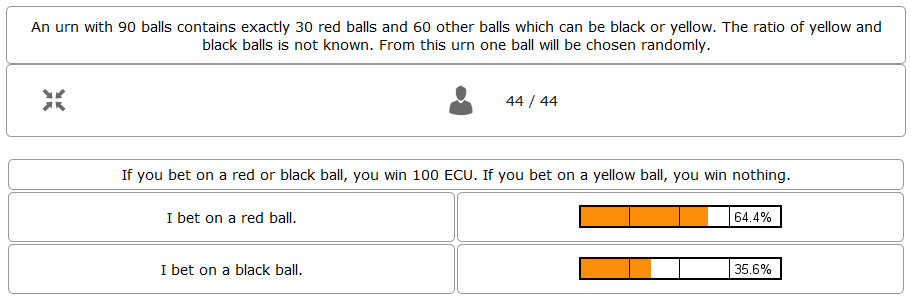

One possible application for games with random events is the so-called Ellsberg paradox. You can find games concerning this paradox under the titles “Ambiguity 1" and “Ambiguity 2". In these games, an urn contains 90 balls, 30 of which are red and 60 of which are either black or yellow. The proportion of black and yellow balls is unknown. Now, one ball is drawn from the urn. Participants can bet on a red or a black ball. If a yellow ball is drawn, participants win nothing. Results show that participants rather bet on red balls, hence, they try to avoid the uncertainty connected with betting on a black ball.

Special feature: Random Draw

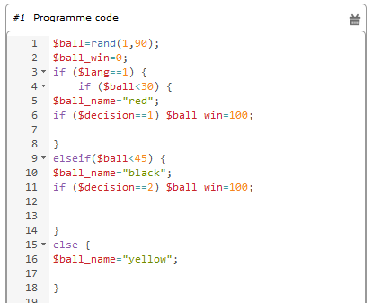

The special thing about this game is that you can actually implement random draws. Participants, therefore, can be informed about whether they would have won or not. For this, you need to implement a random draw in the second stage in classEx. You simply write a small program with PHP-function rand(); in order to draw a ball. The outcome is displayed in a text field. You can find a detailed description of programmes in [[Elements]].

- Lottery and Risk Preference

A test to determine subjects‘ risk preferences was presented by Holt and Laury (American Economic Review 2002). The following experiment shows how this works. 10 situations are presented to the participants, who then choose between a low-risk option A and a high-risk option B for each situation.

============= ========================================== ===========================================
Situation     Option A                                   Option B
============= ========================================== ===========================================
Situation 1   €2 with p = 1/10 and €1.60 with p = 9/10   €3,85 with p = 1/10 und €0.1 with p = 9/10
Situation 2   €2 with p = 2/10 und €1.60 with p = 8/10   €3,85 with p = 2/10 und €0.1 with p = 8/10
Situation 3   €2 with p = 3/10 und €1.60 with p = 7/10   €3,85 with p = 3/10 und €0.1 with p = 7/10
Situation 4   €2 with p = 4/10 und €1.60 with p = 6/10   €3,85 with p = 4/10 und €0.1 with p = 6/10
Situation 5   €2 with p = 5/10 und €1.60 with p = 5/10   €3,85 with p = 5/10 und €0.1 with p = 5/10
Situation 6   €2 with p = 6/10 und €1.60 with p = 4/10   €3,85 with p = 6/10 und €0.1 with p = 4/10
Situation 7   €2 with p = 7/10 und €1.60 with p = 3/10   €3,85 with p = 7/10 und €0.1 with p = 3/10
Situation 8   €2 with p = 8/10 und €1.60 with p = 2/10   €3,85 with p = 8/10 und €0.1 with p = 2/10
Situation 9   €2 with p = 9/10 und €1.60 with p = 1/10   €3,85 with p = 9/10 und €0.1 with p = 1/10
Situation 10  €2 with p = 10/10 und €1.60 with p = 0/10  €3,85 with p = 10/10 und €0.1 with p = 0/10
============= ========================================== ===========================================

Lecturers should explain that a few randomly drawn participants will receive a payoff. One of the ten situations will be drawn for the randomly chosen participants and another random draw will determine whether the first or second value will be paid out.
You need to create a separate input (Single Choice input options) for each of the ten situations, which means that participants will make ten decisions altogether. **This game is not yet implemented in classEx.**

- Search Costs

Decisions and random draws can also be implemented over several rounds. As an example, classEx provides a game in which the advantages and disadvantages of a continued search are demonstrated. While searching for a suitable craftsman, participants need to invite several offers that are determined randomly and, therefore, cause subjects to weigh up the costs of searching and the improvement of offers through a continued search.

The costs of searching are 1.20€ per offer. Participants can invite up to five offers with the value of the craftsman’s service varying between 0 and 20 euros. The participants’ payoff is determined by the craftsman with the highest value among the invited offers, minus the costs of searching.
This game was played during the lecture Economics of Institutions in the summer semester 2012. A video (in German) can be found `here <http://www.wiwi.uni-passau.de/wirtschaftstheorie/classex-interaktive-hoersaalexperimente/anwendungsbeispiele/>`_.

Single Choice with Treatments
------------------------------

Treatments are a great possibility to expand Individual Choice questions. With these, two (or more) variations of the same game can be played. Participants are divided into two groups of the same size and, for example, see different scenarios for the same game. Each group then plays a different treatment and differences between the two treatments allow for conclusions regarding the impact of different scenarios. To implement this, you need to choose the option “Treatment" in list “Treatments, roles & groups" and specify the number of treatments. It is possible to display different information, so-called private information, on the mobile devices of the two groups. A well-known example for the use of treatments is the “Asian disease" presented by Tversky and Kahnemann (Science 1981) which exemplifies a cognitive bias. Similarly, framing and priming effects can be determined with a game. In the following, you can find a few examples of how treatments can be used in classEx:

- Ethical Dilemma

.. image:: _static/Dilemma.PNG
    :alt:  300px

A different application of treatments can be found in experimental ethics. Here, a growing strand of literature is dealing with the diffusion of responsibility. Participants need to weigh up self-serving options, which promise money or convenience, or altruistic options that benefit other people or fulfil social norms or laws. Results show that the self-serving option is chosen more often if participants can shirk their responsibility for other goals. classEx provides a game that covers this topic called “Ethical Dilemma". In this game, a scenario is described (see figure). Two different treatments are implemented. Half of the participants get the description marked with an orange color. The other half get the description marked with a blue color. The treatment effect can be directly observed.

- Nudge

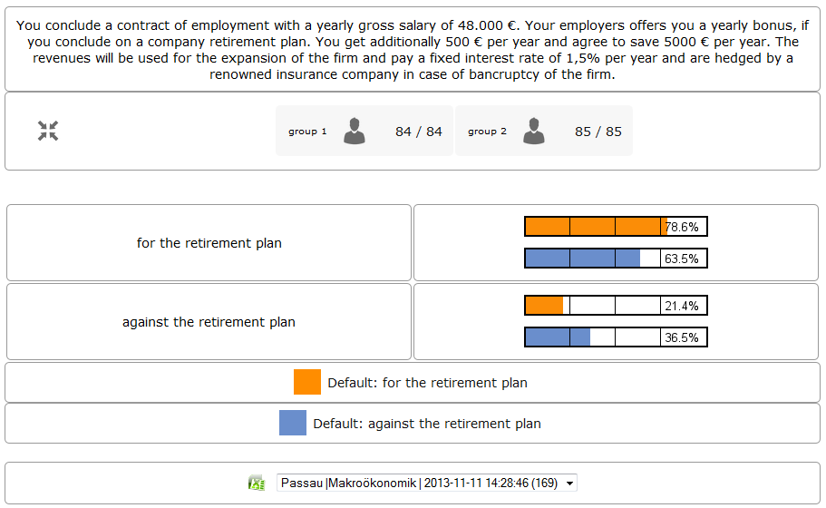

A different example concerns the influence of a default on human behaviour. This is discussed thoroughly in Thaler and Sunstein’s book Nudge (2009). A nudge is a small push that directs participants to one decision or another. [[wikipedia:Nudge|Nudges]] can often be found when filling in surveys or questionnaires if one option is marked as default. Marking another option then requires an explicit decision. This can be illustrated by an experiment in which participants are asked whether or not they would like to participate in a company retirement plan. Two groups are asked to decide for or against a retirement plan, however, in the first group, the pro-option is marked as default and the other group has the contra-option marked. Results show that this treatment strongly influences participants‘ decisions. Those who have the contra-option set as default opt against the insurance scheme more often than those with the other option marked. This can be implemented in the [[editing Mode]] by indicating the relevant variable in the “Default" field.

- Wage Increase

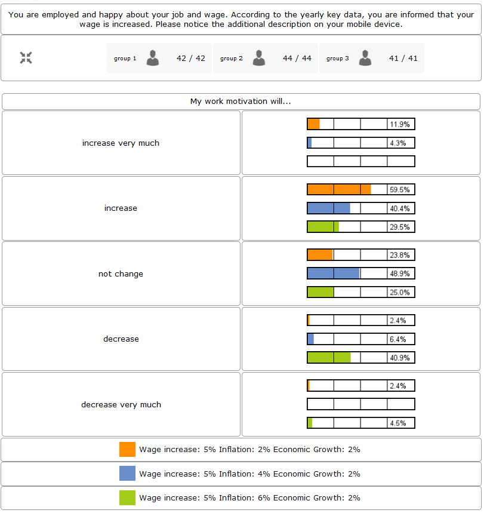

The number of treatments is not limited to two. For example, different wage scenarios and their influence on participants’ motivation to work can be analysed. In their book `Animal Spirits (2009) <http://press.princeton.edu/titles/8967.html>`_, Akerlof and Shiller suggest that people’s motivation to work is guided by nominal wages and that inflation rates are not considered sufficiently. In classEx, you can find a game called “Wage Increase" that covers this topic. Three different treatments are implemented in this game. Participants are asked how their motivation to work changes in reaction to different wage increases and inflation rates. This game enables an analysis of whether participants react to nominal or real wage increases.

Multiple Choice
---------------

Opinion polls differ from quiz questions in the sense that you cannot classify one answer as correct. Further, it may be possible to choose more than one answer (Multiple Choice).

- Effects of inflation

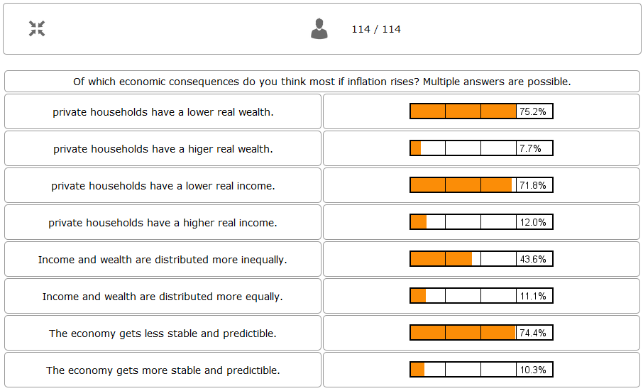

An example for an opinion poll with multiple choice answers is the question of the effects on inflation, where more than one answer may be correct. You can implement such an opinion poll in classEx, by selecting “Check boxes (Multiple Choice)" in the editing mode. None of the options should be marked as correct. Furthermore, you need to select “Multiple Choice" for the evaluation of results.
Hint: You can easily change the order of answer options by drag & drop. Simply click onto the number of the option you would like to change and drag it to the new position.

Numeric Data
------------

Decisions of participants can require an input of numbers. For this, simply choose “Numeric input field" as the type of input field in the editing Mode. A game that uses this form of input is shown below:

- Estimation Task

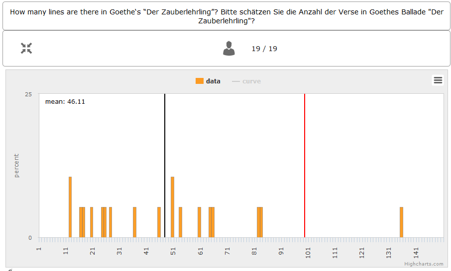

Participants are asked to estimate the number of lines of a famous German poem. The right answer is marked by the red line.

Numeric data with treatments
----------------------------

You can also implement several treatments in games with numeric input.

- Distribution of Income

The distribution of income into consumption and savings is another example for the implementation of treatments with numerical input. Here, participants specify which percentage of a payment they want to use for certain purposes. This allows an analysis of the well-known macroeconomic theory of Ricardian Equivalence, i.e. the question whether households take future tax payments into account while determining their current consumption behaviour. In classEx, you find such a game called “Consumption and Government Spending". In this game, participants are told that each citizen receives a large amount of money from the government. They then have to decide how much of this money they want to spend for non-durable consumer goods, how much they want to spend for durable consumer goods and how much they want to save. Two treatments are implemented which differ in regard to the way in which the government finances these payments. In the one treatment, the government has found new natural resources which finance the payments. In the second treatment, the government finances the payments via credits, i.e. the emission of new government bonds (which would then lead to higher future tax rates). Results show that the treatment only has a small influence on the level of savings. Therefore, evidence for the theory of Ricardian Equivalence is rather small.

Strategic Interaction
======================

With classEx, strategic interaction in the lecture can be modelled, too. It offers games which can be conducted simultaneously, sequentially or continously (not yet implemented). Furthermore, the type of the game is determined by the number of roles. Participants can be assigned to different roles. Every role is related to a seperate task and interaction. In game instructions roles are usually referred to as coloured human shape icons:

Simultaneous with one Role
--------------------------

In a simple variation with strategic interaction, all participants have the same role and only interact with each other in one big group. Contrary to individual choice games, the result is influenced by the decisions of all other participants in the lecture.

Discrete
~~~~~~~~

- Workplaces in the Library

- Schelling Salience (Faces Beauty Contest)

The Faces Beauty Contest goes back to `John Maynard Keynes (1936) <http://de.wikipedia.org/wiki/John_Maynard_Keynes>`_. Here, the participants choose the two most beautiful faces. Precisely, the instructions go as follows:

"Please choose the two prettiest faces among the following eight faces. The two faces which are chosen most often gain the title "man of the year". Of those participants who opted for that pair of faces, one participant is drawn randomly and will earn 20 €."

.. image:: _static/SchellingSalience.JPG
    :alt:  200px

The eight faces are shown in the figure in the right corner in which you can find the faces of the two lecturers themselves. For the participants, these stand out prominently. This prominence is called [[Schelling Salience]]. With this, participants are able to agree on the selection of the two lecturers as a pair. Everybody who does that maintains his / her opportunity to win. As in the case of Keynes, people are not selected with regard to their beauty, but dependent on the achievable profit. For Keynes, this was an example for the fact that investors don’t buy the best asset but those which they can sell to others most successfully.

Numeric
~~~~~~~

- Common Value Auction

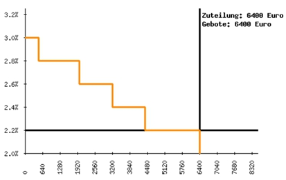

For all participants, a purchased product has the same value (**Common Value**). Still, participants differ in their bidding behaviour as well as in their expectations with regard to other participants. An example for this is the auction of '''Central Bank Credits''' with a loan period of one year. Every participant plays the role of a bank. Every bank submits a tender for credits of the Central Bank to the maximum amount of 5000€. Doing this, any interest rate with two decimal places can be chosen. Every bank can split up their bid into up to three interest rates. For instance, Bank A bids 1000€ for 2.4%, 2000€ for 2.5% and 2000€ for 2.7%. The bank lends the obtained resources to others at a rate of 3%. That is why 3% is the maximum interest rate of the bids.

The lecturer can set the total volume of Central Bank Credits, which are put up for auction, in advance. Consequently, the equilibrium interest rate is determined at the value at which the demanded volume of the participants just equals the provided volume of the Central Bank, e.g. 2.2% as depicted in the figure. Participants win a tender for those bids which at least equal this equilibrium interest rate. Bank A would receive the full amount of 5000€, since every bid is higher than 2.2%. If the equilibrium interest rate was higher, e.g. at 2.5%, Bank A would receive 2000€ for 2.7% for sure. If the volume of the bids at the equilibrium interest rate is higher than the allocated Central Bank Credits, it is down-scaled. Here, the allotment interest rate may be 25%. Bank A would now be allocated 500€ (2000€*0.25) at an interest rate of 2.5%.

This procedure is equivalent to an American auction. The lecturer determines in advance, which rate of interest the participant has to pay, either the interest rate offered for each individual bid (**American auction**; multiple rate auction) or the equilibrium interest rate (**Dutch Auction**; single rate auction). One participant is chosen randomly for who the payoff is carried out for the selected amount by calculating the interest rate difference from 3% each and multiplying it with the allocation amount. Thus, on the screen of the lecturer, the corresponding demand curve is displayed.

- Private Value English Auction

- Beauty Contest

.. image:: _static/BeautyContest.JPG
    :alt:  300px

A frequently used game is the so called Beauty Contest. All participants choose a natural number between 0 and 200. From all numbers picked, the mean is calculated. The participant who comes closest to this mean wins and gets a payoff. A tie is solved by drawing a lot.

In this game, no Nash Equilibrium exists, because every number presents a possible solution. This game demonstrates the dependence of human behaviour on historical experiences. The figure to the right shows a second round of a Beauty Contest, after reporting an average of 107 in the first round. Obviously, a convergence to the previous number occurred, although it does not describe any equilibrium.

Often, variants of the Beauty Contest are implemented, in which the person who comes closest to the mean does not win. Rather, the average is first multiplied by a number p. If, for example, the number p=2/3 is selected, the participants should choose a number which is lower than the average of the other participants' chosen numbers. These results allow for a conclusion to be drawn on how accurately the participants think through strategic interaction, how expectations with regard to the behaviour of others are formed and whether they commit an error themselves.

- Tragedy of the Commons

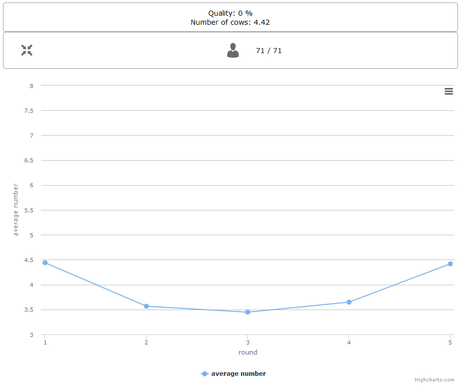

The Tragedy of the Commons describes how a common good can be used excessively. This becomes clear in the following description of the game: All participants in the lecture want to send their cows to graze the meadow in the mountains. At the beginning, the quality (Q) of the meadow is 1 (100%). Depending on the average punching of the cattle, a, the quality of the following period is defined as:

.. image:: _static/AllmendeFormula.JPG
    :alt:  100px

You play a game with a duration of 5 years (rounds). For your payoff, the quantity of the punching of the cattle is multiplied by the quality and summed up over all five rounds. The amount will be disbursed in euros and assigned to a participant randomly determined by a lottery ticket. In the figure below, the initial situation is shown. Over five rounds, the tragedy can be observed: A constant reduction of quality of the alpine meadow, causing damage to the group.

- Public Goods Game, Common-Pool Resource Game or Minimum-Effort Game

.. image:: _static/PublicGoodsGame.JPG
    :alt:  300px

A Public Goods Game is mostly conducted in smaller groups, thus, the participants of the lecture do not all play in one big group. In the Public Goods Game depicted below, five persons interact in a group and decide individually how much of their initial endowment they want to pay into a public account. The game is played over 10 rounds and the groups are identical over all these rounds (partner protocol). For one deposited Euro, every participant receives 0.50€, so that, individually, a payment is not worthwhile. But a participant hopes for high payments of other participant since returns accrue from this. The figure shows a typical result: The willingness to pay decreases over time.

Simultaneous | 2 Roles
----------------------

Discrete
~~~~~~~~

This sort of game entails standard Matrix Games.

- Battle of the Sexes

Strategic interaction games often entail two participants who interact and play in different roles. In the easiest case, each participant can choose between to options, so that the payoff can be displayed in a 2x2 matrix. This form of display is supported by classEx.

The battle of the sexes game is an example for a strategic interaction game with two roles. Two participants would like to see each other again but each prefer a different place. They must decide simultaneously which option they choose. participant 1 has a higher payoff for option A, whereas participant 2 to has a higher payoff for option B. However, if participants do not coordinate on the same choice, both receive a payoff of zero because. Depending on the setting, one of the two options can emerge as point of coordination.

- Chicken Game

- Hawk-Dove Game

- Stag Hunt

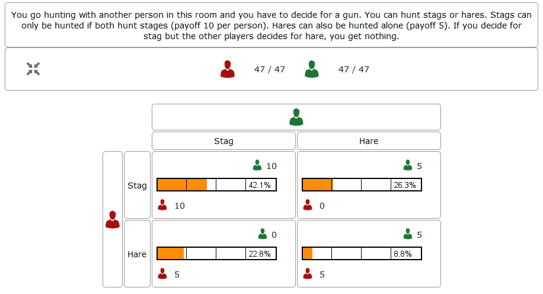

Standard matrix games can be implemented in classEx. Like the famous `Stag-Hunt Game <https://en.wikipedia.org/wiki/Stag_hunt>`_. participants are matched with a partner in the lecture room and have to decide. After all made their decisions, the game is closed and the result is displayed.

- Prisonners Dilemma

.. image:: _static/Pd.PNG
    :alt:  300px

Standard matrix games can be implemented in classEx. Like the famous `Prisoner's dilemma <https://en.wikipedia.org/wiki/Prisoner%27s_dilemma>`_. participants are matched with a partner in the lecture room and have to decide. After all made their decisions, the game is closed and the result is displayed.

- Coordination Game

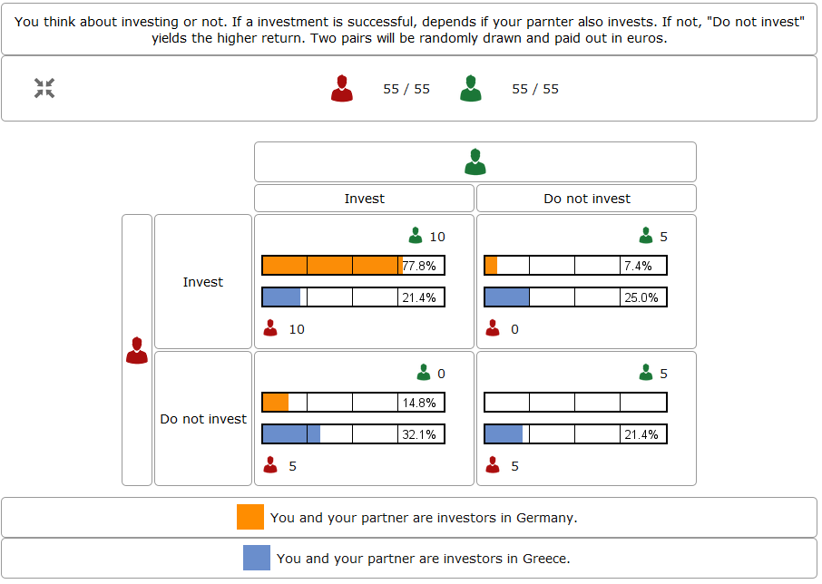

Treatments can also be implemented for games with two roles in order to study, for instance, effects of differences in the environment of the decision or different incentives. The macroeconomic book of Akerlof and Shiller `Animal Spirits (2009) <http://press.princeton.edu/titles/8967.html>`_ presents the idea that investments are only made if other investors simultaneously decide to do so, too. This relationship is investigated in the game “Coordinated Investment", by providing private information to participants of the otherwise identical `Coordination Game <https://en.wikipedia.org/wiki/Coordination_game>`_. In one treatment, this information reads that the investment is made in Germany. In another treatment, the country of destination of the investment is Greece, which was suffering an `economic crisis <https://en.wikipedia.org/wiki/European_debt_crisis>`_ at the time of conducting the experiment.

All of these might be carried out with multiple treatments.

Numeric
~~~~~~~

- Dictator Game

A dictator game can be easily implemented in classEx. Here, you will require a numeric input field. participant 1 receives an endowment and can then decide how much of this endowment to transfer to participant 2. participant 2 is passive in this game and can make no decision.

- Ultimatum Game with MAO°

In the ultimatiom game in the strategy method, both participants make a decision simultaneously.
participant 1 takes the role of the proposer and is endowed with a certain amount. He may then transfer all, some or none of this endowment to participant 2.
In the ultimatum game, participant 2 then decides whether to accept or reject the proposed division of the pie. If participant 2 rejects, both participants receive a payoff of zero. When the ultimatum game is implemented in the strategy method, participant 2 is presented with all possible divisions. She then decides which offers she would reject and which she would accept. At this point, participant 2 is not yet informed about the actual decision of participant 1.
This strategy method is usually implemented to extract participants' minimum acceptable offer (MAO).

Sequential | 2 Roles
--------------------

Sequential games can be modelled with two or more stages.

Discrete
~~~~~~~~

- Principal-Agent

A sequential game consists of at least three stages. In the first stage, participant 1 makes a decision. In the second stage, participant 2 makes a decision. In the third stage, the results are displayed.

The pricipal agent game is an example for sequential games that can be implemented with classEx:

A principal agent situation can be found in many economic interactions like, for example, between an owner and a manager or broker. In classEx, you will find an easy implementation for a labour contract in which an employer (principal) chooses the type of contract and the employee (agent) then chooses his level of effort as a reaction to the contract. This set-up presents a simplification of Brown, Falk and Fehr's (2002) gift-giving in the labor market, implemented without repitition.
The level of effort chosen by the agent determines the revenue of the principal. The principal can choose between three different payment systems:
a fixed wage without a share of the revenue, a share of the revenue without a fixed wage and a mixture of the two, labelled Bonus. The systems in which the agent receives a share of the revenue involve organisational costs. Therefore, following table results:

======================== =========== ========================== ========================== ============
Renumeration system      Fixed wage  Share of revenue participant 1  Share of revenue participant 2  Revenue loss
======================== =========== ========================== ========================== ============
Fixed wage system        3.20 €      100%                       0%                         0%
Bonus system             1.60 €      60%                        25%                        15%
Share of revenue system  0 €         20%                        50%                        50%
======================== =========== ========================== ========================== ============

In the table, participant 1 denotes the principal and participant 2 the agent.
The agent then chooses his level of effort and consequently the revenue and his disutility from working denoted in €:

================ ============ ======= ======= ============ ================
Level of effort  Very little  Little  Medium  Hardworking  Very hardworking
================ ============ ======= ======= ============ ================
Revenue          1.60 €       3.20 €  4.80 €  6.40 €       8.00 €
Disutility       1.00 €       1.20 €  1.60 €  2.20 €       3.00 €
================ ============ ======= ======= ============ ================

This game shows that revenue losses are accepted and that systems allowing the agent to participate in the revenues are chosen despite the revenue losses, because the agent only has an incentive to work hard if he participates substantially in the revenues. Some principals also choose the system with a fixed wage and no participation of the agent. However, the game is not played repeatedly and agents hence do not have to fear for their reputation. Therefore, the level of positive reciprocity is small and results in little effort in the system with a fixed wage.

- Centipede Game

Sequential games can be run over more than two rounds. A well-known example for this is the centipede game. In the centipede game, the sum of payoffs for both participants increases over a finite and known number of rounds. First of all, participant 1 makes a decision. In the next stage, participant 2 does so. In each stage, participants choose between two options, either to **take**, which ends the game and ensures the payoff of that round, or to **pass** which delegates the decision to participant 2 and increases the payoff.

**Implementation in classEx:**

The game starts with a total payoff of 5€. In this stage, participant 1 decides whether to **take** or **pass**. If he **takes**, receives 4€ and receives 1€. If he chooses to **pass** the total payoff increases to 10€ and now has to decide whether to **take** or **pass**. In this stage, has an advantage. **Take** renders a payoff of 8€ for and 2€ for. However, if **passes**, the total payoff increases to 20€. Now, has the choice again. He can either **take** and receive 16€, leaving 4€ for . Or, if he chooses to **pass**, the game ends with another increase of the total payoff to 40€, giving participant 2 32€ and 8€. Two pairs are randomly drawn and receive a winners' notification with which they can collect their payoff. The lecturer is provided with a graphical illustration of how often the game was terminated with the choice of **take** in the respective stages.

Numeric
~~~~~~~

- Labor Contract

- Trust Game

In the trust game, participant 1 (trustor) can can decide whether to transfer none, some or all of her endowment to participant 2 (trustee). Transferring the entire endowment is socially optimal because the transferred amount is multiplied by the experimentor. participant 2 can then decide whether to transfer none, some or all of his endowment back to participant 1. Therefore, transferring is only worthwile for the trustor, if the trustee repays the trust and transfers back at least the sent amount.

.. image:: _static/Trustred.JPG
    :alt:  200px

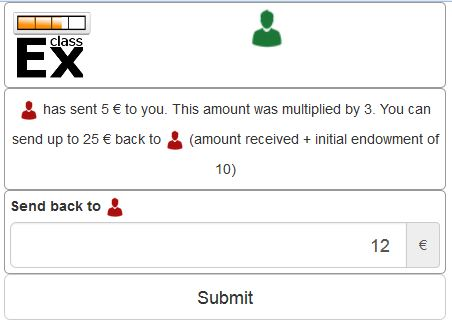

**Implementation in classEx:**

The input for participants can be implemented by defining the variables:

    $max=10; $endow=10; and $multi=3;

Here, the endowment equals 10, the maximum transfer by the trustor equals 10 and the multiplier equals 3. The input decision of participant 1 is stored by the variable $send;. In the second stage, you need to write following code in a programme field:

    $send=$getPartnerDecision("692#1"); $max=$endow+$send*$multi;

Make sure that you make reference to the correct stage and the correct input field. In this example, the code refers to stage number 692 and input field number 1. The following input by participant 2 is stored as variable $sendback. Hence, the amount sent back can be calculated by:

    $received=$getPartnerDecision("693#1"); $payoff=$endow-$send+$received;

With this, you can write the following in the text field that is displayed to the trustor:

Of your endow; €, you sent $send; € to participant 2. This amount was trippled. participant 2 sent back $received; € to you."

**Display of results**

The results are displayed as a bubble chart on the lecturer's screen:

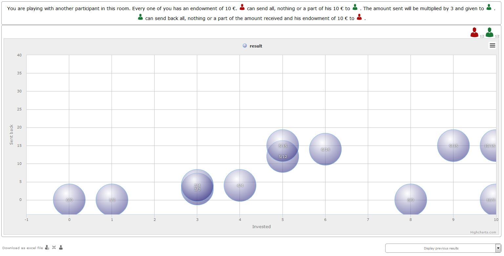

- Ultimatum Game

In the ultimatum game, participant 1 takes the role of the proposer and is endowed with a certain amount. He may then transfer all, some or none of this endowment to participant 2.
In the next stage, participant 2 then decides whether to accept or reject the proposed division of the pie. If participant 2 rejects, both participants receive a payoff of zero.

- Alternating Offer Bargaining

In contrast to the centipede game, the total pie shrinks over time in the alternating offer bargaining game. Also, input is numeric.

The game starts with a pie of, for example, 20€. In stage 1 participant 1 makes a suggestion on how to divide the pie between both participants. In stage 2, participant 2 can decide whether to accept the division or not. If participant 2 does not accept the division, the pie shrinks to 16€ and participant 2 is then required to make a suggestion on how to divide the remaining pie. In stage 3, participant 1 then decides whether to accept or reject the division and, in case of a rejection, makes a new suggestion on how to divide the pie which has now shrunk to 12€. In stage 4, participant 2 can decide and if she rejects, the pie shrinks to 8€. She then makes a new suggestion on how to divide this pie. In stage 5, participant 1 decides and if he rejects the proposed division, he can make a final suggestion on how to divide the pie which has now shrunk to 4€. If participant 2 rejects this final suggestion, both participants end up with a payoff of 0€. Two pairs of participants are randomly drawn and receive a winner's notification and a real payoff.

A bubble chart allows lecturer to gain an overview of how high the offers were in the respective stages and to compare the results with theoretic values that would result via backwards induction presuming income maximising behaviour.

Continuous | 2 Roles
--------------------

Continuous games are not yet implemented in classEx. This will be done in the near future.

- Unstructured Bargaining

Continuous games are games in which the sequence of decisions is not determined. Participants are allocated to different roles and matched into pairs. However, there are no rules as to who may make an offer in which stage. In contrast to Alternating Offer Bargaining, bargaining is unstructured here. Both participants can make offers at all times. Participants can always accept an offer or make a different offer.

A buyer is willing to pay a certain amount for a good, ranging between 0€ and 100€. The number is determined randomly and is only known to the buyer but not the seller. The seller faces costs for the production of the good which also lie between 0€ and 100€, are determined randomly and are only known to the seller.
Buyers and sellers are matched to one another randomly. The buyer can make an offer to buy the good for a price that must not be above his willingness to pay. At the same time, the seller can make an offer that cannot be lower than his production costs. If an offer is accepted, the game ends. An offer is updated by issuing a new offer. If participants have not reached an agreement after two minutes, the game ends and both receive 0€. In case of an agreement, the buyer receives the difference between his willingness to pay and the price. The seller, analogously, receives the difference between his production costs and the price.

The lecturer is provided with graphical results in a scatter plot. The abscissa depicts the buyer's willingness to pay and the ordinate displays the costs of the sellers. An **x** indicates that an agreement was reached. An **o** shows that no agreement was reached. Here, one can see efficiency losses that result from strategic offers.

- Dutch Auction

The dutch auction is a variation of the Common Value Auction. For the description of the game, please see Common Value Auction.

The difference between the American and the Dutch auction is that in the case of a Dutch auction, the bank pays an equilibrium interest rate for all bids and not the interest rate it offered for each bid.

- Double Auction

Often, markets are characterised by the fact that sellers and buyers can make public offers instead of negotiating bilaterally. In one of the first experimental studies on this, Vernon Smith (Journal of Political Economy 1962) showed that prices quickly converge to a level that is predicted for competition and income maximisation. Further studies have exhibited that competition crowds out other factors such as the desire to obtain a monopoly rent or the aim to achieve an equal split of the revenue between buyers and sellers.

A double auction is marked by an environment in which buyers and sellers can make public offers. Hence, a buyer can offer to buy a product for a certain price and this offer is then displayed in a list to all participants. Sellers can either accept the offer or also make an offer which is displayed in the list.

