=====================
Run ready-made games
=====================

In the overview mode in classEx, you can find a set of ready-made games which can be played directly in the lecture mode. The interaction between the lecturer and the participants takes place in the lecture mode. The lecturer's browser is usually projected to a wall. Games are started and terminated in the lecture mode and the results are also displayed in this mode.  Just start a game by pressing "play" and open some test participants by clicking at the test participant symbol |pic_testparticipant| in the top navigation bar. Test participants open in a new tab of the browser.

.. |pic_testparticipant| image:: _static/pic/addPlayer.png
                            :width: 15px

.. raw:: html

    How to do this step by step is shown in the following video.

    

    <iframe width="100%" height="350" src="https://www.youtube.com/embed/zmAn0ZzTQPk" frameborder="0" allow="autoplay; encrypted-media" allowfullscreen></iframe>
    

.. raw:: latex

    You can find a short video on how to play a ready-made game on \url{https://youtu.be/zmAn0ZzTQPk}.

If you are already familiar with running a ready-made game and want to prepare for your first classEx experiment in your lecture you can also download the classEx `cheat sheet`_. It gives a step-by-step guide what to prepare for and do in class.

.. _cheat sheet: https://classex.de/easystart.pdf

What you need
=============

Participants' devices
---------------------
Every participant who wants to take part in a session needs a mobile device (e.g. mobile phone or tablet) with a browser and internet connection. Browsers should be up-to-date and javascript and cookies enabled. Participants can connect via mobile Internet or available wifi.

Lecturer device
----------------
The lecturer conducting a session needs a device with a big screen (e.g. laptop, tablet) with a browser and internet connection. The screen of the lecturers device should be visible for all participants (e.g. via a classroom projector). 

.. note:: Make sure you have a stable internet connection as a lecturer. The best option is with a cable. It is best not to use the same connection (e.g. wifi) as the participants in case the network slows down.

.. note:: The ideal browser to use is Mozilla Firefox (in a current version). Javascript has to be turned on and cookies allowed (normally default setting). **Do not use the Internet Explorer**.

Run a game
==========

Information for participants before the course
-----------------------------------------------

You may inform participants upfront e.g. via email that you plan to run an experiment in class.

- participants have to bring a mobile device that has internet access, e.g. a smart phone, a tablet or laptop (see `Participants' devices`_).
- The browser they use should be up-to-date and javascript and cookies enabled. We suggest to use Firefox.
- The devise has to have enough battery left (suggest to bring a charger).

Additionally, if relevant, you can inform participants that classEx only requires a small amount of data volume (for participants). When using classEx as a participant for the first time, loading all settings requires about 120 KB (this is cached and does not need to be reloaded when reentering). Each game that is played requires data volume of roughly 20-50 KB. If you decide to use games with additional graphical libraries (e.g. for plots on the participants' screens), this amount may be higher. This information may be especially relevant if participants have limited amounts of data volume.

Information for participants in the course
-------------------------------------------

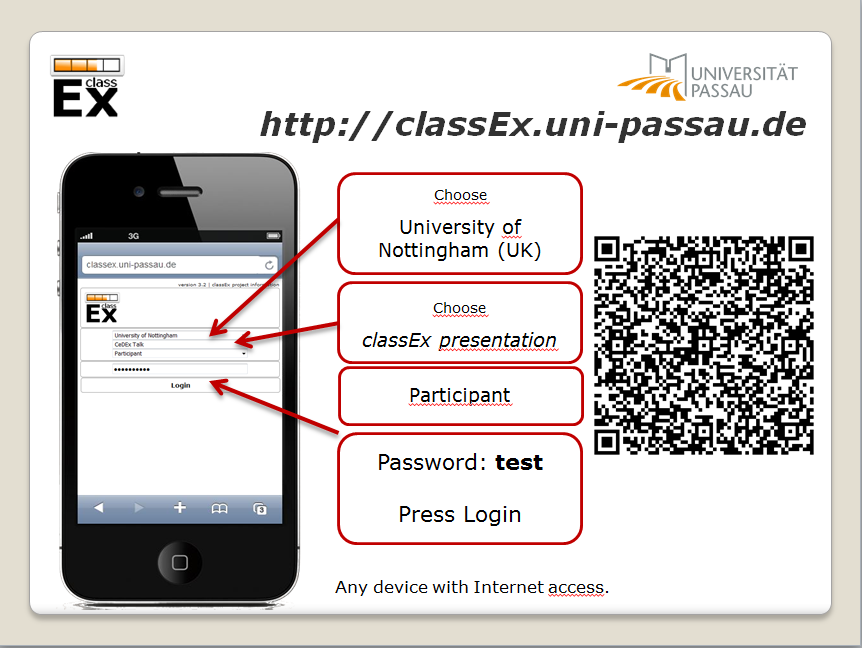

**The only important information participants need is how to login**. The easiest way is to provide them with a PowerPoint slide with the login data. You can add a QR code but notice that QR codes may not work in big lecture halls. For all login possibilities (link, QR,...) see `Login of participants and test participants`_.

Before you start a game, you may inform participants also about the following:

- Participants need to stay logged in until the experiment is over.

- Participants should close all apps. Having other apps open might reduce the internet speed and therefore a well-functioning of classEx.

- If the experiment has already started (and some decisions have already been entered), participants might not be able to join the experiment any more. This depends on the game, but usually joining is no longer possible after the first stage of a game has been concluded.

- If participants are chosen randomly to receive their payoff, they should make screen-shots of their winner's notification to be sure to receive their payoff. (see `Disbursal of payoffs`_).

Before the start
----------------

Ask all participants to login. The counter over the start button shows how many participants are currently logged in. There is no minimum number of participants required to start a game.

.. note:: The best option is to let all participants login first, then start a game. Participants can also login when the game is running. Participation is always possible when the first stage of the game is running. Depending on the game, it may not be possible to participate if the game has already proceeded to later stages.

The lecturer can select a new game by choosing it from the drop down list in the top left corner or by selecting in the overview mode. The drop down list shows all available games.

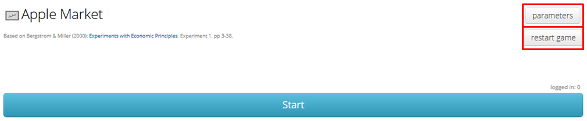

Parameters offer a possibility to adapt the setting of the game. If a game has changeable parameters the *parameters* button appears in the lecture mode before you start the game. You can change the parameters of a game by clicking on *parameters*. For example, in a public goods game, you can change the the endowment and restart the game with the new settings. The button *restart game* allows you to restart the current game.

Start a game
------------

A selected game can be started by pressing the blue start button.

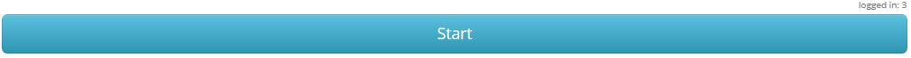

By pressing start, the lecturer initiates the first stage of the game. If a game consists of several stages, the start button for the next stage appears after pressing the start button for the first stage.

.. warning:: By starting a new game, the currently running game is stopped. There can only be one running game at a time.

If a game consists of several treatments and / or roles the participants will be assigned into treatments / roles in the first stage. For more information on assignment of roles and treatments see :ref:`Develop:Develop your own games`.

.. note:: If you have different roles and treatments, the first stage should be opened long enough that all participants are assigned to a role and treatment. The assignment is done when the stage has been loaded at the participants' device. So make sure that you do not continue to the next stage too fast.

During the game
---------------

During the course of a stage, a display shows how many participants are logged in and how many of them have already made their decision in the current stage.

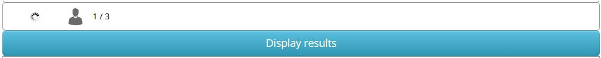

Here, 3 participants are logged in and 1 has already made their decision.

.. note:: If you play a game with large groups, it can happen that participants take some time until they make their decision. You should wait for a while but then terminate the stage and carry on if the added value of more input is fairly small.

.. note:: Note that there is no way back if you continue to feedback or next round/session.

.. note:: If you accidentally close the browser, no problem. Just open it again. Normally you should be still logged in. Otherwise just log in again.

End the game
------------

When the participants have made their decisions, the lecturer can end the game by clicking on the blue button. In many cases it shows „display results“.

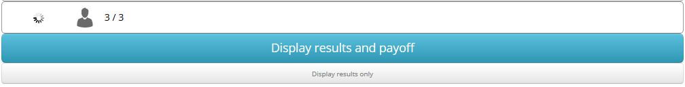

If games are played for real money (and participants receive a payoff code), the lecturer does not only have the normal „display results“ button but also the enhanced button "Display results and payoff". If you should not want to pay out any money, for example in a practice round, you have the possibility of clicking on “display results only" below the actual button.

.. note:: A game does not have an end button. A game is only stopped when a new game is started. 

After the game
--------------------

Once a game is over, you can download all recorded data by selecting "download as excel file" from the "data" menu in the top bar. If you want to go back to compare the current results with old ones or ones in different courses, click on “previous results".

If you want to log out all participants after the game you can do so by clicking on the log out all participants button in the :ref:`Coursedata:Course data`. 

.. note::  Logging out all participants does not work correctly when trying it with your self-made test participants. If you want to test it you can use different mobile devices and therefore simulate real participants.

Settings in the top bar
========================

The top bar of the **lecture mode** provides the following functionality.

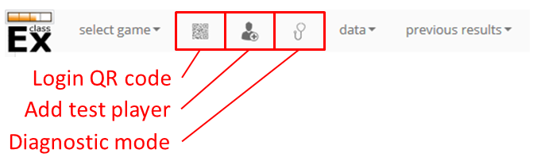

select games
    Select games from own and ready-made games. The selected game opens up as soon as you click on it.

login QR code
    Click on QR code to display the QR code for login. The QR code page also provides some details about other ways to login (see `Login of participants and test participants`_)

test participant
    This button will open a test participant in a new tab. This can be very useful to test classEx games. If you want to open multiple test players at a time, just hold the Crtl-button and click several times on the test player icon.

diagnosis mode
    In the diagnosis mode you can see all variables for the lecturer and the participants, which makes detecting programming errors much easier. It is only useful if you use advanced programing.

data
    The drop-down menu *data* offers two options. By clicking on **show data** you can access a preview over participants current decisions in real time. You can also download the results via **download as excel file**. More information on the excel file can be found under :ref:`Run:Excelfile`

export to x-econ
    classEx offers the possibility to directly export data to the data-repository `xecon`_ for long term storage and publication. More information on the excel file can be found under :ref:`Run:xecon`.

    .. _xecon: https://x-econ.org

  previous results
    You can access previous results via the previous results drop-down menu. Simply choose which results from previous session you want to display. This way you can directly compare current outcomes with previous ones, you just played or, if available, old results of the same game. When you selected a previous result you can also download all data for this result by clicking on **show data** in the data drop-down menu. The previous result section also contains results from other lecturers if the game and the recorded data are public. If you use such a public game, your data will be available to other lecturers as well.

.. note:: If you do not want that others see your recorded data when you use a public game, you should make a copy of the game and set it to private. Then play the private version of the game.

Login of participants and test participants
============================================

Login via website (default)
----------------------------

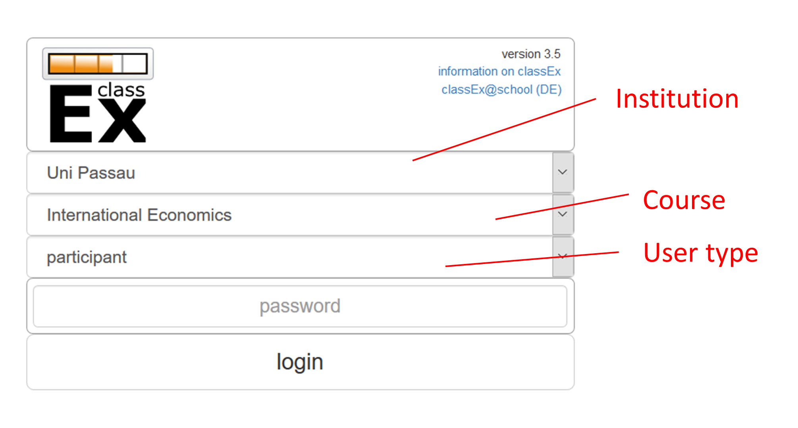

In order to login, participants go to the website http://classex.uni-passau.de and choose their university and then their course. They enter the password provided by the lecturer and click on "Login".

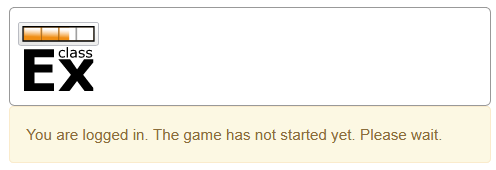

If participants are logged in before the lecturer has started the game, participants see a waiting screen with the message displayed above. The lecturer can edit the text on the waiting screen in the :ref:`Coursedata:Course data`.

.. note:: If a game has already been started, participants directly see the game and can play it. If may therefore be useful to ask all participants to login and start the game after that has happened. If a game has ended (but no new one selected), new participants get the message on login that the current game is still running and they cannot participate.

.. note:: If you want to identify participants, you can also add some additional fields to the login field. This can be done in :ref:`Coursedata:Additional setting`.

Login with QR-Code
------------------

All experiments can be accessed by participants via a QR-Code. This QR-Code is provided automatically in the lecture Mode in the top bar. Display the QR code by clicking on the symbol |pic_qr|. When clicking on the QR code symbol instructions on how to log in without using the QR code also appear on the screen.

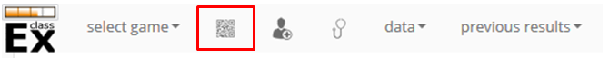

Lecturers can either copy the QR-Code and print it on leaflets, for example, or display it on the screen. 

.. |pic_qr| image:: _static/pic/qr.png
    :width: 15px

.. note:: Be aware that in big lecture halls the QR code cannot be scanned directly from the projection screen. 

Automatic link for login
------------------------

When you click on |pic_qr|, you also get some information on how to login participants directly with a link. They just have to copy the link in their browser and are logged in into your course (without the need of selecting the course and entering a password). The link looks like this: https://classex.uni-passau.de/bin/?automatic=L3ZY2rNO2gz14YkeGUxxF-g (this link is just for demonstration and cannot be used.)

Personalized link for login
----------------------------

You can augment the automatic link by a personalized ticket. This ticket will be stored as external ID in classEx and allows you to identify participants. This way you can ensure that participants only take part on one device and also track the actions of specific participants. You simply need to add &tic= to the URL. The ticket is saved to the participant data and can be retrieved by the variable $tic; in the game. It is also saved to the excel file. If the ticket is  e.g. 12345 the link looks like this: https://classex.uni-passau.de/bin/?automatic=L3ZY2rNO2gz14YkeGUTsdsdsFs&tic=12345 (this link is just for demonstration and cannot be used.)

Add test participant
---------------------

As lecturer you can run a game with fictional test participants in one browser. To add a test participant click on the button in the top bar of the lecture mode:

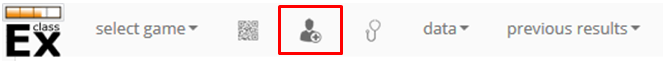

For every test participant a new tab in your browser will open. The tab for a test participant replicates the fully functional interface for a real participant. This enable you to make test sessions which is especially useful when you develop your own games. If you want to open multiple test participants just hold the Crtl-Button and click on the icon multiple times. 

Logout
------

There is no (visible) logout button for participants. This is done in order to keep participants in the game and that they cannot logout accidentally. 

If you want to log out a participant (e.g. in case of a problem), click on the classEx logo on the participant's device. This displays a logout button.

As a lecturer you can log out all participants that are currently logged in to your course by going into your :ref:`Coursedata:Course data` and by clicking on the button below. This will logout all participants immediately. This may be necessary if you run to lectures in a row and do not want to have the participants from the first lecture in the second one.

No refresh page needed
-----------------------

Participants’ screens are updated automatically when their partner has made a decision or when the lecturer has started a new stage. Therefore, it is not necessary to press a refresh button to proceed. This way, participants can simply wait until the next stage appears on their mobile devices and do not have to keep refreshing their screens. 

Participants' screens
=====================

The participants interface should be self-explanatory. The top bar contains the classEx logo and shows if participants are assigned to a specific role by displaying a (colored) icon |Role1|. The top bar may additionally show the internal participant id of the participant. 

The most common actions participants are asked to carry out are discrete decisions and numeric decisions as shown in the following sample screens. Another common element is the contract element where participants can trade items with other participants. There are also other input types such as text elements, radio buttons or sliders which are explained in the section :ref:`Elements`. 

Discrete Decisions
-------------------

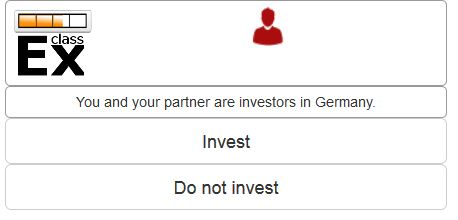

Discrete options can be shown to the participant. By clicking on one of the options, the decision is submitted and saved. The participant is informed that his or her message has been stored.

.. |Role1| image:: _static/pic/role1.png
    :width: 15px

.. note:: Participants cannot undo their decisions. You may add that participants have to confirm that they are sure to send their input.

Numeric Decisions
-------------------

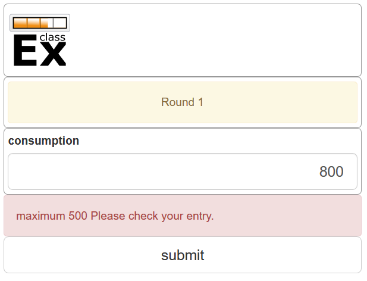

Numeric decisions can also be made by entering a number and pressing the submit button. If the input exceeds a predefined maximum or minimum, the participant has to redo his or her input. Beside minima and maxima you can also specify the number of digits and whether entering an input is mandatory. For further information see :ref:`Elements`.

Contracts
----------

Participant can trade items in classEx. Therefore, they walk around in class to find a trading partner. If they found a trading partner they have to conclude a contract in the following way.

.. image:: _static/rungame/seller_png.png
    :width:  100%

.. image:: _static/rungame/buyer_png.png
    :width:  100%

The upper row shows the different steps for the seller |Role4|, the lower row shows the different steps for the buyer |Role3|. In this case, only sellers can send offers to buyers. This can also be changed in the :ref:`Elements` settings. 

Each screen consists of two fields. The item field shows all items which a participant possesses. The contract field shows all contracts and offers.

First, the seller asks for the ID of the buyer which is displayed on the buyer's screen. In this example, the buyer has the ID 3. The seller enters the ID of the buyer and the price into the input field on his screens and presses *SELL*. Then an offer shows up for the buyer in the contract field. The buyer can accept or reject the offer. The seller can withdraw the offer. If the buyer accepts the offers, the item is transfered to the buyer and shows up in his or her item field. The contract is marked as accepted.

Disbursal of payoffs
====================

In some games participants will receive a real monetary payoff. The payoff is paid out by providing the participant with a payoff code. 

.. note:: Participants should not show their payoff code to others, as others could then claim the payoff. Therefore, it is advisable for participants not to let any other participant see the screen of their mobile device during the experiment.

.. note:: If a participant closes the browser, normally the payoff code is lost. Therefore, participants should take note of the payoff code or make a screen-shot of it. 

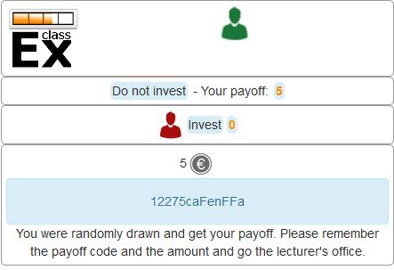

The participant can present the payoff code to the administrative staff after the end of the lecture in order to claim his or her payoff. The person entrusted with disbursing the payoff can login into classEx with the user type "administration" (see :ref:`Basics:Login`). The payoff can also be disbursed directly by the lecturer. The password for the lecturer is always valid for administration of payoffs as well.

If you login as user type "administration", you can see a list indicating the date, the payoff code and the amount of money to be paid out to the participant. Further, clicking on the red icons opens a pdf with a receipt that can be printed out and can be signed by the participant. Also, the administrator can tick the box on the right indicating that the participant has picked up his or her payoff.

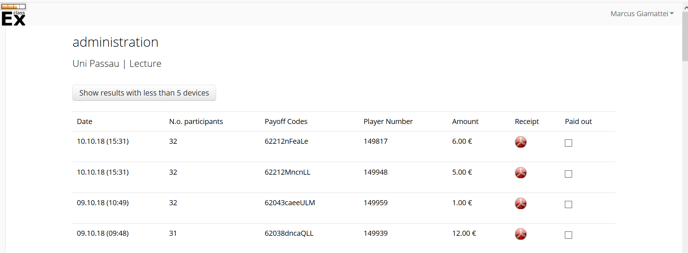

.. note:: The lecturer reserves the right of withholding the payoff in the event of error. classEx displays an automatic message which states: "In this game payoffs could be made. The lecturer is responsible for the payoff, subject to a technical check for correctness of the winning codes. Legal recourse is excluded."

.. note:: If a participant lost his or her payoff code, the list of payoffs also shows the internal player number of the player. If the participant logs in with the same device as he or she played the game, the player number can be retrieved by clicking on the classEx logo in the top right corner. This can be used then to verify that the persons is entitled to receive the payoff.

Graphical results
=================

At the end of a game, classEx displays summary results directly on the lecturer screen. There are different result elements available like histograms, bar charts, line charts and pie charts. For a full list see :ref:`Elements`. The figure shows an example of a histogram.

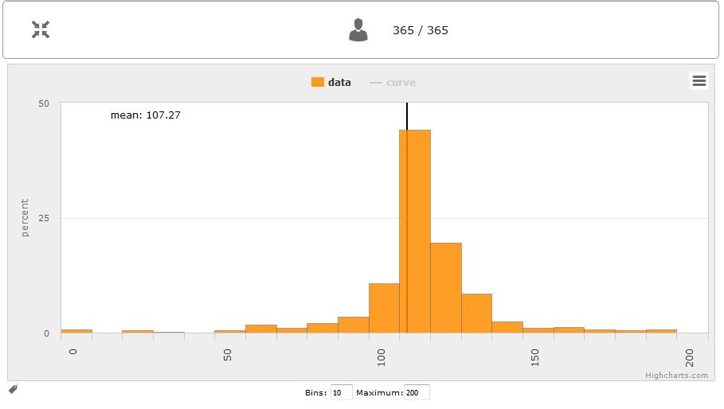

Some of the graphs have interactive features and can be adapted. All figures that are labeled with "Highcharts.com" (see bottom right corner of the figure above) have a zoom function. You can zoom in by simply clicking and pulling the mouse over the section you want to zoom in on. The button “Reset zoom" resets the display back to the original size.

For histograms, you can also change the settings for the bins and the maximum by clicking on the little symbol under the bottom left corner of the chart. You simply change the values in the fields and then click beside the bins display. This can be useful if the default bin size was too small. The bins are then changed for all graphs.

Via the button *previous results* in the lecture menu, you can also access and display results (and their corresponding graphs) of previous sessions.

Data
=====

Excelfile
---------

The excel files contain all variables recorded in the game. A file contains an overview of participants, decisions, contracts (if made), payoffs (if made) and assignment to roles, treatments & groups. The excel file can be downloaded at any time during the game and always shows all currently recorded data. It can also be accessed after a new game has started. In order to get previous data, just select the respective session from the previous results menu. When the game is open, you can download results again via *download as excel*. 

xecon
-----

The data repository `xecon`_ provides long term secure data storage. It is provided by gesis - Leibniz Institute for Social Sciences in Cologne. It allows to store and publish experimental data sets. Data sets can be directly exported to x-econ (including meta information) and can obtain a DOI to make them citable. The export is automatized so that you only have to select which session to export. classEx creates a ZIP file which is automatically transferred to xecon. You only need an account with xecon. All available meta-information, like number of players, groups, rounds,... are extracted automatically and put to xecon where they can be adjusted.

Dealing with problems 
======================

classEx runs smoothly with all standard browsers when javascript and cookies enabled. Still, in rare cases it may come to problems due to different mobile devices. If you encounter a problem, here are some strategies how to deal with them. Typical problems involve that subjects cannot load the page or are stuck in the game. 

In order to get more information if a participant cannot proceed, classEx offers some little helpers which can be displayed on the participant's device. Just click on the classEx logo and some new buttons appear.

.. note:: These functionality is only for assistance in case of problems and should not be told to participants beforehand. Participants may use the functionality to log themselves out.

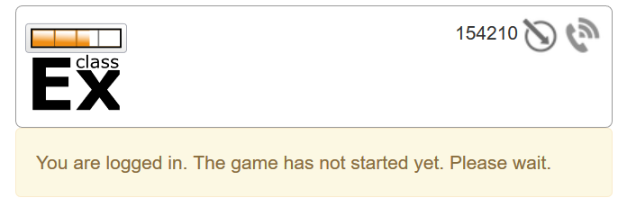

The new buttons are a logout button |pic_logout| and a check for the internet connection |pic_check|. The internal ID of the participant is displayed as well. 

.. |pic_check| image:: _static/pic/connected.png
    :width: 15px

.. |pic_check2| image:: _static/pic/connected_aborted.png
    :width: 15px

.. |pic_logout| image:: _static/pic/logout.png
    :width: 15px

Internet connection is slow
-----------------------------

The most common problem which can arise is that the internet connection of the participant is too slow. If this is the case, it can happen that pages are no reloaded and the participant seems to be stuck in the game. Try another network or mobile internet.

You can check if the internet connection if working with the telephone symbol. If the connection works, the symbol |pic_check| should blink every 2-3 seconds. If there is a problem, instead the following symbol is shown |pic_check2|. 

Re-login of the participant
----------------------------

If a participant has problems which cannot be solved by a better internet connection or a reload of the web page, you can try a re-login. Therefore, you have to logout the participant by clicking on the logout button |pic_logout|. Then the participant should login again. 

.. note:: If the game is running and you have proceeded beyond the first stage, re-login may not be possible. If a participant try to re-login then, he or she may get the message that the game is running and participation is not longer possible.

Check participant ID
----------------------

Sometimes participants may claim that they clicked some button or made some input but received different feedback. In many cases, this can also be a wrong perception by participants. But it could also be due to a programming error. To check this, you can download the data after the experiment and look for the respective (internal) ID of the participant. The ID of the participant is displayed when you click on the classEx logo on the participant's device. The ID can also be used if the participant looses his or her payoff code (see `Disbursal of payoffs`_).

Other problems
---------------

If the above strategies do not help, participants should try out a different browser. We always suggest to use Mozilla Firefox. If you have persistent problems with a special browser please let us know via classEx@uni-passau.de. For error retrieval, please tell us the ID of the participant and the date of your course.
