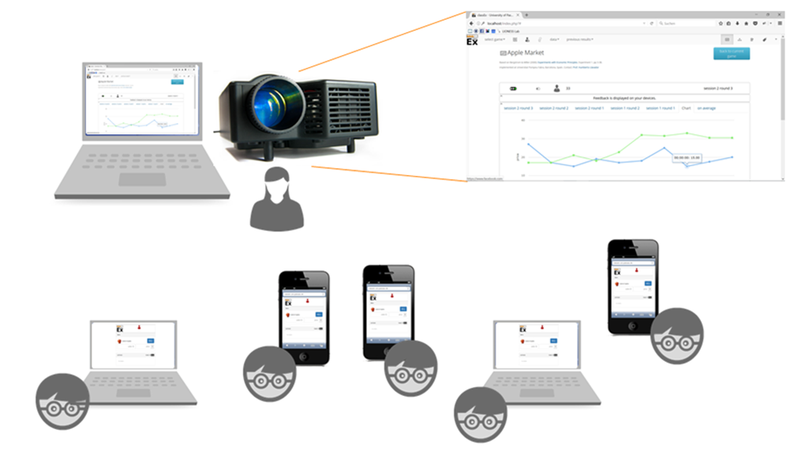

.. Read the Docs Template documentation master file, created by
   sphinx-quickstart on Tue Aug 26 14:19:49 2014.
   You can adapt this file completely to your liking, but it should at least
   contain the root `toctree` directive.

=====================================
classEx documentation
=====================================

Welcome to the documentation of classEx. In this documentation you can find all information on how to use classEx. General information on classEx can be found at https://classEx.de.

.. note:: You can also download a `pdf version`_ of the documentation. Please note that we change the documentation from time to time. So you might check from time if your PDF is still up-to-date. For this just compare the release version. Current release is 1.0.

.. _pdf version: https://readthedocs.org/projects/classex-doc/downloads/pdf/latest/

classEx is an online tool to run interactive experiments and surveys. It is directed both towards usage in classroom and lectures as well as for running in experiments with a group of people located in one place (cinema, public viewing event,...). Participants log in with their mobile device (smartphone or notebook) and can participate interactively in the lecture. They only need a standard browser and an internet connection. Results are shown instantly on the presentation screen of the lecturer with intuitive graphs. Quizzes and spontaneous tests can be integrated into lectures or presentations of all academic disciplines. classEx can be used in political science to simulate polls or elections, psychologists can test the effect of roles and scenarios and economists can assess the strategic interaction in markets and the whole of behavioral economics.

This documentation is written for lecturers and experimenters who want to use classEx for conducting games
in the classroom or in the field. In the following, we will talk about lecturers as the one running the game. All information hold true for as experimenters as well. **Participants do not need to read this documentation.** Participants are informed by the lecturer on how to login.

The chapter :ref:`Basics:Getting started with classEx` explains the first steps for new classEx users.

In the chapter :ref:`Run:Run ready-made games` you find a step-by-step guide how to run ready-made games in classEx.

The  chapter :ref:`Organize:Organize games` tells you how to structure your games in your account and how to find games from other users.

The chapter :ref:`Tutorial:Tutorial: How to develop a simple game` shows a step-by-step introduction for how to develop an ultimatum game.

The chapter :ref:`Develop:Develop your own games` is a manual for users who want to develop their own games.

The chapter :ref:`Elements:Elements` provides an overview of all elements which can be used to develop own games.

The chapter :ref:`Programming:Programming` provides a list of variables and functions for advanced programmers.

.. toctree::
   :maxdepth: 10
   :caption: classEx documentation

   Basics
   Run
   Organize
   Coursedata
   Tutorial
   Develop
   Elements
   Programming
   changelog

